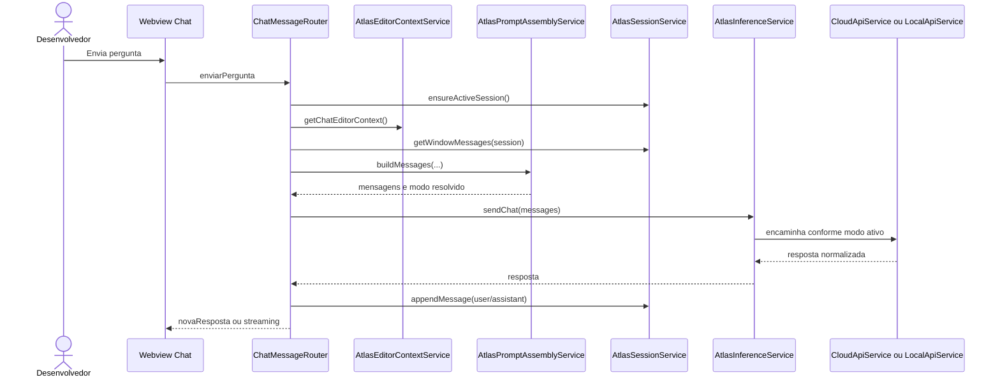
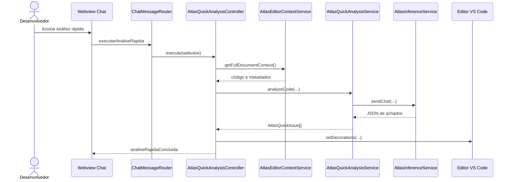
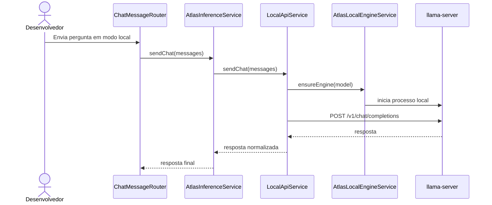

# Atualização do Documento V2 - Modelagem e Arquitetura - ATLAS

Este README reúne os pontos que precisam ser atualizados no arquivo `V2 - Modelagem e Arquitetura - ATLAS.pdf`, considerando a arquitetura atual implementada no projeto ATLAS.

O objetivo não é apagar a visão futura do sistema. RAG, ChromaDB, diagnóstico automático de hardware, integração com Hugging Face, download automatizado de modelos e configuração automática completa da engine local continuam sendo parte da evolução planejada. A atualização necessária é separar com clareza o que já está implementado, o que está parcialmente implementado e o que ainda é roadmap.

## 1. Resumo Executivo da Atualização

O documento V2 já descreve corretamente a intenção arquitetural do ATLAS como uma extensão para IDE baseada em camadas, com integração com LLMs, suporte cloud/local, RAG e persistência local. Porém, alguns trechos ainda tratam como futura uma parte que já avançou, principalmente:

- inferência local inicial via `llama-server`;
- descoberta de modelos `.gguf` na pasta `models`;
- `AtlasInferenceService` como ponto central de decisão entre cloud e local;
- histórico persistente de sessões;
- resumo arquitetural de conversas longas;
- análise rápida acionada pela Webview, não por comando VS Code registrado.

Também existem trechos que ainda tratam como implementados recursos que continuam planejados:

- backend local em Python;
- RAG funcional;
- ChromaDB funcional;
- diagnóstico automático de hardware;
- integração real com Hugging Face;
- download automatizado de modelos locais;
- indexação semântica do projeto.

## 2. Texto Para Inserir Após a Introdução

Recomenda-se adicionar uma subseção chamada **Estado Atual da Arquitetura Implementada** ao final da seção 1 ou no início da seção 2.

Texto sugerido:

> Na versão atual, o ATLAS está implementado como uma extensão para VS Code desenvolvida em TypeScript. A arquitetura já possui Webview lateral de chat, painéis auxiliares, gerenciamento de chaves de API via SecretStorage do VS Code, seleção de provedores cloud, montagem de prompts especializados, personalização de comportamento, modo estudo, análise rápida do arquivo aberto, marcações visuais no editor, sessões de conversa persistidas e resumo arquitetural de conversas longas. A camada de inferência é centralizada por `AtlasInferenceService`, que decide entre `CloudApiService` e `LocalApiService` conforme o modo ativo. A execução local existe em estágio inicial por meio de modelos `.gguf` e `llama-server`, com suporte a engine CPU, CUDA ou Vulkan quando os binários correspondentes estão disponíveis. Recursos como RAG funcional, ChromaDB, indexação semântica do projeto, inclusão de documentos externos, diagnóstico automático de hardware, integração com Hugging Face e download automatizado de modelos permanecem planejados para fases futuras.

## 3. Histórico de Revisão

Adicionar uma nova linha ao histórico de revisão.

Texto sugerido:

| Data | Autor | Descrição | Versão |
| --- | --- | --- | --- |
| 21/05/2026 | João Victor da Silva Ferreira | Atualização da arquitetura conforme implementação atual: inferência centralizada, execução local inicial, histórico de sessões, análise rápida via Webview e separação entre recursos implementados e planejados. | 1.2 |

## 4. Seção 3 - Requisitos e Restrições Arquiteturais

### 4.1 Linguagem

**Situação atual:** o documento afirma que o frontend será em TypeScript e que o backend local responsável pela inferência será em Python.

**Ajuste necessário:** remover a ideia de backend Python como componente implementado. A implementação atual concentra a extensão em TypeScript e usa `llama-server` como processo local externo.

Texto sugerido para substituir o item **Linguagem**:

> A extensão ATLAS é desenvolvida em TypeScript, utilizando as APIs do VS Code para integração com a IDE, renderização de Webviews, acesso ao editor, persistência local e armazenamento seguro de credenciais. No estado atual, a inferência em nuvem é realizada por serviços TypeScript que consomem APIs externas, enquanto a inferência local é feita por integração com uma engine `llama-server` compatível com API OpenAI. Não há, na implementação atual, um backend Python próprio do ATLAS. Componentes futuros de RAG, indexação e preparação automática de ambiente poderão ser implementados em serviços auxiliares, caso essa separação se torne necessária.

### 4.2 Plataforma

**Situação atual:** o documento descreve runtime local, serviços de indexação, RAG e ChromaDB como parte da arquitetura.

**Ajuste necessário:** separar a arquitetura atual da visão futura.

Texto sugerido para substituir o item **Plataforma**:

> O sistema é executado como uma extensão do VS Code na máquina do usuário. A arquitetura atual é composta pela extensão TypeScript, pelas Webviews de interface, pelos serviços de configuração, seleção, prompts, credenciais, inferência cloud/local, análise rápida e histórico de sessões. Quando o modo cloud está ativo, o ATLAS se comunica com provedores externos como OpenAI-compatible, Claude e Gemini. Quando o modo local está ativo, o ATLAS utiliza `LocalApiService` e `AtlasLocalEngineService` para iniciar ou reutilizar uma instância de `llama-server` e enviar requisições para uma API local OpenAI-compatible. A arquitetura preserva espaço para RAG, ChromaDB, indexação de projeto, documentos externos e integração com Hugging Face, mas esses recursos ainda permanecem planejados.

### 4.3 Segurança

**Situação atual:** a ideia geral está correta, mas precisa citar mecanismos reais.

Texto sugerido:

> A arquitetura prioriza o controle do usuário sobre o envio de código e contexto. Chaves de API são armazenadas no SecretStorage do VS Code por `SecretStorageService` e gerenciadas por `ApiKeyManager`. O envio para provedores em nuvem depende da configuração explícita de provedor, chave e modelo cloud. No modo local, a inferência ocorre na máquina do usuário quando há modelo `.gguf` e engine `llama-server` configurados. As configurações de segurança, como timeout, limite de payload, confirmação de cloud e bloqueio de RAG em cloud, são persistidas em `config/atlas-config.json`.

### 4.4 Persistência

**Situação atual:** o documento cita configurações, biblioteca de modelos, metadados de indexação e base vetorial. Precisa incluir histórico implementado e marcar RAG/ChromaDB como futuro.

Texto sugerido:

> A persistência atual do ATLAS é local e baseada principalmente em arquivos JSON e SecretStorage do VS Code. As configurações gerais, provedores, seleção de modo/modelo, parâmetros de execução, segurança, comportamento customizado, estado do modo estudo e modelos locais registrados são armazenados em `config/atlas-config.json`. As sessões de conversa, mensagens e resumos arquiteturais são armazenados em `config/atlas-history.json` por `AtlasHistoryRepository`. As chaves de API são armazenadas no SecretStorage do VS Code. A base vetorial, os metadados de indexação e a persistência de embeddings com ChromaDB permanecem planejados para a fase de RAG.

## 5. Seção 4 - Visão de Casos de Uso

### 5.1 Atores do Sistema

Atualizar os atores secundários para refletir os componentes reais.

Texto sugerido:

> Atores secundários:
>
> - Modelo de IA em nuvem: provedor externo responsável por gerar respostas quando o modo cloud está ativo.
> - Engine local `llama-server`: processo local responsável por executar modelos `.gguf` quando o modo local está ativo.
> - Provedor de IA em nuvem: serviço externo compatível com OpenAI, Claude ou Gemini.
> - VS Code SecretStorage: mecanismo seguro usado para armazenar chaves de API.
> - Repositório de modelos, como Hugging Face: ator futuro para busca e download automatizado de modelos.
> - Base vetorial local/ChromaDB: componente futuro associado ao mecanismo de RAG.

### 5.2 Lista de Casos de Uso

Atualizar a lista para não marcar biblioteca local como totalmente futura e para incluir sessões e inferência local.

Texto sugerido para substituir a lista:

> Casos de uso do sistema:
>
> - UC001 - Perguntar sobre o código pelo chat.
> - UC002 - Executar análise rápida do arquivo atual.
> - UC003 - Solicitar análise arquitetural formal.
> - UC004 - Ativar modo estudo.
> - UC005 - Gerenciar chaves de API.
> - UC006 - Selecionar provedor e modelo cloud.
> - UC007 - Alternar modo local ou nuvem.
> - UC008 - Configurar parâmetros de execução e segurança.
> - UC009 - Alterar comportamento do modelo.
> - UC010 - Gerenciar biblioteca/registro de modelos locais.
> - UC011 - Abrir painéis da extensão.
> - UC012 - Gerenciar sessões de conversa.
> - UC013 - Usar inferência local com modelo GGUF.
> - UC014 - Indexar projeto com RAG (futuro).
> - UC015 - Adicionar documentos externos ao RAG (futuro).
> - UC016 - Pesquisar modelos de IA em repositórios externos (futuro).
> - UC017 - Baixar modelo local automaticamente (futuro).

### 5.3 Observações Sobre Casos de Uso Específicos

Adicionar estas observações na seção de casos significativos:

> A análise rápida está implementada por acionamento na Webview, por meio da mensagem `executarAnaliseRapida`, tratada por `ChatMessageRouter`. O comando direto `atlas.quickAnalysis` ainda não está registrado em `extension.ts` nem contribuído em `package.json`, portanto deve ser descrito como pendência caso continue fazendo parte da arquitetura desejada.
>
> O histórico de chats deve ser tratado como funcionalidade implementada. `AtlasSessionService` gerencia criação, troca, renomeação, exclusão e listagem de sessões, enquanto `AtlasHistoryRepository` persiste os dados em `config/atlas-history.json`.
>
> A execução local deve ser tratada como parcial avançada. O ATLAS já descobre modelos `.gguf`, seleciona modelo local, inicia `llama-server` e envia mensagens para uma API local OpenAI-compatible. Porém, o download automático de modelos, a instalação assistida da engine e o diagnóstico de hardware ainda são futuros.

## 6. Seção 5 - Visão Lógica

### 6.1 Texto de Abertura da Visão Lógica

Substituir o texto inicial da seção 5 por este:

> O sistema foi projetado seguindo uma arquitetura modular em camadas, permitindo separação clara de responsabilidades entre interface, lógica de aplicação, gerenciamento de prompts, integração com modelos de IA, recuperação de contexto e persistência de dados. Na implementação atual, a extensão TypeScript concentra a interface, a orquestração dos casos de uso, a configuração, a seleção de modelos, o gerenciamento de prompts, a integração cloud/local, a análise rápida e o histórico de sessões. A camada de inferência é centralizada por `AtlasInferenceService`, que encaminha chamadas para `CloudApiService` ou `LocalApiService` conforme o modo ativo. A recuperação semântica por RAG, a base vetorial ChromaDB e a indexação de projeto permanecem como evolução futura.

### 6.2 Casos de Uso Que Influenciam a Arquitetura

Substituir a lista atual por:

> Os principais casos de uso que influenciam essa organização incluem:
>
> - perguntar sobre o código pelo chat;
> - executar análise rápida do arquivo atual;
> - solicitar análise arquitetural formal;
> - ativar modo estudo;
> - gerenciar chaves de API;
> - selecionar provedor e modelo cloud;
> - alternar entre execução local e em nuvem;
> - usar inferência local com modelo GGUF;
> - configurar parâmetros de execução e segurança;
> - alterar comportamento do modelo;
> - gerenciar biblioteca/registro de modelos locais;
> - gerenciar sessões de conversa;
> - indexar projeto com RAG (futuro);
> - adicionar documentos externos ao RAG (futuro);
> - pesquisar e baixar modelos externos (futuro).

## 7. Camadas Arquiteturais

### 7.1 Camada de Interface

Adicionar ou substituir os componentes por:

> Principais componentes:
>
> - `ChatViewProvider`;
> - `ChatPanelManager`;
> - `AtlasQuickAnalysisController`;
> - `src/webview/chat`;
> - `src/webview/api-keys`;
> - `src/webview/library`;
> - `src/webview/search`;
> - `src/webview/atlas`;
> - Webview de configuração de RAG (planejada/futura).

### 7.2 Camada de Aplicação

Adicionar os serviços de sessão e inferência aos componentes.

> Principais componentes:
>
> - `ChatMessageRouter`;
> - `AtlasEditorContextService`;
> - `AtlasQuickAnalysisService`;
> - `AtlasQuickAnalysisController`;
> - `ApiKeyManager`;
> - `AtlasConfigManager`;
> - `AtlasSelectionService`;
> - `AtlasSettingsService`;
> - `AtlasProviderService`;
> - `AtlasModelRegistryService`;
> - `AtlasSessionService`;
> - `AtlasInferenceService`.

### 7.3 Camada de Inteligência

Substituir o trecho que diz que o runtime local é futuro.

Texto sugerido:

> A Camada de Inteligência é responsável pela integração com modelos de linguagem, montagem das mensagens enviadas ao modelo e aplicação do comportamento padrão do ATLAS. Ela também centraliza a escolha entre execução cloud e local.
>
> Principais componentes:
>
> - `AtlasInferenceService`: decide entre inferência cloud e local;
> - `CloudApiService`: envia mensagens e lista modelos em provedores cloud;
> - `LocalApiService`: envia mensagens para a engine local por API OpenAI-compatible;
> - `AtlasLocalEngineService`: inicia, monitora e encerra o `llama-server`;
> - `AtlasLocalModelDiscoveryService`: descobre modelos `.gguf` na pasta `models`;
> - `AtlasPromptAssemblyService`;
> - `AtlasPromptModeResolver`;
> - `AtlasSystemPromptPolicyService`;
> - `AtlasPromptCustomizationService`;
> - `AtlasPromptTypes`;
> - `ApiTypes`.

### 7.4 Camada de Recuperação de Contexto

Manter como futura, mas deixar explícito o estado atual.

Texto sugerido:

> No estado atual, o contexto usado pelo ATLAS é composto principalmente pelo arquivo aberto, pelo trecho selecionado no editor, pela janela recente de mensagens da sessão e pelo resumo arquitetural gerado a partir de conversas longas. Ainda não há indexação semântica do projeto, geração de embeddings, armazenamento vetorial ou recuperação via RAG. Esses componentes permanecem planejados para evolução futura.

### 7.5 Camada de Persistência

Substituir/atualizar a lista de responsabilidades por:

> Responsabilidades:
>
> - armazenar configurações do usuário;
> - armazenar provedores cadastrados;
> - armazenar seleção de modo, provedor e modelo;
> - armazenar parâmetros de execução;
> - armazenar configurações de segurança;
> - armazenar comportamento customizado do modelo;
> - armazenar estado do modo estudo;
> - armazenar sessões de conversa;
> - armazenar mensagens e resumos arquiteturais;
> - armazenar registro de modelos locais;
> - armazenar chaves de API com segurança;
> - armazenar metadados de indexação futuramente;
> - armazenar base vetorial do RAG futuramente.
>
> Principais componentes e mecanismos:
>
> - `AtlasConfigRepository`;
> - `AtlasConfigDefaults`;
> - `AtlasHistoryRepository`;
> - `SecretStorageService`;
> - `config/atlas-config.json`;
> - `config/atlas-history.json`;
> - VS Code SecretStorage;
> - ChromaDB (futuro).

## 8. Seção 6 - Visão de Implementação

### 8.1 Ajustes nos Diagramas de Sequência

Os diagramas de sequência de pergunta, análise arquitetural e análise rápida devem incluir `AtlasInferenceService` entre o roteador/serviço de análise e o provedor final.

Fluxo atualizado para perguntas:

Fluxo atualizado para análise rápida:

Fluxo sugerido para inferência local:

## 9. Seção 8 - Visão de Implantação

**Situação atual:** a seção descreve um backend Python, RAG e ChromaDB como artefatos implantados.

**Ajuste necessário:** marcar esses recursos como futuros e descrever a implantação real.

Texto sugerido para substituir o texto da seção:

> A implantação atual do ATLAS ocorre principalmente como uma extensão do VS Code executada na máquina do desenvolvedor. O pacote da extensão contém a interface Webview, os serviços TypeScript, os repositórios locais de configuração/histórico e a integração com provedores de IA. No modo cloud, a extensão se comunica com APIs externas configuradas pelo usuário. No modo local, a extensão pode iniciar ou reutilizar um processo `llama-server`, desde que exista um modelo `.gguf` selecionado e o binário da engine esteja disponível na pasta esperada ou configurado no modelo.
>
> Os artefatos implantados atualmente incluem:
>
> - pacote da extensão ATLAS para VS Code;
> - Webviews de chat, configurações, biblioteca, busca e configurações ATLAS;
> - serviços TypeScript de configuração, prompts, credenciais, inferência, engine local, análise rápida e sessões;
> - pasta `models` para arquivos `.gguf`;
> - pasta `engine` para builds do `llama-server`;
> - `config/atlas-config.json`;
> - `config/atlas-history.json`;
> - VS Code SecretStorage para credenciais.
>
> O backend Python, a indexação semântica, a geração de embeddings, a base vetorial ChromaDB, a inclusão de documentos externos e o download automático de modelos ainda devem ser tratados como componentes planejados para implantação futura.

## 10. Seção 9 - Projeto de Banco de Dados

**Situação atual:** a seção descreve ChromaDB como banco vetorial implementado.

**Ajuste necessário:** transformar a seção em uma visão de persistência atual + persistência vetorial futura.

Texto sugerido:

> Diferente de aplicações tradicionais com banco relacional, o ATLAS utiliza, no estado atual, persistência local baseada em arquivos JSON e armazenamento seguro do VS Code. As configurações da extensão são persistidas em `config/atlas-config.json`, incluindo provedores, seleção de modo, modelos, parâmetros de execução, segurança, comportamento customizado e modo estudo. O histórico de conversas é persistido em `config/atlas-history.json`, incluindo sessões, mensagens, datas e resumo arquitetural. As chaves de API são armazenadas no VS Code SecretStorage.
>
> A base vetorial com ChromaDB permanece planejada para a implementação futura do mecanismo de RAG. Quando implementada, ela deverá armazenar embeddings, metadados e referências para arquivos do projeto e documentos externos, permitindo recuperação semântica de contexto para os modelos locais e cloud.

## 11. Componentes Reais Que Devem Aparecer nos Diagramas

Atualize os diagramas de classe, componentes e pacotes para incluir:

- `ChatViewProvider`;
- `ChatPanelManager`;
- `ChatMessageRouter`;
- `AtlasEditorContextService`;
- `AtlasQuickAnalysisController`;
- `AtlasQuickAnalysisService`;
- `AtlasInferenceService`;
- `CloudApiService`;
- `LocalApiService`;
- `AtlasLocalEngineService`;
- `AtlasLocalModelDiscoveryService`;
- `AtlasSessionService`;
- `AtlasHistoryRepository`;
- `AtlasConfigManager`;
- `AtlasSettingsService`;
- `AtlasProviderService`;
- `AtlasModelRegistryService`;
- `AtlasSelectionService`;
- `AtlasConfigRepository`;
- `AtlasConfigDefaults`;
- `ApiKeyManager`;
- `SecretStorageService`;
- `AtlasPromptAssemblyService`;
- `AtlasPromptModeResolver`;
- `AtlasSystemPromptPolicyService`;
- `AtlasPromptCustomizationService`.

## 12. Componentes Que Devem Ser Marcados Como Futuros

Marcar explicitamente como futuro nos diagramas e textos:

- `Project Indexer`;
- `Embedding Generator`;
- `Vector Database Manager`;
- `Context Retriever`;
- `ChromaDB`;
- integração com Hugging Face;
- download automático de modelos;
- diagnóstico de hardware;
- configuração automática da engine local;
- inclusão de documentos externos no RAG.

## 13. Nota Curta Para Inserir no Documento

Texto curto para inserir como nota de status:

> Observação sobre o estado atual: este documento descreve a arquitetura completa planejada para o ATLAS. Na implementação atual, já existem extensão VS Code em TypeScript, Webviews, integração cloud, seleção de provedor/modelo, gerenciamento de chaves, camada de prompts, modo estudo, análise rápida via Webview, marcações visuais no editor, histórico persistente de sessões, resumo arquitetural e execução local inicial via `llama-server` com modelos `.gguf`. RAG, ChromaDB, indexação semântica, documentos externos, diagnóstico de hardware, integração com Hugging Face e download automatizado de modelos permanecem como evolução futura.

