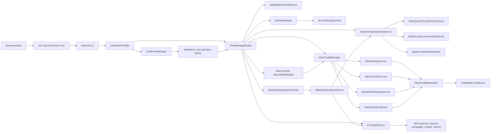
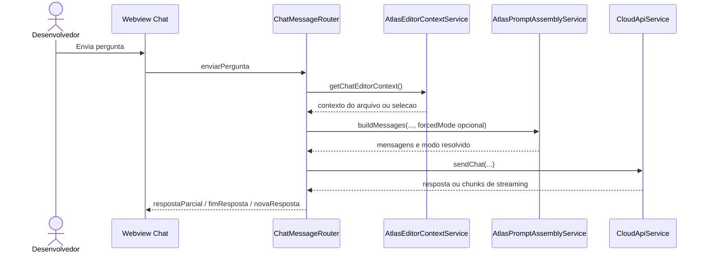
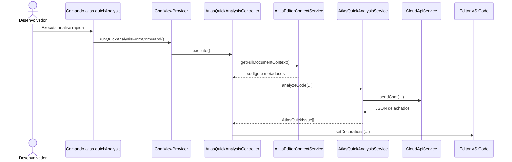

# Atualizacao da Modelagem e Arquitetura do ATLAS

Este documento registra a atualizacao das referencias de classes, componentes e casos de uso ja implementados no ATLAS. As partes relacionadas a RAG completo, ChromaDB, backend Python, runtime com llama.cpp e download automatizado de modelos locais permanecem como evolucao futura da arquitetura e nao devem ser removidas do documento principal.

## 1. Escopo Implementado Atualmente

A versao atual do ATLAS esta implementada como uma extensao para VS Code escrita em TypeScript. O sistema ja possui:

- painel lateral em Webview para chat;
- abertura de paineis auxiliares de configuracao e biblioteca;
- gerenciamento de chaves de API por provedor;
- selecao de modo de execucao local ou nuvem no nivel de configuracao;
- integracao com provedores cloud OpenAI-compatible, Claude e Gemini;
- montagem de prompts com modos de comportamento;
- personalizacao complementar do comportamento do modelo;
- modo estudo com resposta didatica orientada a aprendizado;
- analise rapida do arquivo aberto;
- marcacao visual de problemas arquiteturais no editor;
- persistencia local de configuracoes em JSON;
- armazenamento seguro de credenciais usando SecretStorage do VS Code.

Permanecem planejados para fases futuras:

- indexacao real do projeto para RAG;
- adicao de documentos ao RAG;
- geracao de embeddings;
- persistencia vetorial com ChromaDB;
- backend local em Python;
- execucao local de modelos com llama.cpp;
- busca e download automatizado de modelos locais.

## 2. Casos de Uso Atualizados

### UC001 - Perguntar sobre o codigo pelo chat

**Ator principal:** Desenvolvedor.

**Objetivo:** Enviar uma pergunta ao ATLAS pelo chat, opcionalmente usando o arquivo aberto ou trecho selecionado como contexto.

**Classes participantes:**

- `ChatViewProvider`
- `ChatPanelManager`
- `ChatMessageRouter`
- `AtlasEditorContextService`
- `AtlasPromptAssemblyService`
- `AtlasPromptModeResolver`
- `AtlasSystemPromptPolicyService`
- `AtlasPromptCustomizationService`
- `CloudApiService`

**Fluxo principal:**

1. O usuario digita uma pergunta na Webview de chat.
2. A Webview envia a mensagem `enviarPergunta`.
3. `ChatMessageRouter` recebe a mensagem e identifica o fluxo de pergunta.
4. `AtlasEditorContextService` coleta o trecho selecionado ou o arquivo aberto, quando existir.
5. `AtlasPromptAssemblyService` monta as mensagens do modelo.
6. `AtlasPromptModeResolver` define o modo do prompt.
7. `AtlasSystemPromptPolicyService` gera o system prompt base.
8. `AtlasPromptCustomizationService` adiciona diretivas complementares, quando configuradas.
9. `CloudApiService` envia a requisicao ao provedor cloud selecionado.
10. A resposta retorna para a Webview como resposta final ou streaming.

### UC002 - Executar analise rapida do arquivo atual

**Ator principal:** Desenvolvedor.

**Objetivo:** Solicitar uma analise arquitetural rapida do arquivo aberto e destacar problemas diretamente no editor.

**Classes participantes:**

- `ChatViewProvider`
- `ChatMessageRouter`
- `AtlasQuickAnalysisController`
- `AtlasEditorContextService`
- `AtlasQuickAnalysisService`
- `AtlasPromptAssemblyService`
- `CloudApiService`
- `AtlasQuickIssue`

**Fluxo principal:**

1. O usuario executa o comando `atlas.quickAnalysis` ou aciona a analise pela Webview.
2. `ChatViewProvider` encaminha a execucao para `AtlasQuickAnalysisController`.
3. `AtlasEditorContextService` coleta o conteudo completo do arquivo aberto.
4. `AtlasQuickAnalysisService` monta uma solicitacao em modo `quick-analysis`.
5. `CloudApiService` envia o codigo ao provedor configurado.
6. `AtlasQuickAnalysisService` interpreta a resposta JSON e normaliza os achados.
7. `AtlasQuickAnalysisController` aplica decoracoes no editor conforme severidade.
8. A Webview recebe o resultado pelo evento `analiseRapidaConcluida`.

### UC003 - Gerenciar chaves de API

**Ator principal:** Desenvolvedor.

**Objetivo:** Cadastrar, listar, editar e excluir chaves de API usadas por provedores cloud.

**Classes participantes:**

- `ChatPanelManager`
- `ChatMessageRouter`
- `ApiKeyManager`
- `SecretStorageService`
- `AtlasConfigManager`
- `AtlasProviderService`
- `ProviderConfig`
- `ApiCredentialView`

**Fluxo principal:**

1. O usuario abre o painel de configuracoes.
2. A Webview envia eventos como `adicionarChave`, `listarChaves`, `editarChave` ou `excluirChave`.
3. `ChatMessageRouter` delega o processamento para `ApiKeyManager`.
4. `ApiKeyManager` solicita dados ao usuario por recursos nativos do VS Code.
5. `SecretStorageService` grava, consulta ou remove a chave no SecretStorage.
6. `AtlasConfigManager` atualiza provedores personalizados quando necessario.
7. A Webview recebe a lista atualizada por `credenciaisAtualizadas`.

### UC004 - Selecionar provedor e modelo cloud

**Ator principal:** Desenvolvedor.

**Objetivo:** Escolher o provedor cloud e o modelo que serao usados nas respostas do ATLAS.

**Classes participantes:**

- `ChatMessageRouter`
- `AtlasConfigManager`
- `AtlasSelectionService`
- `AtlasProviderService`
- `CloudApiService`
- `AtlasModelSummary`

**Fluxo principal:**

1. A Webview solicita os provedores e modelos disponiveis.
2. `ChatMessageRouter` consulta `AtlasConfigManager`.
3. `AtlasProviderService` retorna os provedores cadastrados.
4. Ao selecionar um provedor, `AtlasSelectionService` grava a selecao.
5. `CloudApiService.getModelsForCurrentProvider` busca modelos do provedor selecionado.
6. A Webview recebe a lista por `modelosCloudCarregados`.
7. Ao selecionar um modelo, `AtlasSelectionService` grava o modelo ativo.

### UC005 - Alternar modo local ou nuvem

**Ator principal:** Desenvolvedor.

**Objetivo:** Alterar o modo de execucao configurado no ATLAS entre `local` e `cloud`.

**Classes participantes:**

- `ChatMessageRouter`
- `AtlasConfigManager`
- `AtlasSelectionService`
- `AtlasModelRegistryService`
- `AtlasProviderService`

**Fluxo principal:**

1. O usuario seleciona o modo desejado na interface.
2. A Webview envia `selecionarModo`.
3. `ChatMessageRouter` chama `AtlasConfigManager.setMode`.
4. `AtlasSelectionService` atualiza `llms.selection.mode` no arquivo de configuracao.
5. A Webview recebe `modoSelecionado`.

**Observacao arquitetural:** o modo local ja existe como selecao e registro de modelos, mas a inferencia local ainda depende da implementacao futura do runtime local.

### UC006 - Configurar parametros de execucao e seguranca

**Ator principal:** Desenvolvedor.

**Objetivo:** Definir parametros de execucao do modelo e preferencias de seguranca relacionadas ao uso de cloud.

**Classes participantes:**

- `ChatMessageRouter`
- `AtlasConfigManager`
- `AtlasSettingsService`
- `AtlasConfigRepository`
- `AtlasConfigDefaults`
- `AtlasSecuritySettings`
- `AtlasLlmDefaults`

**Fluxo principal:**

1. O usuario abre o painel de configuracoes.
2. A Webview solicita ou envia configuracoes por `carregarConfiguracoesSeguranca` e `salvarConfiguracoesSeguranca`.
3. `ChatMessageRouter` aciona `AtlasConfigManager`.
4. `AtlasSettingsService` atualiza secoes como `cloudSecurity` e `llms.defaults`.
5. `AtlasConfigRepository` persiste as alteracoes em `config/atlas-config.json`.
6. A Webview recebe `configuracoesSegurancaCarregadas` ou `configuracoesSegurancaSalvas`.

### UC007 - Alterar comportamento do modelo

**Ator principal:** Desenvolvedor.

**Objetivo:** Configurar diretivas complementares de comportamento para o ATLAS.

**Classes participantes:**

- `ChatMessageRouter`
- `AtlasPromptCustomizationService`
- `AtlasConfigRepository`
- `AtlasPromptAssemblyService`
- `AtlasSystemPromptPolicyService`

**Fluxo principal:**

1. O usuario abre as configuracoes de comportamento.
2. A Webview envia `carregarComportamentoModelo` ou `salvarComportamentoModelo`.
3. `ChatMessageRouter` delega para `AtlasPromptCustomizationService`.
4. `AtlasPromptCustomizationService` le ou grava a configuracao em `custom.systemPrompt`.
5. Na proxima pergunta, `AtlasPromptAssemblyService` injeta as diretivas complementares no prompt, respeitando as regras obrigatorias do ATLAS.

### UC008 - Gerenciar biblioteca/registro de modelos locais

**Ator principal:** Desenvolvedor.

**Objetivo:** Exibir e manter referencias a modelos locais configurados.

**Classes participantes:**

- `ChatPanelManager`
- `ChatMessageRouter`
- `AtlasConfigManager`
- `AtlasModelRegistryService`
- `AtlasSelectionService`
- `AtlasModelConfig`

**Fluxo principal:**

1. O usuario abre a biblioteca de modelos.
2. A Webview envia `requestModels`.
3. `ChatMessageRouter` solicita a lista de modelos a `ChatViewProvider`.
4. `ChatViewProvider` consulta `AtlasConfigManager.getAllModels`.
5. `AtlasModelRegistryService` retorna os modelos registrados em configuracao local.
6. A Webview recebe `updateModelsList`.

**Observacao arquitetural:** este caso de uso representa a parte implementada da biblioteca local. Busca em repositorio externo, download fisico e execucao do modelo local permanecem como evolucao futura.

### UC009 - Abrir paineis da extensao

**Ator principal:** Desenvolvedor.

**Objetivo:** Navegar entre chat, configuracoes e biblioteca dentro da extensao.

**Classes participantes:**

- `ChatViewProvider`
- `ChatPanelManager`
- `ChatMessageRouter`

**Fluxo principal:**

1. O usuario solicita abertura de um painel pela Webview.
2. A Webview envia `abrirPainelConfig` com a visao desejada.
3. `ChatMessageRouter` chama a funcao `openPanel`.
4. `ChatPanelManager` normaliza a visao solicitada.
5. `ChatPanelManager` cria ou reaproveita um `WebviewPanel`.
6. O HTML, CSS e JavaScript correspondentes sao carregados a partir de `src/webview`.

### UC010 - Ativar modo estudo

**Ator principal:** Desenvolvedor ou estudante.

**Objetivo:** Alternar o ATLAS para um modo de resposta didatico, no qual o assistente explica conceitos e codigo de forma progressiva, evitando respostas secas e priorizando aprendizado.

**Classes participantes:**

- `ChatMessageRouter`
- `AtlasConfigManager`
- `AtlasPromptAssemblyService`
- `AtlasSystemPromptPolicyService`
- `AtlasPromptTypes`
- `AtlasConfigTypes`
- `src/webview/chat/script.js`
- `src/webview/chat/styles.css`

**Fluxo principal:**

1. O usuario aciona o botao de modo estudo na Webview de chat.
2. A Webview alterna o estado visual do botao e envia `alterarModoEstudo`.
3. `ChatMessageRouter` chama `AtlasConfigManager.setStudyModeEnabled`.
4. `AtlasConfigManager` persiste o estado em `custom.studyMode.enabled`.
5. O backend da extensao responde `modoEstudoAtualizado`.
6. Em perguntas seguintes, a Webview envia `forcedMode: "study-mode"` quando o modo estudo estiver ativo.
7. `AtlasPromptAssemblyService` monta a mensagem usando o modo `study-mode`.
8. `AtlasSystemPromptPolicyService` aplica o prompt didatico do modo estudo.

**Observacao arquitetural:** o modo estudo nao substitui o modo de analise arquitetural formal. Ele e um modo de interacao educacional para perguntas, explicacoes de codigo e apoio ao aprendizado.

## 3. Mapeamento dos Casos de Uso Antigos para a Implementacao Atual

| Caso no documento original | Situacao atual | Atualizacao sugerida |
| --- | --- | --- |
| UC001 - Solicitar analise de codigo do projeto | Parcialmente implementado como analise rapida do arquivo atual | Renomear para "Executar analise rapida do arquivo atual" |
| UC002 - Perguntar sobre o codigo | Implementado | Atualizar classes para `ChatMessageRouter`, `AtlasEditorContextService`, `AtlasPromptAssemblyService` e `CloudApiService` |
| UC003 - Indexar projeto com RAG | Futuro | Manter como caso planejado, sem classes implementadas atuais |
| UC004 - Adicionar documentos ao RAG | Futuro | Manter como caso planejado |
| UC005 - Pesquisar modelos de IA | Parcialmente implementado para listar modelos de provedor cloud | Atualizar para "Selecionar provedor e modelo cloud" |
| UC006 - Baixar modelo local | Futuro | Manter como caso planejado |
| UC007 - Alternar modo local / nuvem | Implementado no nivel de configuracao | Atualizar classes para `AtlasSelectionService` e `AtlasConfigManager` |
| UC008 - Configurar parametros do modelo | Implementado | Atualizar classes para `AtlasSettingsService`, `AtlasConfigRepository` e `AtlasConfigDefaults` |
| UC009 - Adicionar chaves de API | Implementado | Atualizar classes para `ApiKeyManager` e `SecretStorageService` |
| Novo - Alterar comportamento da IA | Implementado | Incluir como caso de uso proprio |
| Novo - Abrir paineis da extensao | Implementado | Incluir como caso de suporte de interface |
| Novo - Ativar modo estudo | Implementado | Incluir como caso de uso de interacao educacional |

## 4. Visao Logica Atualizada das Classes

### Camada de ativacao da extensao

- `extension.ts`: ponto de entrada da extensao. Registra o `ChatViewProvider` e o comando `atlas.quickAnalysis`.

### Camada de interface

- `src/webview/chat`: interface principal de conversa.
- `src/webview/api-keys`: interface de chaves, seguranca e comportamento.
- `src/webview/library`: interface da biblioteca de modelos.
- `ChatPanelManager`: abre, reaproveita e renderiza paineis Webview.
- `ChatViewProvider`: registra e resolve a Webview lateral do VS Code.

### Camada de roteamento e orquestracao

- `ChatMessageRouter`: centraliza o tratamento das mensagens vindas da Webview.
- `ChatViewProvider`: atua tambem como composition root, criando e conectando servicos.

### Camada de contexto do editor e analise rapida

- `AtlasEditorContextService`: coleta arquivo aberto, trecho selecionado e metadados do editor.
- `AtlasQuickAnalysisService`: monta a solicitacao de analise rapida e interpreta a resposta JSON.
- `AtlasQuickAnalysisController`: executa o fluxo no VS Code e aplica decoracoes visuais no editor.

### Camada de prompts

- `AtlasPromptAssemblyService`: monta a lista final de mensagens enviada ao modelo.
- `AtlasPromptModeResolver`: escolhe o modo do prompt entre `developer-assistant`, `architectural-analysis` e `quick-analysis`.
- `AtlasSystemPromptPolicyService`: define as politicas de system prompt por modo, incluindo `study-mode`.
- `AtlasPromptCustomizationService`: aplica diretivas complementares configuradas pelo usuario.
- `AtlasPromptTypes`: define os modos aceitos pelo sistema, incluindo `study-mode`.

### Camada de configuracao e selecao

- `AtlasConfigManager`: fachada para configuracoes, provedores, modelos e selecao.
- `AtlasConfigManager`: tambem controla o estado do modo estudo por `isStudyModeEnabled` e `setStudyModeEnabled`.
- `AtlasSettingsService`: le e atualiza secoes gerais de configuracao.
- `AtlasProviderService`: gerencia provedores cloud cadastrados.
- `AtlasModelRegistryService`: gerencia referencias de modelos locais registrados.
- `AtlasSelectionService`: controla modo ativo, provedor cloud, modelo cloud e modelo local.
- `AtlasConfigRepository`: le e grava `config/atlas-config.json`.
- `AtlasConfigDefaults`: define a configuracao inicial e provedores padrao.
- `AtlasConfigTypes`: inclui `AtlasStudyModeConfig` e `AtlasCustomSettings`.

### Camada de credenciais

- `ApiKeyManager`: conduz cadastro, edicao, listagem e remocao de chaves.
- `SecretStorageService`: encapsula o SecretStorage do VS Code.

### Camada de integracao com IA

- `CloudApiService`: envia mensagens e lista modelos usando provedores cloud.
- `ApiTypes`: define contratos de mensagens, respostas e modelos retornados pelos provedores.

## 5. Diagrama de Componentes Atualizado

## 6. Sequencia Atualizada: Perguntar sobre Codigo

## 7. Sequencia Atualizada: Analise Rapida

## 8. Ajustes Recomendados no Documento Principal

1. Atualizar a lista de casos de uso para separar funcionalidades implementadas de funcionalidades futuras.
2. Substituir nomes genericos como `Analysis Orchestrator`, `Request Controller`, `Context Builder`, `Model Gateway` e `Cloud Model Adapter` pelos nomes reais das classes implementadas.
3. Manter RAG, ChromaDB, backend Python, llama.cpp e download de modelos locais como componentes planejados na visao de evolucao ou implantacao futura.
4. Atualizar os diagramas de classe dos casos implementados usando as classes listadas neste documento.
5. Atualizar os diagramas de sequencia de pergunta e analise rapida conforme os fluxos reais.
6. Corrigir a visao de persistencia implementada para incluir `AtlasConfigRepository`, `config/atlas-config.json` e SecretStorage.
7. Diferenciar biblioteca de modelos implementada como registro/configuracao local da futura funcionalidade de busca e download de modelos.
8. Adicionar o modo estudo como funcionalidade implementada de interacao educacional, vinculada ao prompt `study-mode` e a configuracao `custom.studyMode.enabled`.

## 9. Texto Atualizado Para a Secao 5 - Visao Logica

### 5. VISAO LOGICA

O sistema foi projetado seguindo uma arquitetura modular em camadas, permitindo separacao clara de responsabilidades entre interface, logica de aplicacao, gerenciamento de prompts, integracao com modelos de IA, recuperacao de contexto e persistencia de dados. Essa organizacao facilita a manutencao, extensibilidade e substituicao de componentes, especialmente no que diz respeito aos provedores de modelos de IA, aos modos de comportamento do assistente e aos mecanismos futuros de inferencia local e RAG.

Os principais casos de uso que influenciam essa organizacao incluem:

- Perguntar sobre o codigo pelo chat
- Solicitar analise rapida do arquivo atual
- Solicitar analise arquitetural do codigo aberto
- Ativar modo estudo
- Gerenciar chaves de API
- Selecionar provedor e modelo cloud
- Configurar parametros de execucao e seguranca
- Alterar comportamento do modelo
- Gerenciar biblioteca/registro de modelos locais
- Alternar entre execucao local e em nuvem
- Indexar projeto com RAG (futuro)
- Adicionar documentos externos ao RAG (futuro)

Essas funcionalidades exigem a integracao entre diferentes subsistemas, como interface Webview, contexto do editor, orquestracao de mensagens, configuracao local, camada de prompts, integracao com provedores cloud, marcacao visual no editor e, futuramente, recuperacao semantica de contexto por RAG.

### 5.1 Visao Geral - Pacotes e Camadas

A arquitetura logica do ATLAS e organizada em cinco camadas principais, cada uma responsavel por um conjunto especifico de responsabilidades.

### 5.1.1 Camada de Interface

Responsavel pela interacao direta com o usuario dentro da IDE.

Principais responsabilidades:

- Interface de chat com o assistente
- Painel lateral da extensao
- Abertura de paineis auxiliares de configuracao e biblioteca
- Visualizacao de respostas, erros e feedback
- Destaque de trechos problematicos no editor
- Selecao de modelo/provedor
- Acionamento de analise rapida e analise arquitetural
- Ativacao do modo estudo
- Telas de configuracao de modelo, chaves, comportamento e RAG futuro

Principais componentes:

- `ChatViewProvider`
- `ChatPanelManager`
- `src/webview/chat`
- `src/webview/api-keys`
- `src/webview/library`
- `AtlasQuickAnalysisController`
- `Webview Chat UI`
- `Webview API Keys UI`
- `Webview Library UI`
- `Study Mode Toggle`
- `RAG Configuration UI` (futuro)

### 5.1.2 Camada de Aplicacao

Coordena os fluxos de execucao do sistema e implementa a logica dos casos de uso.

Responsabilidades:

- Orquestracao das mensagens vindas da Webview
- Encaminhamento de comandos para servicos especificos
- Gerenciamento de requisicoes feitas pelo usuario
- Coleta e preparacao do contexto do editor
- Execucao da analise rapida
- Controle de cancelamento de geracao
- Atualizacao da interface com resultados e estados de carregamento
- Coordenacao entre contexto do editor, prompts, configuracoes e modelos de IA

Principais componentes:

- `ChatMessageRouter`
- `AtlasEditorContextService`
- `AtlasQuickAnalysisService`
- `AtlasQuickAnalysisController`
- `ApiKeyManager`
- `AtlasConfigManager`
- `AtlasSelectionService`
- `AtlasSettingsService`
- `AtlasProviderService`
- `AtlasModelRegistryService`

### 5.1.3 Camada de Inteligencia

Responsavel pela integracao com modelos de linguagem e pelo gerenciamento do comportamento da IA.

Responsabilidades:

- Comunicacao com provedores cloud
- Preparacao das mensagens enviadas ao modelo
- Aplicacao da camada de comportamento padrao
- Aplicacao de personalizacao complementar do usuario
- Resolucao do modo de resposta do ATLAS
- Suporte a modo assistente tecnico, analise arquitetural, analise rapida e modo estudo
- Listagem de modelos disponiveis por provedor cloud
- Suporte futuro a runtime local de modelos

Principais componentes:

- `CloudApiService`
- `AtlasPromptAssemblyService`
- `AtlasPromptModeResolver`
- `AtlasSystemPromptPolicyService`
- `AtlasPromptCustomizationService`
- `AtlasPromptTypes`
- `ApiTypes`
- `Local Model Runtime (llama.cpp)` (futuro)
- `Local Model Adapter` (futuro)

Essa camada permite que o sistema utilize provedores em nuvem no estado atual e preserve a arquitetura para a futura execucao local de modelos, mantendo a montagem de prompts e o comportamento do assistente separados do mecanismo de inferencia.

### 5.1.4 Camada de Recuperacao de Contexto

Responsavel por fornecer ao modelo informacoes relevantes do projeto e de documentos adicionais.

No estado atual, o contexto utilizado pelo ATLAS vem principalmente do arquivo aberto ou do trecho selecionado no editor. A recuperacao semantica baseada em RAG permanece planejada para fases futuras.

Responsabilidades atuais:

- Coleta do arquivo aberto no editor
- Coleta do trecho selecionado pelo usuario
- Preparacao textual do contexto enviado ao prompt

Responsabilidades futuras:

- Indexacao do codigo-fonte do projeto
- Geracao de embeddings
- Armazenamento vetorial
- Recuperacao semantica de contexto
- Inclusao de documentos externos
- Integracao do contexto recuperado com modelos locais e cloud

Principais componentes atuais:

- `AtlasEditorContextService`
- `AtlasPromptAssemblyService`

Principais componentes futuros:

- `Project Indexer` (futuro)
- `Embedding Generator` (futuro)
- `Vector Database Manager` (futuro)
- `Context Retriever` (futuro)
- `ChromaDB` (futuro)

A base vetorial futura permitira que trechos relevantes do projeto sejam recuperados e utilizados como contexto para melhorar a qualidade das respostas do modelo.

### 5.1.5 Camada de Persistencia

Responsavel pelo armazenamento de dados necessarios para o funcionamento da extensao.

Responsabilidades:

- Armazenamento de configuracoes do usuario
- Armazenamento de provedores cadastrados
- Armazenamento da selecao de modo, provedor e modelo
- Armazenamento de parametros de execucao
- Armazenamento de configuracoes de seguranca
- Armazenamento de comportamento customizado do modelo
- Armazenamento do estado do modo estudo
- Armazenamento seguro de chaves de API
- Registro de modelos locais configurados
- Metadados de indexacao (futuro)
- Base vetorial do RAG (futuro)
- Diretorios locais de modelos baixados (futuro)

Principais componentes e mecanismos de persistencia:

- `AtlasConfigRepository`
- `AtlasConfigDefaults`
- `SecretStorageService`
- `config/atlas-config.json`
- VS Code `SecretStorage`
- `AtlasConfigTypes`
- `AtlasStudyModeConfig`
- Arquivos JSON para configuracoes do usuario
- Banco vetorial local `ChromaDB` para embeddings (futuro)
- Diretorios locais para armazenamento de modelos (futuro)
