# Casos de Uso e Diagramas PlantUML - ATLAS

Este arquivo contem os casos de uso atualizados com base na arquitetura atual do ATLAS e o codigo PlantUML correspondente para gerar os diagramas no PlantText.

## 1. Casos de Uso Atualizados

### UC001 - Perguntar sobre o codigo pelo chat

**Ator principal:** Desenvolvedor.

**Objetivo:** Enviar uma pergunta ao ATLAS pelo chat, usando opcionalmente o arquivo aberto ou trecho selecionado como contexto.

**Componentes principais:**

- `ChatViewProvider`
- `ChatPanelManager`
- `ChatMessageRouter`
- `AtlasEditorContextService`
- `AtlasPromptAssemblyService`
- `AtlasPromptModeResolver`
- `AtlasSystemPromptPolicyService`
- `AtlasPromptCustomizationService`
- `CloudApiService`

### UC002 - Executar analise rapida do arquivo atual

**Ator principal:** Desenvolvedor.

**Objetivo:** Analisar o arquivo aberto e destacar trechos com possiveis problemas arquiteturais no editor.

**Componentes principais:**

- `ChatViewProvider`
- `ChatMessageRouter`
- `AtlasQuickAnalysisController`
- `AtlasEditorContextService`
- `AtlasQuickAnalysisService`
- `AtlasPromptAssemblyService`
- `CloudApiService`

### UC003 - Solicitar analise arquitetural formal

**Ator principal:** Desenvolvedor.

**Objetivo:** Solicitar uma avaliacao arquitetural mais completa do codigo aberto, com resposta estruturada em topicos.

**Componentes principais:**

- `ChatMessageRouter`
- `AtlasEditorContextService`
- `AtlasPromptAssemblyService`
- `AtlasPromptModeResolver`
- `AtlasSystemPromptPolicyService`
- `CloudApiService`

### UC004 - Ativar modo estudo

**Ator principal:** Desenvolvedor ou estudante.

**Objetivo:** Alternar o ATLAS para um modo didatico, no qual as respostas priorizam explicacao progressiva, exemplos e apoio ao aprendizado.

**Componentes principais:**

- `src/webview/chat/script.js`
- `ChatMessageRouter`
- `AtlasConfigManager`
- `AtlasSystemPromptPolicyService`
- `AtlasPromptAssemblyService`
- `AtlasPromptTypes`
- `AtlasConfigTypes`

### UC005 - Gerenciar chaves de API

**Ator principal:** Desenvolvedor.

**Objetivo:** Cadastrar, listar, editar e excluir chaves de API para provedores cloud.

**Componentes principais:**

- `ChatPanelManager`
- `ChatMessageRouter`
- `ApiKeyManager`
- `SecretStorageService`
- `AtlasConfigManager`
- `AtlasProviderService`

### UC006 - Selecionar provedor e modelo cloud

**Ator principal:** Desenvolvedor.

**Objetivo:** Escolher o provedor cloud e o modelo usado nas interacoes com o ATLAS.

**Componentes principais:**

- `ChatMessageRouter`
- `AtlasConfigManager`
- `AtlasSelectionService`
- `AtlasProviderService`
- `CloudApiService`

### UC007 - Alternar modo local ou nuvem

**Ator principal:** Desenvolvedor.

**Objetivo:** Alterar o modo de execucao configurado entre `local` e `cloud`.

**Componentes principais:**

- `ChatMessageRouter`
- `AtlasConfigManager`
- `AtlasSelectionService`
- `AtlasModelRegistryService`
- `AtlasProviderService`

**Observacao:** a selecao de modo local ja existe na configuracao. A inferencia local ainda depende da implementacao futura do runtime local.

### UC008 - Configurar parametros de execucao e seguranca

**Ator principal:** Desenvolvedor.

**Objetivo:** Definir parametros como temperatura, top_p, max_tokens, streaming, timeout e configuracoes de seguranca.

**Componentes principais:**

- `ChatMessageRouter`
- `AtlasConfigManager`
- `AtlasSettingsService`
- `AtlasConfigRepository`
- `AtlasConfigDefaults`

### UC009 - Alterar comportamento do modelo

**Ator principal:** Desenvolvedor.

**Objetivo:** Configurar diretivas complementares de comportamento para o ATLAS.

**Componentes principais:**

- `ChatMessageRouter`
- `AtlasPromptCustomizationService`
- `AtlasConfigRepository`
- `AtlasPromptAssemblyService`

### UC010 - Gerenciar biblioteca/registro de modelos locais

**Ator principal:** Desenvolvedor.

**Objetivo:** Exibir e manter referencias a modelos locais configurados.

**Componentes principais:**

- `ChatPanelManager`
- `ChatMessageRouter`
- `ChatViewProvider`
- `AtlasConfigManager`
- `AtlasModelRegistryService`

**Observacao:** busca, download, instalacao e execucao fisica de modelos locais permanecem como evolucao futura.

### UC011 - Abrir paineis da extensao

**Ator principal:** Desenvolvedor.

**Objetivo:** Navegar entre chat, configuracoes e biblioteca.

**Componentes principais:**

- `ChatViewProvider`
- `ChatPanelManager`
- `ChatMessageRouter`

### UC012 - Indexar projeto com RAG

**Ator principal:** Desenvolvedor.

**Objetivo:** Indexar o projeto para recuperacao semantica de contexto.

**Estado:** futuro.

### UC013 - Pesquisar modelos de IA

**Ator principal:** Desenvolvedor.

**Objetivo:** Pesquisar modelos de IA disponiveis em repositorios externos, como Hugging Face, exibindo informacoes relevantes para escolha do modelo.

**Estado:** futuro.

**Componentes planejados:**

- `Model Search UI` (futuro)
- `HuggingFaceModelSearchService` (futuro)
- `AtlasModelRegistryService`
- `AtlasConfigManager`
- `Model CompatibilityService` (futuro)

### UC014 - Baixar modelo local

**Ator principal:** Desenvolvedor.

**Objetivo:** Baixar um modelo de IA selecionado para a maquina local e registra-lo na biblioteca local do ATLAS.

**Estado:** futuro.

**Componentes planejados:**

- `Model Download UI` (futuro)
- `ModelDownloadService` (futuro)
- `LocalModelStorageService` (futuro)
- `AtlasModelRegistryService`
- `AtlasConfigManager`
- `Local Model Runtime (llama.cpp)` (futuro)

### UC015 - Adicionar documentos externos ao RAG

**Ator principal:** Desenvolvedor.

**Objetivo:** Adicionar documentos externos para uso no contexto recuperado pelo RAG.

**Estado:** futuro.

## 2. Diagrama de Casos de Uso

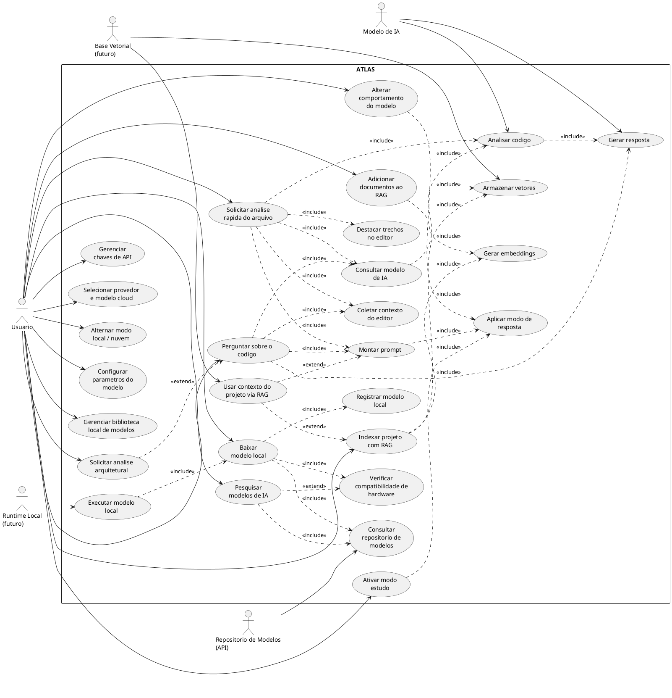

## 3. Diagrama de Classes - Visao Geral da Extensao

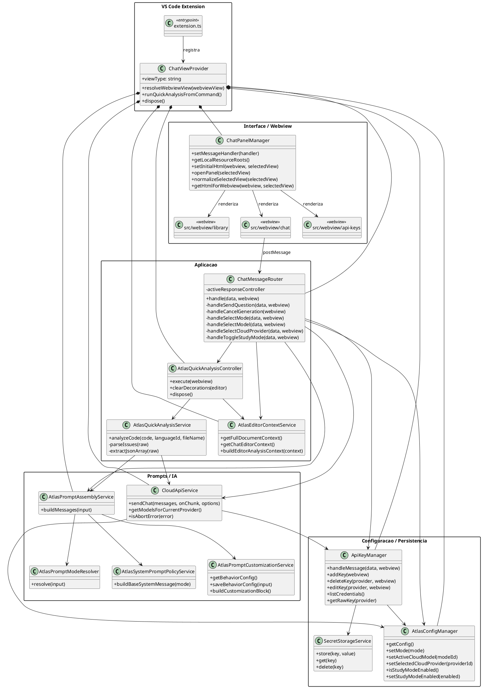

## 4. Diagrama de Classes - Configuracao, Selecao e Persistencia

```plantuml
@startuml
skinparam shadowing false
skinparam classAttributeIconSize 0
skinparam packageStyle rectangle

package "Managers" {
  class AtlasConfigManager {
    -defaults
    -repository
    -settingsService
    -providerService
    -modelRegistry
    -selectionService
    +getConfig()
    +saveConfig(config)
    +resetConfig()
    +updateSecuritySettings(settings)
    +updateLlmDefaults(defaults)
    +getCurrentMode()
    +setMode(mode)
    +setActiveLocalModel(modelId)
    +setSelectedCloudProvider(providerId)
    +setActiveCloudModel(modelId)
    +getAllProviders()
    +addProvider(provider)
    +updateProvider(providerId, partialData)
    +removeProvider(providerId)
    +getAllModels()
    +getLocalModels()
    +isStudyModeEnabled()
    +setStudyModeEnabled(enabled)
  }
}

package "Services" {
  class AtlasSettingsService {
    +getConfig()
    +saveConfig(config)
    +resetConfig()
    +getSection(section)
    +updateSection(section, partialData)
    +updateSecuritySettings(settings)
    +updateRagSettings(settings)
    +updateLlmDefaults(defaults)
    +updateCustomRoot(customData)
  }

  class AtlasProviderService {
    +getAllProviders()
    +getProvider(providerId)
    +getSelectedProvider()
    +saveProviders(providers)
    +addProvider(provider)
    +updateProvider(providerId, partialData)
    +removeProvider(providerId)
  }

  class AtlasModelRegistryService {
    +getAllModels()
    +getLocalModel(modelId)
    +getLocalModels()
    +upsertModel(model)
    +updateModel(modelId, partialData)
    +removeModel(modelId)
  }

  class AtlasSelectionService {
    +getCurrentMode()
    +isCloudMode()
    +isLocalMode()
    +setMode(mode)
    +setActiveLocalModel(modelId)
    +setSelectedCloudProvider(providerId)
    +setActiveCloudModel(modelId)
    +getResolvedCloudSelection()
    +getResolvedLocalSelection()
    +getResolvedSelectionForCurrentMode()
  }
}

package "Repository" {
  class AtlasConfigRepository {
    -configDirPath
    -configFilePath
    +load()
    +save(config)
    +reset()
  }

  class AtlasConfigDefaults {
    +createDefaultConfig()
    +mergeWithDefaults(partial)
  }
}

package "Types" {
  interface AtlasConfigSchema
  interface ProviderConfig
  interface AtlasModelConfig
  interface AtlasLlmSelection
  interface AtlasStudyModeConfig
  interface AtlasCustomSettings
}

database "config/atlas-config.json" as ConfigFile

AtlasConfigManager *-- AtlasConfigDefaults
AtlasConfigManager *-- AtlasConfigRepository
AtlasConfigManager *-- AtlasSettingsService
AtlasConfigManager *-- AtlasProviderService
AtlasConfigManager *-- AtlasModelRegistryService
AtlasConfigManager *-- AtlasSelectionService

AtlasSettingsService --> AtlasConfigRepository
AtlasProviderService --> AtlasConfigRepository
AtlasModelRegistryService --> AtlasConfigRepository
AtlasSelectionService --> AtlasConfigRepository
AtlasSelectionService --> AtlasProviderService
AtlasSelectionService --> AtlasModelRegistryService

AtlasConfigRepository --> AtlasConfigDefaults
AtlasConfigRepository --> ConfigFile : le/grava
AtlasConfigRepository ..> AtlasConfigSchema
AtlasConfigDefaults ..> AtlasConfigSchema
AtlasConfigSchema *-- ProviderConfig
AtlasConfigSchema *-- AtlasLlmSelection
AtlasConfigSchema *-- AtlasCustomSettings
AtlasCustomSettings *-- AtlasStudyModeConfig
AtlasConfigSchema *-- AtlasModelConfig
@enduml
```

## 5. Diagrama de Classes - Prompt e Integracao com IA

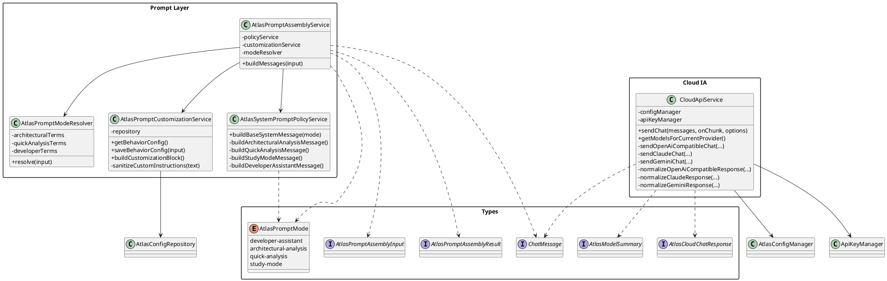

## 6. Diagrama de Sequencia - Perguntar sobre o Codigo

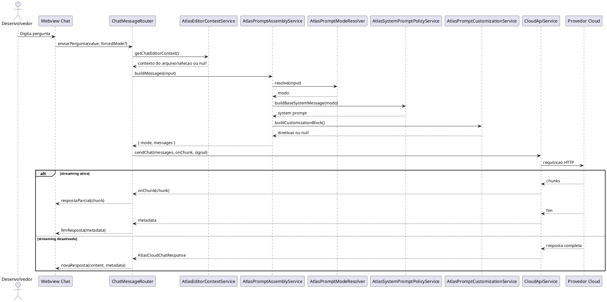

## 7. Diagrama de Sequencia - Analise Rapida

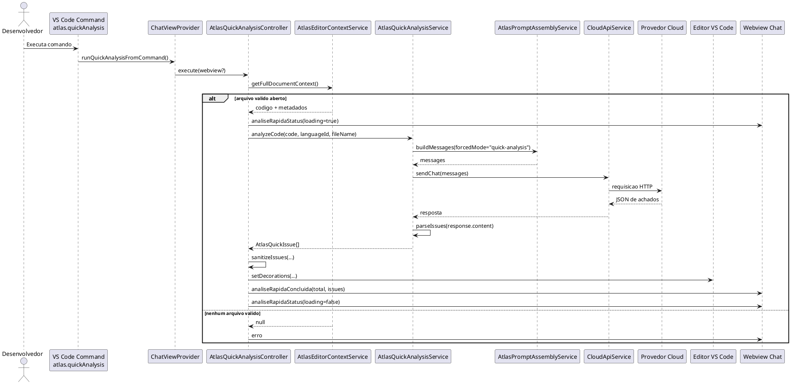

## 8. Diagrama de Sequencia - Ativar Modo Estudo

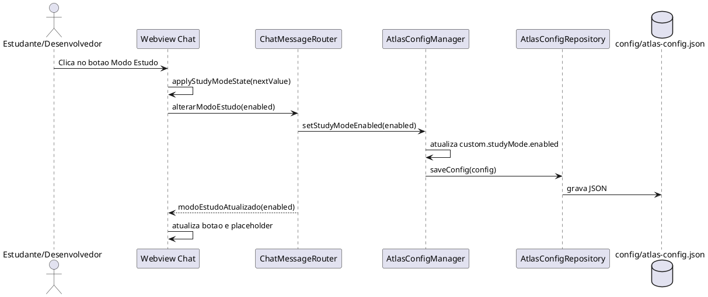

## 9. Diagrama de Sequencia - Perguntar com Modo Estudo Ativo

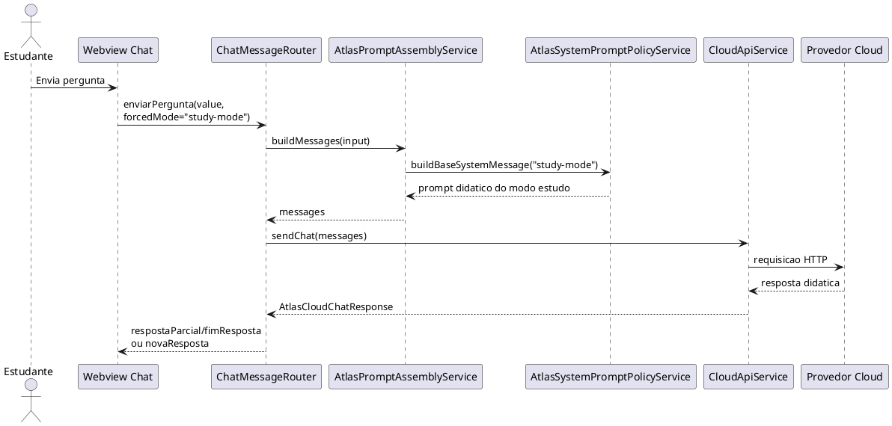

## 10. Diagrama de Sequencia - Gerenciar Chave de API

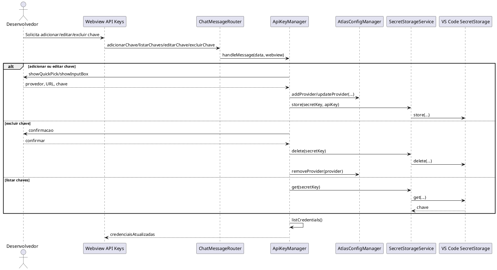

## 11. Diagrama de Sequencia - Selecionar Provedor e Modelo Cloud

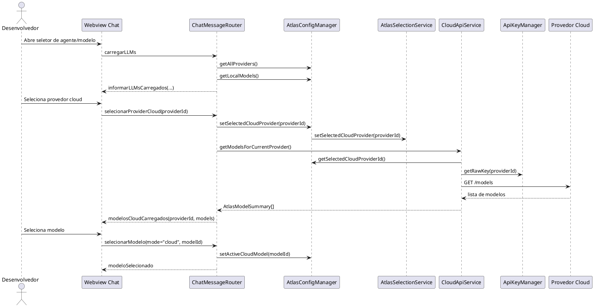

## 12. Diagrama de Sequencia - Configuracoes de Seguranca e Execucao

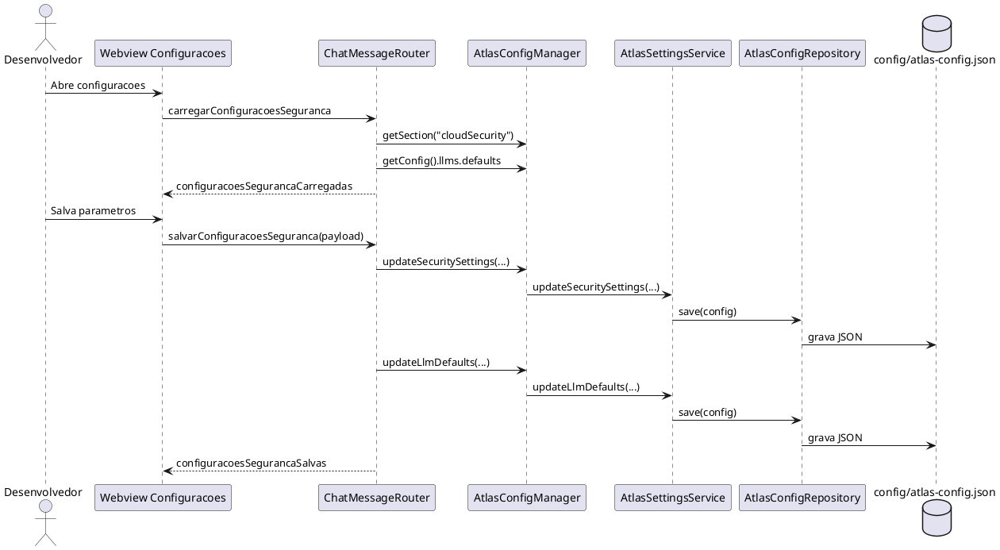

## 13. Diagrama de Sequencia - Pesquisar Modelos de IA (Futuro)

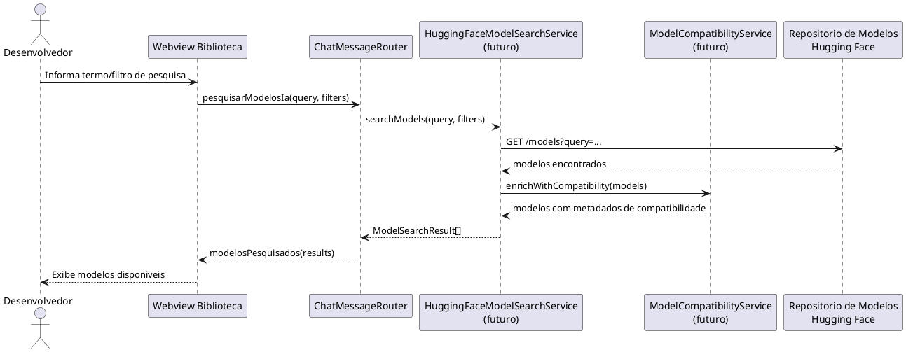

## 14. Diagrama de Sequencia - Baixar Modelo Local (Futuro)

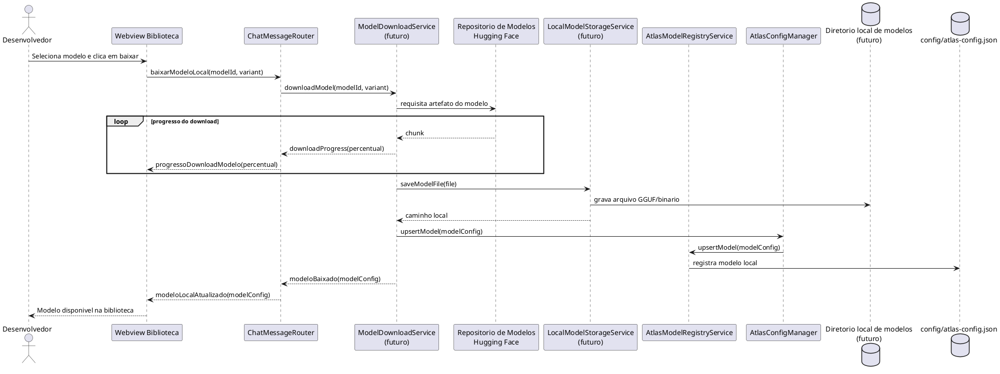
