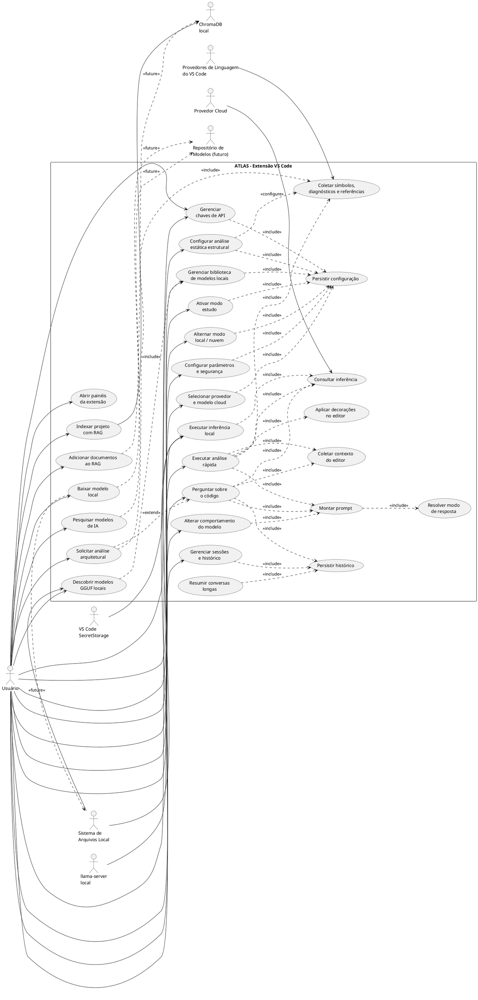
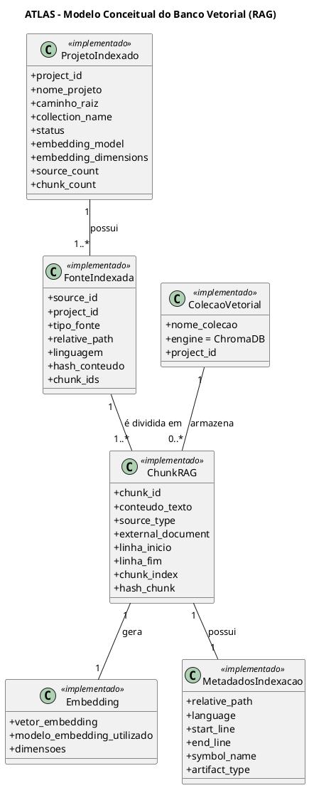
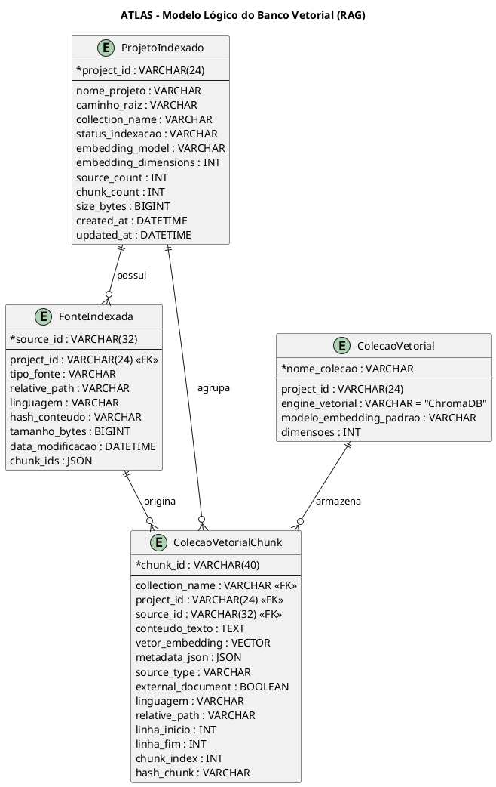

# Casos de Uso e Diagramas PlantUML - ATLAS

Este arquivo contém os casos de uso e os diagramas PlantUML atualizados com base na implementação atual do ATLAS.
Os blocos podem ser copiados diretamente para o PlantText ou para uma extensão PlantUML compatível com UTF-8.

> **Nota de atualização:** a arquitetura atual do ATLAS é uma extensão do VS Code implementada em TypeScript. O ponto central de inferência é o `AtlasInferenceService`, que decide entre execução em nuvem e execução local. O projeto possui sessões, histórico, resumo de conversas, modelos `.gguf`, análise rápida e contexto estrutural do VS Code. O RAG local também está implementado: `AtlasRagService` coordena indexação e recuperação, `AtlasEmbeddingService` gera vetores localmente, `AtlasChromaService` gerencia o processo ChromaDB empacotado e `AtlasRagRepository` mantém coleções e manifesto. Documentos externos, busca real em Hugging Face e download automatizado de modelos de chat permanecem como evolução.

## Pontos atualizados na versão 1.5

- RAG local integrado ao fluxo de resposta do chat, com fontes persistidas nas mensagens.
- ChromaDB iniciado automaticamente em porta local dinâmica e persistido no `globalStorageUri`.
- Indexação do workspace atual ou de pasta selecionada, com coleção independente por projeto.
- Barra de progresso por arquivos e chunks, cancelamento, reindexação e exclusão da base.
- Configurações de indexação e recuperação, incluindo controles separados para Markdown e JSON/configurações.
- Watcher e debounce implementados; a atualização automática atual reconstrói o índice completo.
- Recuperação com distância/relevância, diversidade, filtros por linguagem/diretório, prioridade de fonte e orçamento de contexto.
- Tela RAG com status da base vetorial no topo, projetos indexados em destaque, documentos externos preparados e carregamento inicial não bloqueante.
- Seleção de modelos de embeddings por pasta configurável, com atualização ao abrir o seletor e download do modelo padrão quando necessário.

## Pontos atualizados na versão 1.4

- `AtlasDocumentStructureService` coleta símbolos hierárquicos e intervalos de linha pelo comando `vscode.executeDocumentSymbolProvider`, resume diagnósticos publicados no editor e pode consultar referências externas com `vscode.executeReferenceProvider`.
- A coleta estrutural possui fallback explícito para o conteúdo textual quando a extensão da linguagem não oferece símbolos ou quando ocorre falha na consulta.
- A tela **Configurações Gerais** permite ativar globalmente a análise estática e escolher seu uso na Análise Rápida e na Análise Arquitetural, além da inclusão opcional de diagnósticos e relações entre símbolos.
- `ChatResponseController` recompõe o prompt arquitetural com o contexto estrutural quando o modo resolvido é `architectural-analysis` e a opção correspondente está habilitada.
- `AtlasQuickAnalysisService` usa a estrutura como evidência auxiliar, solicita cobertura completa do arquivo e normaliza também os campos `impact` e `suggestion`.
- `AtlasQuickAnalysisController` mantém achados por documento, restaura as decorações ao alternar editores, invalida marcações quando o texto muda e oferece limpeza manual pela Webview.
- O hover das marcações passou a separar observação, impacto e sugestão, deixando explícito que a recomendação deve ser validada no contexto do projeto.

## Pontos consolidados da versão 1.3

- `AtlasPromptModeResolver` passou a decidir entre `developer-assistant`, `architectural-analysis` e `quick-analysis` por uma heurística pontuada, combinando frases explícitas, sinais arquiteturais fortes, termos contextuais, intenção de análise e termos de desenvolvimento.
- `AtlasSystemPromptPolicyService` agora define um prompt arquitetural obrigatório em 8 tópicos Markdown, um prompt de análise rápida com taxonomia de categorias/severidades e regras rígidas para saída JSON, além de orientações para não transformar respostas comuns em análise formal.
- `ChatResponseController` mantém snapshot da geração ativa, cancela geração anterior, serializa geração em andamento para troca de sessão e delega ao fluxo de análise rápida quando o modo resolvido é `quick-analysis`.
- `AtlasQuickAnalysisService` numera o arquivo antes de enviar ao modelo, força o modo `quick-analysis`, extrai arrays JSON mesmo quando há texto extra e normaliza aliases de severidade e categoria.
- `AtlasQuickAnalysisController` aceita origem da execução (`button` ou `chat`), propaga `sessionId` para a Webview, sanitiza intervalos de linha, limpa decorações quando não há achados e aplica cores/hover por severidade.

## 1. Diagrama de Casos de Uso



## 2. Diagrama de Classes - Visão Geral da Extensão

```plantuml
@startuml
skinparam shadowing false
skinparam classAttributeIconSize 0
skinparam packageStyle rectangle

package "Entrada VS Code" {
  class "extension.ts" as ExtensionEntry <<entrypoint>>
  class ChatViewProvider {
    +resolveWebviewView(webviewView)
    +dispose()
  }
}

package "Interface / Webview" {
  class ChatPanelManager {
    +setInitialHtml(webview, selectedView)
    +openPanel(selectedView)
    +getHtmlForWebview(webview, selectedView)
  }

  class "src/webview/chat" as WebviewChat <<webview>>
  class "src/webview/atlas" as WebviewAtlas <<webview>>
  class "src/webview/api-keys" as WebviewApiKeys <<webview>>
  class "src/webview/library" as WebviewLibrary <<webview>>
  class "src/webview/rag" as WebviewRag <<webview>>
}

package "Aplicação" {
  class ChatMessageRouter {
    +handle(data, webview)
    -handleSendQuestion(data, webview)
    -handleCancelGeneration(webview)
    -handleSelectMode(data, webview)
    -handleSelectModel(data, webview)
  }

  class ChatResponseController {
    +handleSendQuestion(data, webview)
    +handleCancelGeneration(webview)
    +serializeActiveGeneration()
    -handleQuickAnalysisFromChat(sessionId, userContent, webview)
    -notifyResponseCompletedIfAway(session)
  }

  class ChatSessionController {
    +handleCreateSession(data, webview)
    +handleSwitchSession(data, webview)
    +handleRenameSession(data, webview)
    +handleDeleteSession(data, webview)
    +handleListSessions(webview)
  }

  class ChatModelWebviewService {
    +sendModelsToWebview(webview)
    +sendLocalEngineHealth(webview)
  }
}

package "Contexto e Análise" {
  class AtlasEditorContextService {
    +getFullDocumentContext()
    +getChatEditorContext()
    +buildEditorAnalysisContext(context)
  }

  class AtlasQuickAnalysisController {
    +execute(webview, options)
    +clearDecorations(editor)
    +hasActiveDecorations()
    +clearActiveDecorations()
    +dispose()
    -restoreDecorations(editor)
    -sanitizeIssues(issues, lineCount)
    -applyDecorations(editor, issues)
    -buildHoverMessage(issue)
  }

  class AtlasQuickAnalysisService {
    +analyzeCode(document, code, languageId, fileName)
    -buildQuickAnalysisPrompt(code, structureSummary, languageId, fileName)
    -addLineNumbers(code)
    -parseIssues(raw)
    -normalizeSeverity(value)
    -normalizeCategory(value)
    -extractJsonArray(raw)
  }

  class AtlasDocumentStructureService {
    +collect(document)
    +buildSummary(structure)
    +buildDiagnosticsSummary(document)
    +buildSymbolRelationsSummary(document)
  }
}

package "Inferência" {
  class AtlasInferenceService {
    +sendChat(messages, onChunk, options)
    +isAbortError(error)
  }

  class CloudApiService {
    +sendChat(messages, onChunk, options)
    +getModelsForCurrentProvider()
  }

  class LocalApiService {
    +sendChat(messages, onChunk, options)
    +isAbortError(error)
  }

  class AtlasLocalEngineService {
    +ensureEngine(model)
    +stopEngine()
    +restartEngine(model)
    +isRunning()
    +getEnginesDir()
  }
}

package "RAG Local" {
  class AtlasRagService {
    +indexCurrentWorkspace(onProgress, signal)
    +indexSelectedFolder(folderUri, onProgress, signal)
    +indexProject(projectId, onProgress, signal)
    +retrieveContext(query, signal)
    +deleteProjectIndex(projectId)
  }

  class AtlasEmbeddingService {
    +embedDocuments(texts, signal)
    +embedQuery(text, signal)
  }

  class AtlasEmbeddingModelDiscoveryService {
    +refreshEmbeddingModels()
    +getModelsDir()
    +resolveActiveModel()
    +downloadDefaultEmbeddingModel()
  }

  class AtlasChromaService {
    +ensureReady()
    +getStatus()
    +stop()
  }

  class AtlasRagRepository {
    +listProjects()
    +upsertChunks(collection, chunks)
    +search(collection, embedding, topK)
    +deleteProject(projectId)
  }

  database "ChromaDB local" as ChromaDb
  artifact "index-manifest.json" as RagManifest
}

package "Prompts e Sessões" {
  class AtlasPromptAssemblyService {
    +buildMessages(input)
  }

  class AtlasPromptModeResolver {
    +resolve(input)
    -scoreTerms(question, terms, weight)
    -hasAnyTerm(question, terms)
    -normalize(text)
  }

  class AtlasSystemPromptPolicyService {
    +buildBaseSystemMessage(mode)
    -buildArchitecturalAnalysisMessage()
    -buildQuickAnalysisMessage()
    -buildStudyModeMessage()
    -buildDeveloperAssistantMessage()
  }

  class AtlasPromptCustomizationService {
    +getBehaviorConfig()
    +saveBehaviorConfig(input)
    +buildCustomizationBlock()
  }

  class AtlasSessionService {
    +createSession()
    +appendMessage(sessionId, message)
    +summarizeIfNeeded(sessionId)
  }
}

package "Configuração / Persistência" {
  class AtlasConfigManager
  class AtlasConfigRepository
  class AtlasHistoryRepository
  class ApiKeyManager
  class SecretStorageService
  class AtlasLocalModelDiscoveryService
  class AtlasModelRegistryService
}

ExtensionEntry --> ChatViewProvider : registra view
ChatViewProvider *-- ChatPanelManager
ChatViewProvider *-- ChatMessageRouter
ChatViewProvider *-- ChatResponseController
ChatViewProvider *-- ChatSessionController
ChatViewProvider *-- ChatModelWebviewService

ChatPanelManager --> WebviewChat : renderiza
ChatPanelManager --> WebviewAtlas : renderiza
ChatPanelManager --> WebviewApiKeys : renderiza
ChatPanelManager --> WebviewLibrary : renderiza
ChatPanelManager --> WebviewRag : renderiza
WebviewChat --> ChatMessageRouter : postMessage
WebviewRag --> ChatMessageRouter : postMessage

ChatMessageRouter --> ChatResponseController
ChatMessageRouter --> ChatSessionController
ChatMessageRouter --> ChatModelWebviewService
ChatMessageRouter --> AtlasQuickAnalysisController
ChatMessageRouter --> ApiKeyManager
ChatMessageRouter --> AtlasConfigManager
ChatMessageRouter --> AtlasRagService : indexação e gestão

ChatResponseController --> AtlasEditorContextService
ChatResponseController --> AtlasDocumentStructureService : análise arquitetural
ChatResponseController --> AtlasRagService : recuperar contexto
ChatResponseController --> AtlasPromptAssemblyService
ChatResponseController --> AtlasInferenceService
ChatResponseController --> AtlasSessionService
ChatResponseController --> AtlasQuickAnalysisController : modo quick-analysis

AtlasQuickAnalysisController --> AtlasEditorContextService
AtlasQuickAnalysisController --> AtlasQuickAnalysisService
AtlasQuickAnalysisService --> AtlasPromptAssemblyService
AtlasQuickAnalysisService --> AtlasInferenceService
AtlasQuickAnalysisService --> AtlasDocumentStructureService

AtlasInferenceService --> CloudApiService : modo cloud
AtlasInferenceService --> LocalApiService : modo local
LocalApiService --> AtlasLocalEngineService

AtlasRagService --> AtlasEmbeddingService
AtlasEmbeddingService --> AtlasEmbeddingModelDiscoveryService
AtlasRagService --> AtlasChromaService
AtlasRagService --> AtlasRagRepository
AtlasRagRepository --> AtlasChromaService
AtlasRagRepository --> ChromaDb
AtlasRagRepository --> RagManifest

AtlasPromptAssemblyService --> AtlasPromptModeResolver
AtlasPromptAssemblyService --> AtlasSystemPromptPolicyService
AtlasPromptAssemblyService --> AtlasPromptCustomizationService
AtlasPromptAssemblyService --> AtlasSessionService

AtlasSessionService --> AtlasHistoryRepository
AtlasConfigManager --> AtlasConfigRepository
AtlasConfigManager --> AtlasModelRegistryService
AtlasLocalModelDiscoveryService --> AtlasModelRegistryService
ApiKeyManager --> SecretStorageService
@enduml
```

## 3. Diagrama de Classes - Configuração, Seleção e Persistência

```plantuml
@startuml
skinparam shadowing false
skinparam classAttributeIconSize 0
skinparam packageStyle rectangle

package "Gerência de Configuração" {
  class AtlasConfigManager {
    +getConfig()
    +saveConfig(config)
    +resetConfig()
    +setMode(mode)
    +setActiveLocalModel(modelId)
    +setSelectedCloudProvider(providerId)
    +setActiveCloudModel(modelId)
    +getAllProviders()
    +getLocalModels()
    +isStudyModeEnabled()
    +setStudyModeEnabled(enabled)
    +getStaticAnalysisConfig()
    +isStaticAnalysisEnabledFor(mode)
  }

  class AtlasSettingsService {
    +updateSecuritySettings(settings)
    +updateRagSettings(settings)
    +updateLlmDefaults(defaults)
    +updateCustomRoot(customData)
  }

  class AtlasSelectionService {
    +getCurrentMode()
    +isCloudMode()
    +isLocalMode()
    +getResolvedSelectionForCurrentMode()
  }

  class AtlasProviderService {
    +getAllProviders()
    +getSelectedProvider()
    +addProvider(provider)
    +updateProvider(providerId, partialData)
    +removeProvider(providerId)
  }

  class AtlasModelRegistryService {
    +getAllModels()
    +getLocalModels()
    +upsertModel(model)
    +removeModel(modelId)
  }

  interface AtlasStaticAnalysisConfig {
    enabled
    useInQuickAnalysis
    useInArchitecturalAnalysis
    includeDiagnostics
    includeSymbolRelations
  }
}

package "Persistência" {
  class AtlasConfigRepository {
    +load()
    +save(config)
    +reset()
  }

  class AtlasHistoryRepository {
    +load()
    +save(history)
  }

  class AtlasConfigDefaults {
    +createDefaultConfig()
    +mergeWithDefaults(partial)
  }

  database "config/atlas-config.json" as ConfigFile
  database "config/atlas-history.json" as HistoryFile
}

package "Sessões" {
  class AtlasSessionService {
    +createSession()
    +listSessions()
    +switchSession(sessionId)
    +appendMessage(sessionId, message)
    +summarizeIfNeeded(sessionId)
  }

  class ChatSessionController {
    +handleCreateSession(data, webview)
    +handleSwitchSession(data, webview)
    +handleRenameSession(data, webview)
    +handleDeleteSession(data, webview)
    +handleListSessions(webview)
  }
}

package "Segredos" {
  class ApiKeyManager {
    +addKey(webview)
    +editKey(provider, webview)
    +deleteKey(provider, webview)
    +listCredentials()
    +getRawKey(provider)
  }

  class SecretStorageService {
    +store(key, value)
    +get(key)
    +delete(key)
  }

  database "VS Code SecretStorage" as VSSecrets
}

AtlasConfigManager *-- AtlasSettingsService
AtlasConfigManager *-- AtlasSelectionService
AtlasConfigManager *-- AtlasProviderService
AtlasConfigManager *-- AtlasModelRegistryService
AtlasConfigManager --> AtlasConfigRepository
AtlasConfigManager ..> AtlasStaticAnalysisConfig
AtlasConfigRepository --> AtlasConfigDefaults
AtlasConfigRepository --> ConfigFile : lê/grava

ChatSessionController --> AtlasSessionService
AtlasSessionService --> AtlasHistoryRepository
AtlasHistoryRepository --> HistoryFile : lê/grava

ApiKeyManager --> SecretStorageService
ApiKeyManager --> AtlasConfigManager
SecretStorageService --> VSSecrets : lê/grava
@enduml
```

## 4. Diagrama de Classes - Prompt e Integração com IA

```plantuml
@startuml
skinparam shadowing false
skinparam classAttributeIconSize 0
skinparam packageStyle rectangle

package "Prompt Layer" {
  class AtlasPromptAssemblyService {
    +buildMessages(input)
  }

  class AtlasPromptModeResolver {
    +resolve(input)
    -scoreTerms(question, terms, weight)
    -hasAnyTerm(question, terms)
    -normalize(text)
  }

  class AtlasSystemPromptPolicyService {
    +buildBaseSystemMessage(mode)
    -buildArchitecturalAnalysisMessage()
    -buildQuickAnalysisMessage()
    -buildStudyModeMessage()
    -buildDeveloperAssistantMessage()
  }

  class AtlasPromptCustomizationService {
    +getBehaviorConfig()
    +saveBehaviorConfig(input)
    +buildCustomizationBlock()
  }

  class AtlasSessionService {
    +getWindowMessages(session)
    +getMessagesToSummarize(session)
    +summarizeIfNeeded(sessionId)
  }
}

package "Inferência" {
  class AtlasInferenceService {
    +sendChat(messages, onChunk, options)
    +isAbortError(error)
  }

  class CloudApiService {
    +sendChat(messages, onChunk, options)
    +getModelsForCurrentProvider()
    -sendOpenAiCompatibleChat(...)
    -sendClaudeChat(...)
    -sendGeminiChat(...)
  }

  class LocalApiService {
    +sendChat(messages, onChunk, options)
    -buildLocalEndpoint()
    -streamLocalResponse(...)
  }

  class AtlasLocalEngineService {
    +ensureEngine(model)
    +stopEngine()
    +restartEngine(model)
    +isRunning()
    -waitUntilReady()
  }
}

package "Configuração" {
  class AtlasConfigManager
  class ApiKeyManager
  class AtlasLocalModelDiscoveryService
}

package "Contexto Estrutural" {
  class AtlasDocumentStructureService {
    +collect(document)
    +buildSummary(structure)
    +buildDiagnosticsSummary(document)
    +buildSymbolRelationsSummary(document)
  }

  interface AtlasDocumentStructure
  interface AtlasCodeSymbol
}

package "Tipos" {
  enum AtlasPromptMode {
    developer-assistant
    architectural-analysis
    quick-analysis
    study-mode
  }

  interface ChatMessage
  interface AtlasCloudChatResponse
  interface AtlasLocalEngineHealth
  interface AtlasModelSummary
}

AtlasPromptAssemblyService --> AtlasPromptModeResolver
AtlasPromptAssemblyService --> AtlasSystemPromptPolicyService
AtlasPromptAssemblyService --> AtlasPromptCustomizationService
AtlasPromptAssemblyService --> AtlasSessionService
AtlasPromptAssemblyService ..> ChatMessage
AtlasPromptAssemblyService ..> AtlasPromptMode

AtlasInferenceService --> AtlasConfigManager
AtlasInferenceService --> CloudApiService : cloud
AtlasInferenceService --> LocalApiService : local
CloudApiService --> AtlasConfigManager
CloudApiService --> ApiKeyManager
LocalApiService --> AtlasConfigManager
LocalApiService --> AtlasLocalEngineService
LocalApiService --> AtlasLocalModelDiscoveryService
AtlasDocumentStructureService ..> AtlasDocumentStructure
AtlasDocumentStructureService ..> AtlasCodeSymbol

CloudApiService ..> AtlasCloudChatResponse
CloudApiService ..> AtlasModelSummary
LocalApiService ..> AtlasLocalEngineHealth
@enduml
```



## 5. Diagrama de Implantação - Visão Atual

```plantuml
@startuml
skinparam shadowing false
skinparam componentStyle rectangle
title ATLAS - Visão de Implantação Atual

node "Máquina do Desenvolvedor\n(Windows + VS Code)" as DevMachine {
  node "Visual Studio Code" as VSCode {
    component "ATLAS Extension\n(TypeScript)" as Extension
    component "Webviews\nchat / atlas / library / api-keys / rag" as Webviews
    component "Serviços da Extensão\nChatResponseController\nAtlasInferenceService\nAtlasSessionService\nAtlasDocumentStructureService\nAtlasRagService" as ExtensionServices
    database "VS Code SecretStorage" as SecretStorage
  }

  folder "Configuração Local" as LocalConfig {
    artifact "config/atlas-config.json" as ConfigJson
    artifact "config/atlas-history.json" as HistoryJson
  }

  folder "Modelos Locais" as LocalModels {
    artifact "Arquivos .gguf" as GgufModels
  }

  folder "Engines Locais" as LocalEngines {
    artifact "llama.cpp\nCPU / CUDA / Vulkan" as LlamaBins
  }

  node "Processo Local" as LocalProcess {
    component "llama-server\n127.0.0.1:8080" as LlamaServer
  }

  folder "Runtime RAG Empacotado" as RagRuntime {
    artifact "chromadb-binding.node" as ChromaBinding
    artifact "Modelo atlas-embedding\nopcional no pacote" as BundledEmbedding
  }

  folder "Pasta configurável de embeddings" as EmbeddingFolder {
    artifact "Modelos Transformers.js / ONNX" as EmbeddingModels
  }

  folder "VS Code globalStorageUri/rag/embedding-models" as UserEmbeddingFolder {
    artifact "Modelo padrão baixado" as DownloadedEmbeddingModel
  }

  node "Processo ChromaDB Local" as ChromaProcess {
    component "chroma-runner.cjs\n127.0.0.1:porta dinâmica" as ChromaRunner
  }

  folder "VS Code globalStorageUri/rag" as RagStorage {
    database "chroma/" as VectorDb
    artifact "index-manifest.json" as RagManifest
  }
}

cloud "Provedores de IA em Nuvem\nOpenAI-compatible / Claude / Gemini / xAI" as CloudProviders
cloud "Repositório de Modelos\nHugging Face (futuro)" as ModelRepository

Webviews --> Extension : postMessage
Extension --> ExtensionServices : delega ações
ExtensionServices --> SecretStorage : consulta chaves
ExtensionServices --> ConfigJson : lê/grava configurações
ExtensionServices --> HistoryJson : lê/grava sessões e resumos
ExtensionServices --> GgufModels : descobre modelos locais
ExtensionServices --> VSCode : consulta símbolos, diagnósticos e referências
ExtensionServices --> LlamaBins : seleciona engine
ExtensionServices --> LlamaServer : inicia/para e envia requisições
LlamaServer --> GgufModels : carrega modelo
ExtensionServices --> CloudProviders : inferência cloud
ExtensionServices ..> ModelRepository : busca/download planejado
ExtensionServices --> BundledEmbedding : descobre modelo empacotado
ExtensionServices --> EmbeddingModels : descobre modelo selecionado
ExtensionServices --> DownloadedEmbeddingModel : baixa modelo padrão
ExtensionServices --> ChromaRunner : inicia/para e consulta
ChromaRunner --> ChromaBinding : carrega binding nativo
ChromaRunner --> VectorDb : persiste coleções
ExtensionServices --> RagManifest : lê/grava projetos e fontes
@enduml
```



## 6. Modelo Conceitual do Banco Vetorial (RAG)



## 7. Modelo Lógico do Banco Vetorial (RAG)


