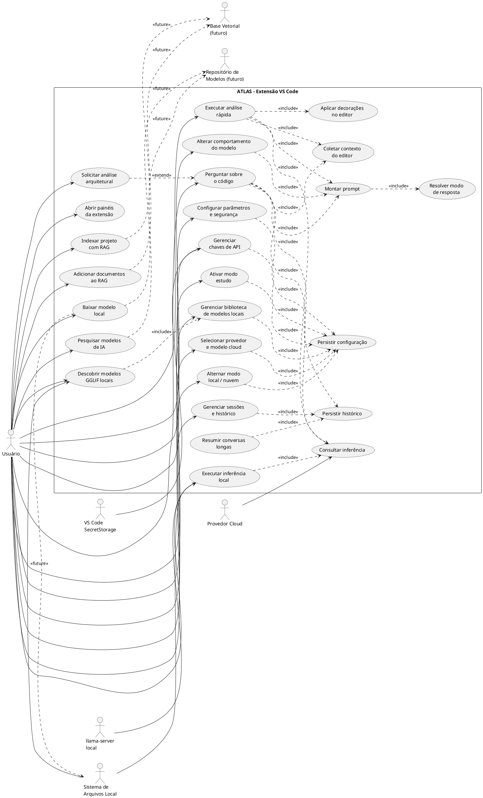
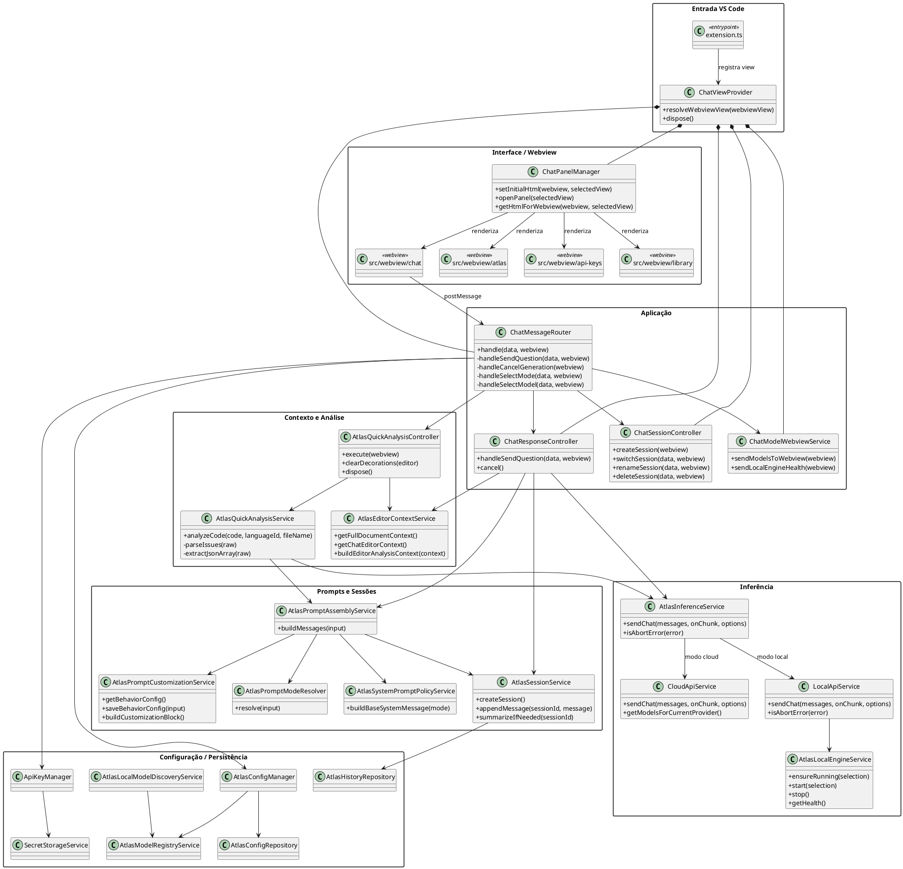
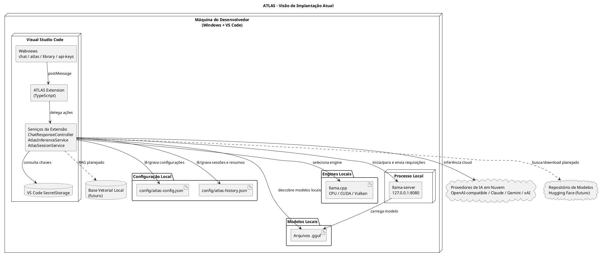
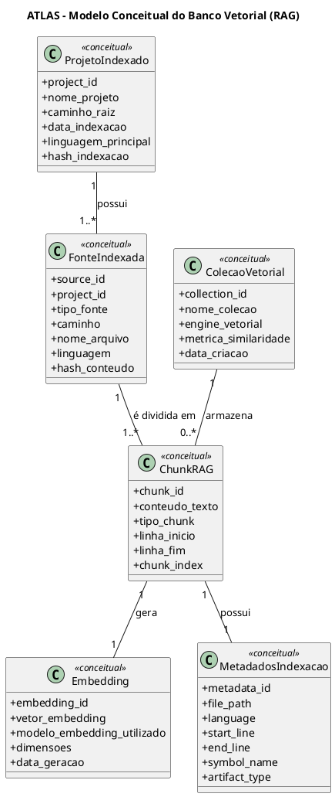
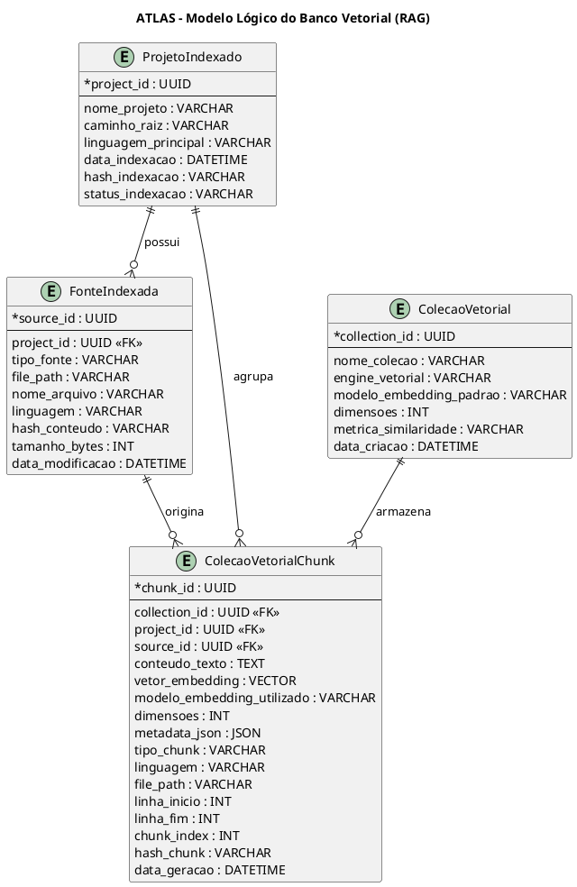

# Casos de Uso e Diagramas PlantUML - ATLAS

Este arquivo contém os casos de uso e os diagramas PlantUML atualizados com base na implementação atual do ATLAS.
Os blocos podem ser copiados diretamente para o PlantText ou para uma extensão PlantUML compatível com UTF-8.

> **Nota de atualização:** a arquitetura atual do ATLAS é uma extensão do VS Code implementada em TypeScript. O ponto central de inferência é o `AtlasInferenceService`, que decide entre execução em nuvem, por meio do `CloudApiService`, e execução local, por meio do `LocalApiService` integrado ao `AtlasLocalEngineService` e ao `llama-server`. O projeto já possui gerenciamento de sessões, histórico persistido, resumo de conversas longas, descoberta de modelos `.gguf`, seleção de provedor/modelo cloud, chaves em `SecretStorage`, análise rápida via Webview e decoração no editor. RAG, ChromaDB, download automatizado de modelos e integração real com repositórios externos permanecem como evolução futura.

## 1. Diagrama de Casos de Uso



## 2. Diagrama de Classes - Visão Geral da Extensão



## 3. Diagrama de Classes - Configuração, Seleção e Persistência

```plantuml
@startuml
skinparam shadowing false
skinparam classAttributeIconSize 0
skinparam packageStyle rectangle

package "Gerência de Configuração" {
  class AtlasConfigManager {
    +getConfig()
    +saveConfig(config)
    +resetConfig()
    +setMode(mode)
    +setActiveLocalModel(modelId)
    +setSelectedCloudProvider(providerId)
    +setActiveCloudModel(modelId)
    +getAllProviders()
    +getLocalModels()
    +isStudyModeEnabled()
    +setStudyModeEnabled(enabled)
  }

  class AtlasSettingsService {
    +updateSecuritySettings(settings)
    +updateRagSettings(settings)
    +updateLlmDefaults(defaults)
    +updateCustomRoot(customData)
  }

  class AtlasSelectionService {
    +getCurrentMode()
    +isCloudMode()
    +isLocalMode()
    +getResolvedSelectionForCurrentMode()
  }

  class AtlasProviderService {
    +getAllProviders()
    +getSelectedProvider()
    +addProvider(provider)
    +updateProvider(providerId, partialData)
    +removeProvider(providerId)
  }

  class AtlasModelRegistryService {
    +getAllModels()
    +getLocalModels()
    +upsertModel(model)
    +removeModel(modelId)
  }
}

package "Persistência" {
  class AtlasConfigRepository {
    +load()
    +save(config)
    +reset()
  }

  class AtlasHistoryRepository {
    +load()
    +save(history)
  }

  class AtlasConfigDefaults {
    +createDefaultConfig()
    +mergeWithDefaults(partial)
  }

  database "config/atlas-config.json" as ConfigFile
  database "config/atlas-history.json" as HistoryFile
}

package "Sessões" {
  class AtlasSessionService {
    +createSession()
    +listSessions()
    +switchSession(sessionId)
    +appendMessage(sessionId, message)
    +summarizeIfNeeded(sessionId)
  }

  class ChatSessionController {
    +createSession(webview)
    +switchSession(data, webview)
    +renameSession(data, webview)
    +deleteSession(data, webview)
  }
}

package "Segredos" {
  class ApiKeyManager {
    +addKey(webview)
    +editKey(provider, webview)
    +deleteKey(provider, webview)
    +listCredentials()
    +getRawKey(provider)
  }

  class SecretStorageService {
    +store(key, value)
    +get(key)
    +delete(key)
  }

  database "VS Code SecretStorage" as VSSecrets
}

AtlasConfigManager *-- AtlasSettingsService
AtlasConfigManager *-- AtlasSelectionService
AtlasConfigManager *-- AtlasProviderService
AtlasConfigManager *-- AtlasModelRegistryService
AtlasConfigManager --> AtlasConfigRepository
AtlasConfigRepository --> AtlasConfigDefaults
AtlasConfigRepository --> ConfigFile : lê/grava

ChatSessionController --> AtlasSessionService
AtlasSessionService --> AtlasHistoryRepository
AtlasHistoryRepository --> HistoryFile : lê/grava

ApiKeyManager --> SecretStorageService
ApiKeyManager --> AtlasConfigManager
SecretStorageService --> VSSecrets : lê/grava
@enduml
```

## 4. Diagrama de Classes - Prompt e Integração com IA

```plantuml
@startuml
skinparam shadowing false
skinparam classAttributeIconSize 0
skinparam packageStyle rectangle

package "Prompt Layer" {
  class AtlasPromptAssemblyService {
    +buildMessages(input)
  }

  class AtlasPromptModeResolver {
    +resolve(input)
  }

  class AtlasSystemPromptPolicyService {
    +buildBaseSystemMessage(mode)
  }

  class AtlasPromptCustomizationService {
    +getBehaviorConfig()
    +saveBehaviorConfig(input)
    +buildCustomizationBlock()
  }

  class AtlasSessionService {
    +getWindowedHistory(sessionId)
    +getSummary(sessionId)
  }
}

package "Inferência" {
  class AtlasInferenceService {
    +sendChat(messages, onChunk, options)
    +isAbortError(error)
  }

  class CloudApiService {
    +sendChat(messages, onChunk, options)
    +getModelsForCurrentProvider()
    -sendOpenAiCompatibleChat(...)
    -sendClaudeChat(...)
    -sendGeminiChat(...)
  }

  class LocalApiService {
    +sendChat(messages, onChunk, options)
    -buildLocalEndpoint()
    -streamLocalResponse(...)
  }

  class AtlasLocalEngineService {
    +ensureRunning(selection)
    +start(selection)
    +stop()
    +waitUntilReady()
  }
}

package "Configuração" {
  class AtlasConfigManager
  class ApiKeyManager
  class AtlasLocalModelDiscoveryService
}

package "Tipos" {
  enum AtlasPromptMode {
    developer-assistant
    architectural-analysis
    quick-analysis
    study-mode
  }

  interface ChatMessage
  interface AtlasCloudChatResponse
  interface AtlasLocalEngineHealth
  interface AtlasModelSummary
}

AtlasPromptAssemblyService --> AtlasPromptModeResolver
AtlasPromptAssemblyService --> AtlasSystemPromptPolicyService
AtlasPromptAssemblyService --> AtlasPromptCustomizationService
AtlasPromptAssemblyService --> AtlasSessionService
AtlasPromptAssemblyService ..> ChatMessage
AtlasPromptAssemblyService ..> AtlasPromptMode

AtlasInferenceService --> AtlasConfigManager
AtlasInferenceService --> CloudApiService : cloud
AtlasInferenceService --> LocalApiService : local
CloudApiService --> AtlasConfigManager
CloudApiService --> ApiKeyManager
LocalApiService --> AtlasConfigManager
LocalApiService --> AtlasLocalEngineService
LocalApiService --> AtlasLocalModelDiscoveryService

CloudApiService ..> AtlasCloudChatResponse
CloudApiService ..> AtlasModelSummary
LocalApiService ..> AtlasLocalEngineHealth
@enduml
```



## 5. Diagrama de Implantação - Visão Atual



## 6. Modelo Conceitual do Banco Vetorial (RAG)



## 7. Modelo Lógico do Banco Vetorial (RAG)


