# Diagramas por Caso de Uso - ATLAS

Este arquivo contem diagramas de classe e de sequencia em PlantUML para cada caso de uso atualizado do ATLAS. Os blocos podem ser copiados diretamente para o PlantText.

## UC001 - Perguntar sobre o codigo pelo chat

### Diagrama de Classes

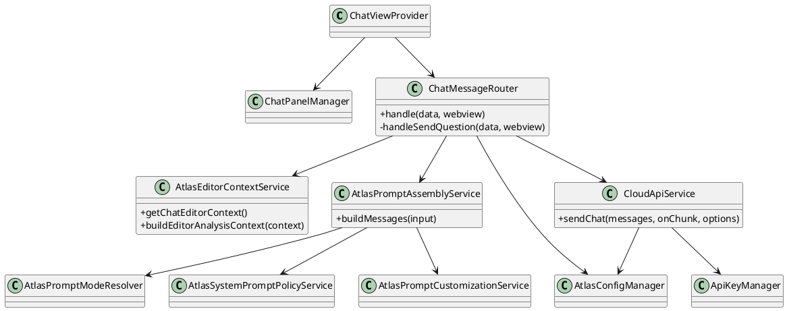

### Diagrama de Sequencia

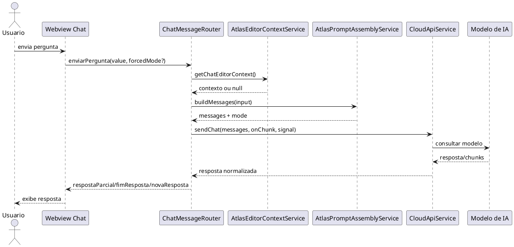

## UC002 - Executar analise rapida do arquivo atual

### Diagrama de Classes

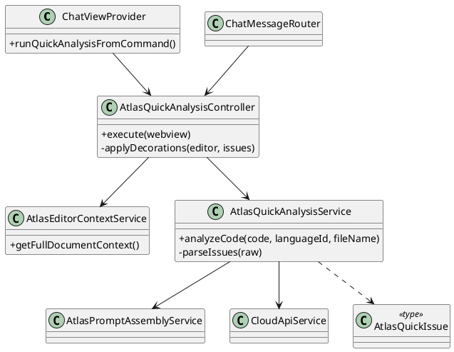

### Diagrama de Sequencia

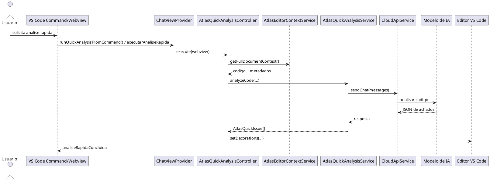

## UC003 - Solicitar analise arquitetural formal

### Diagrama de Classes

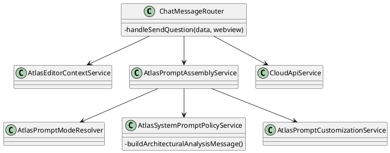

### Diagrama de Sequencia

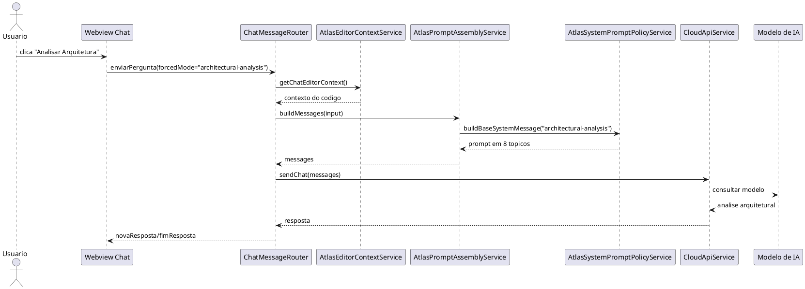

## UC004 - Ativar modo estudo

### Diagrama de Classes

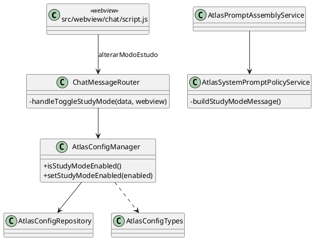

### Diagrama de Sequencia

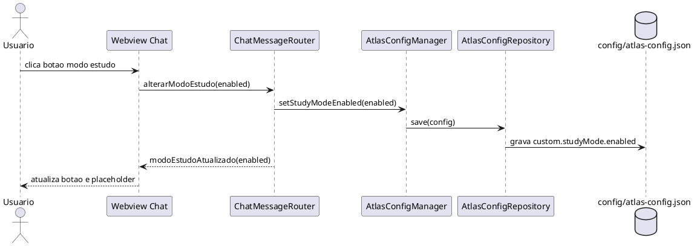

## UC005 - Gerenciar chaves de API

### Diagrama de Classes

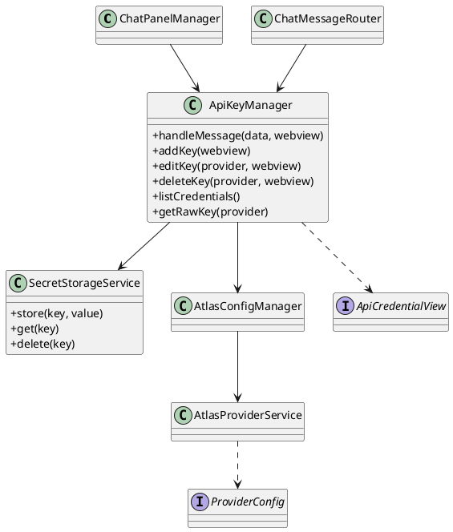

### Diagrama de Sequencia

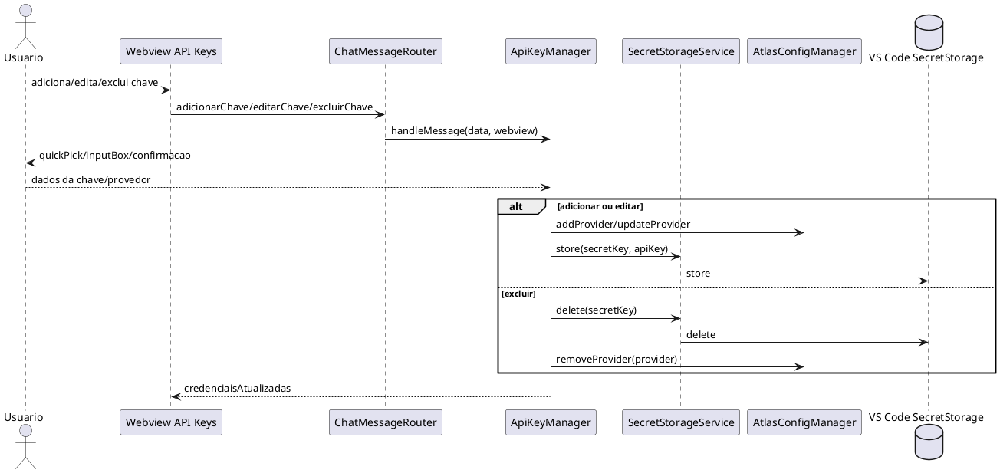

## UC006 - Selecionar provedor e modelo cloud

### Diagrama de Classes

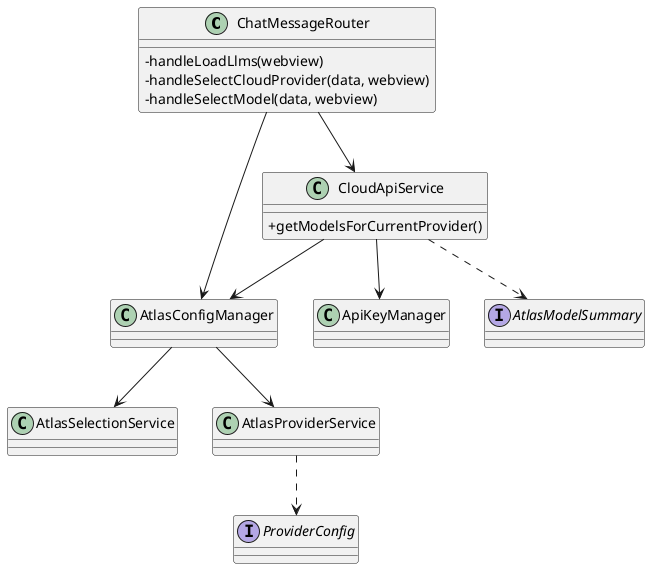

### Diagrama de Sequencia

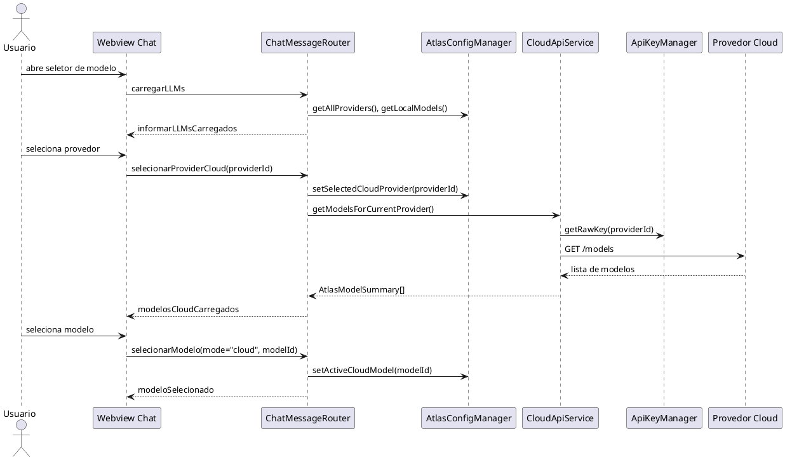

## UC007 - Alternar modo local ou nuvem

### Diagrama de Classes

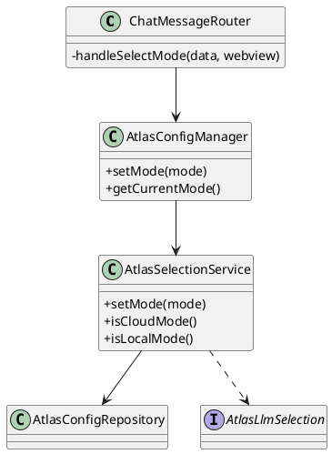

### Diagrama de Sequencia

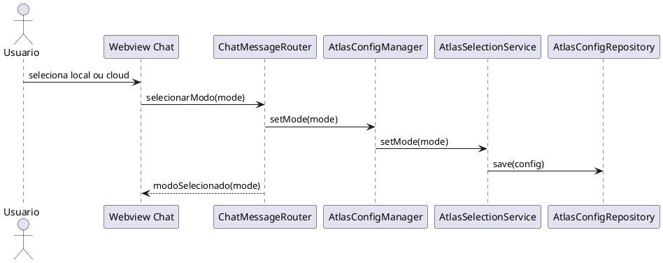

## UC008 - Configurar parametros de execucao e seguranca

### Diagrama de Classes

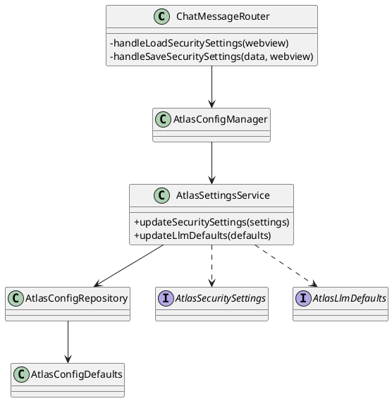

### Diagrama de Sequencia

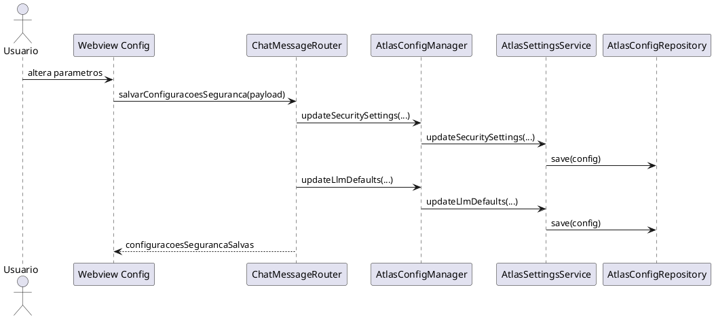

## UC009 - Alterar comportamento do modelo

### Diagrama de Classes

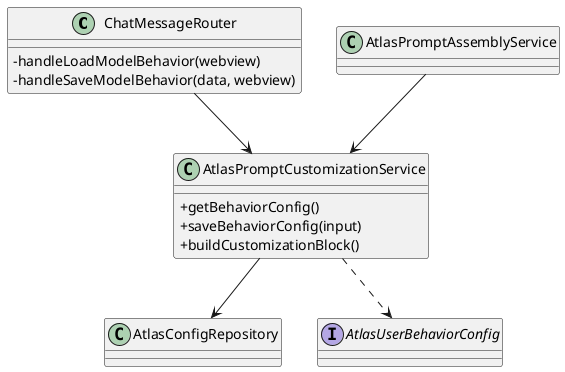

### Diagrama de Sequencia

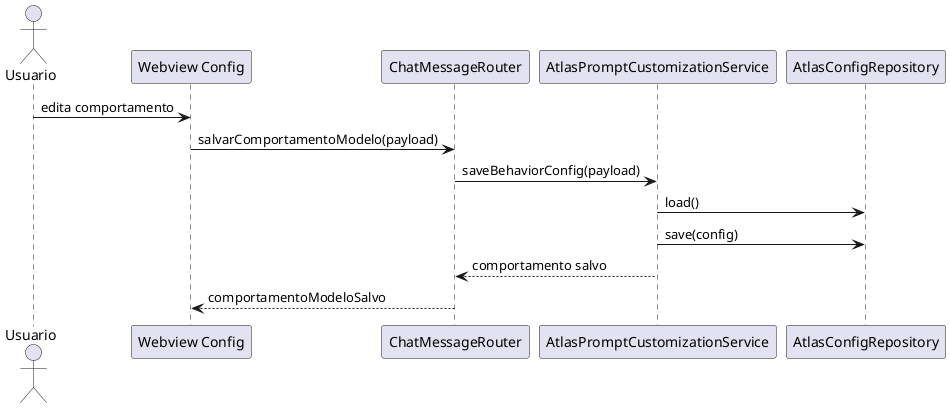

## UC010 - Gerenciar biblioteca/registro de modelos locais

### Diagrama de Classes

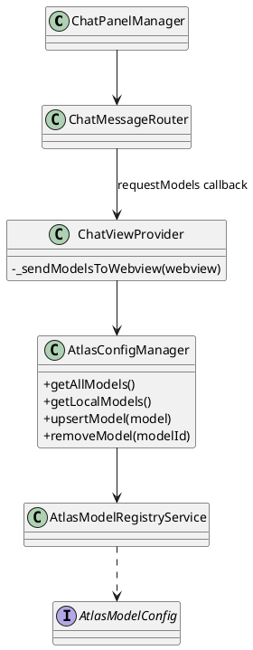

### Diagrama de Sequencia

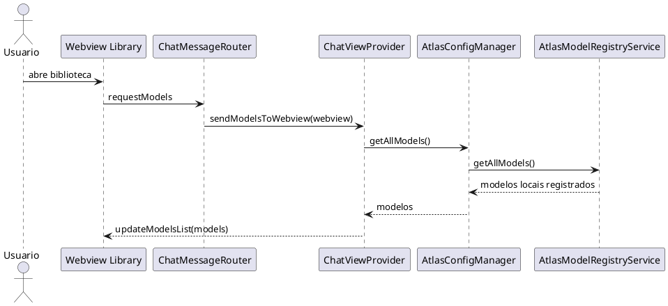

## UC011 - Abrir paineis da extensao

### Diagrama de Classes

```plantuml
@startuml
skinparam shadowing false
skinparam classAttributeIconSize 0

class ChatViewProvider
class ChatPanelManager {
  +openPanel(selectedView)
  +normalizeSelectedView(selectedView)
  +getPanelGroup(selectedView)
  +getHtmlForWebview(webview, selectedView)
}
class ChatMessageRouter
class "src/webview/chat" as ChatWebview
class "src/webview/api-keys" as ApiKeysWebview
class "src/webview/library" as LibraryWebview

ChatViewProvider --> ChatPanelManager
ChatMessageRouter --> ChatPanelManager : openPanel callback
ChatPanelManager --> ChatWebview
ChatPanelManager --> ApiKeysWebview
ChatPanelManager --> LibraryWebview
@enduml
```

### Diagrama de Sequencia

```plantuml
@startuml
skinparam shadowing false
actor Usuario
participant "Webview Chat" as Webview
participant ChatMessageRouter as Router
participant ChatPanelManager as PanelManager
participant "VS Code WebviewPanel" as Panel

Usuario -> Webview : solicita painel
Webview -> Router : abrirPainelConfig(selectedView)
Router -> PanelManager : openPanel(selectedView)
PanelManager -> PanelManager : normalizeSelectedView()
PanelManager -> Panel : createWebviewPanel/reveal
PanelManager -> PanelManager : getHtmlForWebview()
PanelManager --> Panel : html
Panel --> Usuario : painel aberto
@enduml
```

## UC012 - Indexar projeto com RAG (futuro)

### Diagrama de Classes

```plantuml
@startuml
skinparam shadowing false
skinparam classAttributeIconSize 0

class RagConfigurationUI <<future>>
class ProjectIndexer <<future>> {
  +indexProject(workspace)
}
class EmbeddingGenerator <<future>> {
  +generateEmbeddings(chunks)
}
class VectorDatabaseManager <<future>> {
  +saveVectors(vectors)
  +deleteCollection(projectId)
}
class ContextRetriever <<future>>
class AtlasConfigManager
class AtlasConfigRepository
database ChromaDB <<future>>

RagConfigurationUI --> ProjectIndexer
ProjectIndexer --> EmbeddingGenerator
ProjectIndexer --> VectorDatabaseManager
ProjectIndexer --> AtlasConfigManager
AtlasConfigManager --> AtlasConfigRepository
VectorDatabaseManager --> ChromaDB
ContextRetriever --> VectorDatabaseManager
@enduml
```

### Diagrama de Sequencia

```plantuml
@startuml
skinparam shadowing false
actor Usuario
participant "RAG Configuration UI\n(futuro)" as UI
participant "ProjectIndexer\n(futuro)" as Indexer
participant "EmbeddingGenerator\n(futuro)" as Embeddings
participant "VectorDatabaseManager\n(futuro)" as VectorDb
database "ChromaDB\n(futuro)" as Chroma

Usuario -> UI : solicita indexacao do projeto
UI -> Indexer : indexProject(workspace)
Indexer -> Indexer : ler arquivos e gerar chunks
Indexer -> Embeddings : generateEmbeddings(chunks)
Embeddings --> Indexer : vetores
Indexer -> VectorDb : saveVectors(vectors)
VectorDb -> Chroma : persistir embeddings
VectorDb --> Indexer : indexacao concluida
Indexer --> UI : status/tamanho da base
UI --> Usuario : exibe resultado
@enduml
```

## UC013 - Pesquisar modelos de IA (futuro)

### Diagrama de Classes

```plantuml
@startuml
skinparam shadowing false
skinparam classAttributeIconSize 0

class ModelSearchUI <<future>>
class HuggingFaceModelSearchService <<future>> {
  +searchModels(query, filters)
}
class ModelCompatibilityService <<future>> {
  +enrichWithCompatibility(models)
}
class AtlasConfigManager
interface ModelSearchResult <<future>>
actor "Repositorio de Modelos\n(API)" as RepoAPI

ModelSearchUI --> HuggingFaceModelSearchService
HuggingFaceModelSearchService --> ModelCompatibilityService
HuggingFaceModelSearchService --> RepoAPI
HuggingFaceModelSearchService ..> ModelSearchResult
ModelCompatibilityService --> AtlasConfigManager
@enduml
```

### Diagrama de Sequencia

```plantuml
@startuml
skinparam shadowing false
actor Usuario
participant "ModelSearchUI\n(futuro)" as UI
participant "HuggingFaceModelSearchService\n(futuro)" as Search
participant "ModelCompatibilityService\n(futuro)" as Compatibility
participant "Repositorio de Modelos\n(API)" as RepoAPI

Usuario -> UI : pesquisa modelo
UI -> Search : searchModels(query, filters)
Search -> RepoAPI : consultar repositorio
RepoAPI --> Search : resultados
Search -> Compatibility : enrichWithCompatibility(results)
Compatibility --> Search : resultados avaliados
Search --> UI : ModelSearchResult[]
UI --> Usuario : exibe modelos
@enduml
```

## UC014 - Baixar modelo local (futuro)

### Diagrama de Classes

```plantuml
@startuml
skinparam shadowing false
skinparam classAttributeIconSize 0

class ModelDownloadUI <<future>>
class ModelDownloadService <<future>> {
  +downloadModel(modelId, variant)
}
class LocalModelStorageService <<future>> {
  +saveModelFile(file)
}
class AtlasConfigManager
class AtlasModelRegistryService
class LocalModelRuntime <<future>>
actor "Repositorio de Modelos\n(API)" as RepoAPI
database "Diretorio local de modelos\n(futuro)" as ModelDir

ModelDownloadUI --> ModelDownloadService
ModelDownloadService --> RepoAPI
ModelDownloadService --> LocalModelStorageService
LocalModelStorageService --> ModelDir
ModelDownloadService --> AtlasConfigManager
AtlasConfigManager --> AtlasModelRegistryService
LocalModelRuntime --> ModelDir
@enduml
```

### Diagrama de Sequencia

```plantuml
@startuml
skinparam shadowing false
actor Usuario
participant "ModelDownloadUI\n(futuro)" as UI
participant "ModelDownloadService\n(futuro)" as Download
participant "Repositorio de Modelos\n(API)" as RepoAPI
participant "LocalModelStorageService\n(futuro)" as Storage
participant AtlasConfigManager as Config
participant AtlasModelRegistryService as Registry
database "Diretorio local\n(futuro)" as ModelDir

Usuario -> UI : seleciona modelo para baixar
UI -> Download : downloadModel(modelId, variant)
Download -> RepoAPI : requisita artefato
RepoAPI --> Download : arquivo/chunks
Download -> Storage : saveModelFile(file)
Storage -> ModelDir : grava modelo
Storage --> Download : path local
Download -> Config : upsertModel(modelConfig)
Config -> Registry : upsertModel(modelConfig)
Registry --> Config : modelo registrado
Download --> UI : modeloBaixado
UI --> Usuario : modelo disponivel
@enduml
```

## UC015 - Adicionar documentos externos ao RAG (futuro)

### Diagrama de Classes

```plantuml
@startuml
skinparam shadowing false
skinparam classAttributeIconSize 0

class RagDocumentsUI <<future>>
class ExternalDocumentIngestionService <<future>> {
  +addDocument(file)
}
class DocumentParser <<future>> {
  +parse(file)
}
class EmbeddingGenerator <<future>>
class VectorDatabaseManager <<future>>
database ChromaDB <<future>>

RagDocumentsUI --> ExternalDocumentIngestionService
ExternalDocumentIngestionService --> DocumentParser
ExternalDocumentIngestionService --> EmbeddingGenerator
ExternalDocumentIngestionService --> VectorDatabaseManager
VectorDatabaseManager --> ChromaDB
@enduml
```

### Diagrama de Sequencia

```plantuml
@startuml
skinparam shadowing false
actor Usuario
participant "RagDocumentsUI\n(futuro)" as UI
participant "ExternalDocumentIngestionService\n(futuro)" as Ingestion
participant "DocumentParser\n(futuro)" as Parser
participant "EmbeddingGenerator\n(futuro)" as Embeddings
participant "VectorDatabaseManager\n(futuro)" as VectorDb
database "ChromaDB\n(futuro)" as Chroma

Usuario -> UI : adiciona documento externo
UI -> Ingestion : addDocument(file)
Ingestion -> Parser : parse(file)
Parser --> Ingestion : texto/chunks
Ingestion -> Embeddings : generateEmbeddings(chunks)
Embeddings --> Ingestion : vetores
Ingestion -> VectorDb : saveVectors(vectors)
VectorDb -> Chroma : persistir vetores
VectorDb --> Ingestion : concluido
Ingestion --> UI : documento indexado
UI --> Usuario : confirma inclusao
@enduml
```

