# Diagramas por Caso de Uso - ATLAS

Este arquivo contém diagramas de classe e de sequência em PlantUML para cada caso de uso atualizado do ATLAS.
Os blocos podem ser copiados diretamente para o PlantText.

> **Nota de atualização:** os diagramas abaixo representam o ATLAS atual como extensão VS Code em TypeScript. O fluxo de resposta passa por `ChatResponseController`, `AtlasPromptAssemblyService` e `AtlasInferenceService`, que decide entre `CloudApiService` e `LocalApiService`. A execução local com `llama-server`, sessões, histórico, resumo de conversas, descoberta de modelos `.gguf`, análise rápida via botão ou intenção textual no chat, heurística de resolução de modo, normalização de achados e persistência em arquivos JSON já estão contemplados. RAG, ChromaDB, busca real em Hugging Face e download automatizado continuam marcados como futuro.

## UC001 - Perguntar sobre o código pelo chat

### Diagrama de Classes

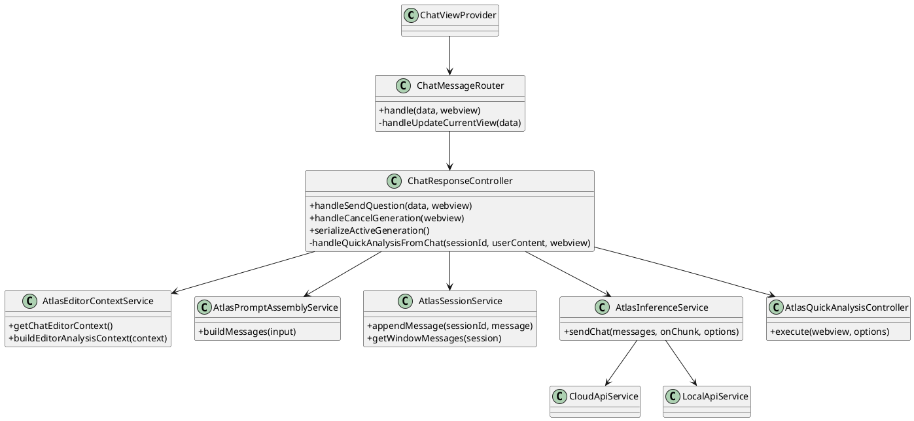
```plantuml
@startuml
skinparam shadowing false
skinparam classAttributeIconSize 0

class ChatViewProvider
class ChatMessageRouter {
  +handle(data, webview)
  -handleUpdateCurrentView(data)
}
class ChatResponseController {
  +handleSendQuestion(data, webview)
  +handleCancelGeneration(webview)
  +serializeActiveGeneration()
  -handleQuickAnalysisFromChat(sessionId, userContent, webview)
}
class AtlasEditorContextService {
  +getChatEditorContext()
  +buildEditorAnalysisContext(context)
}
class AtlasPromptAssemblyService {
  +buildMessages(input)
}
class AtlasSessionService {
  +appendMessage(sessionId, message)
  +getWindowMessages(session)
}
class AtlasInferenceService {
  +sendChat(messages, onChunk, options)
}
class AtlasQuickAnalysisController {
  +execute(webview, options)
}
class CloudApiService
class LocalApiService

ChatViewProvider --> ChatMessageRouter
ChatMessageRouter --> ChatResponseController
ChatResponseController --> AtlasEditorContextService
ChatResponseController --> AtlasPromptAssemblyService
ChatResponseController --> AtlasSessionService
ChatResponseController --> AtlasInferenceService
ChatResponseController --> AtlasQuickAnalysisController
AtlasInferenceService --> CloudApiService
AtlasInferenceService --> LocalApiService
@enduml
```

### Diagrama de Sequência

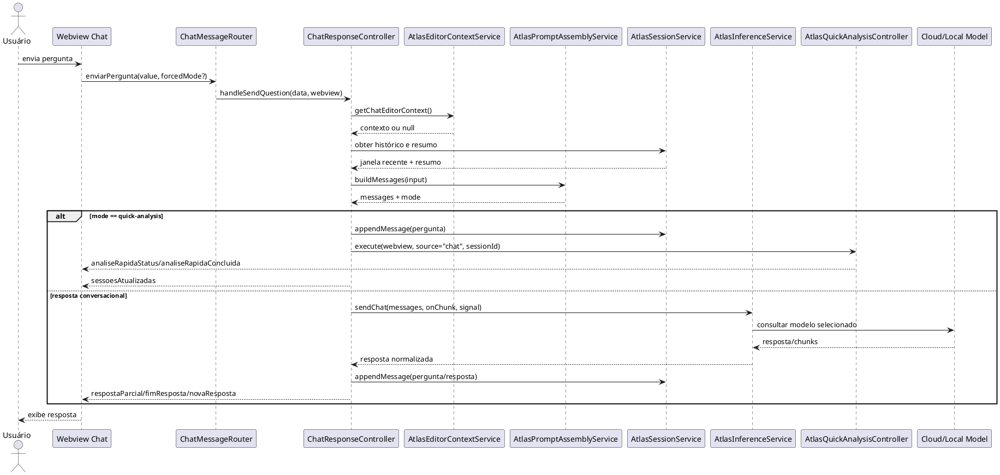
```plantuml
@startuml
skinparam shadowing false
actor Usuário
participant "Webview Chat" as Webview
participant ChatMessageRouter as Router
participant ChatResponseController as Response
participant AtlasEditorContextService as EditorContext
participant AtlasPromptAssemblyService as Prompt
participant AtlasSessionService as Sessions
participant AtlasInferenceService as Inference
participant AtlasQuickAnalysisController as QuickController
participant "Cloud/Local Model" as Model

Usuário -> Webview : envia pergunta
Webview -> Router : enviarPergunta(value, forcedMode?)
Router -> Response : handleSendQuestion(data, webview)
Response -> EditorContext : getChatEditorContext()
EditorContext --> Response : contexto ou null
Response -> Sessions : obter histórico e resumo
Sessions --> Response : janela recente + resumo
Response -> Prompt : buildMessages(input)
Prompt --> Response : messages + mode
alt mode == quick-analysis
  Response -> Sessions : appendMessage(pergunta)
  Response -> QuickController : execute(webview, source="chat", sessionId)
  QuickController --> Webview : analiseRapidaStatus/analiseRapidaConcluida
  Response --> Webview : sessoesAtualizadas
else resposta conversacional
  Response -> Inference : sendChat(messages, onChunk, signal)
  Inference -> Model : consultar modelo selecionado
  Model --> Inference : resposta/chunks
  Inference --> Response : resposta normalizada
  Response -> Sessions : appendMessage(pergunta/resposta)
  Response --> Webview : respostaParcial/fimResposta/novaResposta
end
Webview --> Usuário : exibe resposta
@enduml
```

## UC002 - Executar análise rápida do arquivo atual

### Diagrama de Classes

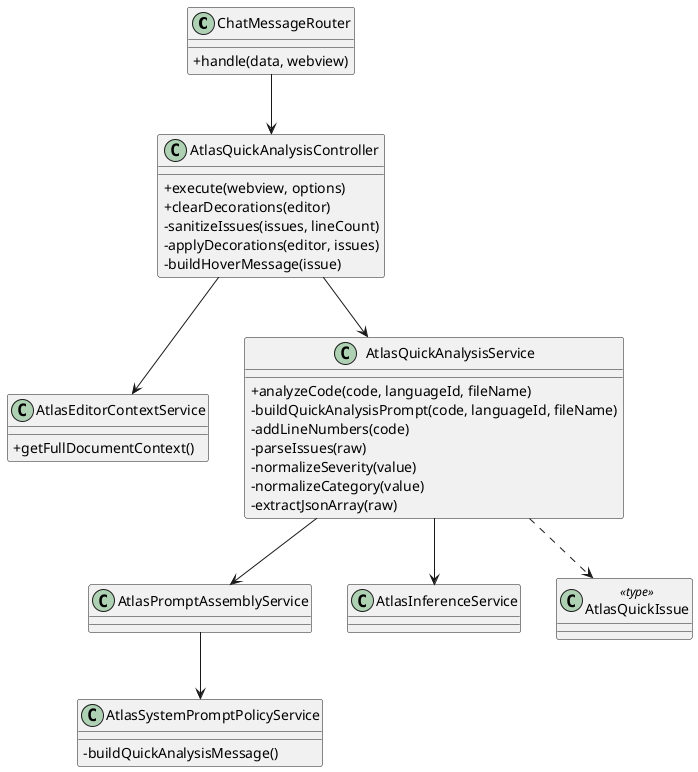
```plantuml
@startuml
skinparam shadowing false
skinparam classAttributeIconSize 0

class ChatMessageRouter {
  +handle(data, webview)
}
class AtlasQuickAnalysisController {
  +execute(webview, options)
  +clearDecorations(editor)
  -sanitizeIssues(issues, lineCount)
  -applyDecorations(editor, issues)
  -buildHoverMessage(issue)
}
class AtlasEditorContextService {
  +getFullDocumentContext()
}
class AtlasQuickAnalysisService {
  +analyzeCode(code, languageId, fileName)
  -buildQuickAnalysisPrompt(code, languageId, fileName)
  -addLineNumbers(code)
  -parseIssues(raw)
  -normalizeSeverity(value)
  -normalizeCategory(value)
  -extractJsonArray(raw)
}
class AtlasPromptAssemblyService
class AtlasSystemPromptPolicyService {
  -buildQuickAnalysisMessage()
}
class AtlasInferenceService
class AtlasQuickIssue <<type>>

ChatMessageRouter --> AtlasQuickAnalysisController
AtlasQuickAnalysisController --> AtlasEditorContextService
AtlasQuickAnalysisController --> AtlasQuickAnalysisService
AtlasQuickAnalysisService --> AtlasPromptAssemblyService
AtlasPromptAssemblyService --> AtlasSystemPromptPolicyService
AtlasQuickAnalysisService --> AtlasInferenceService
AtlasQuickAnalysisService ..> AtlasQuickIssue
@enduml
```

### Diagrama de Sequência

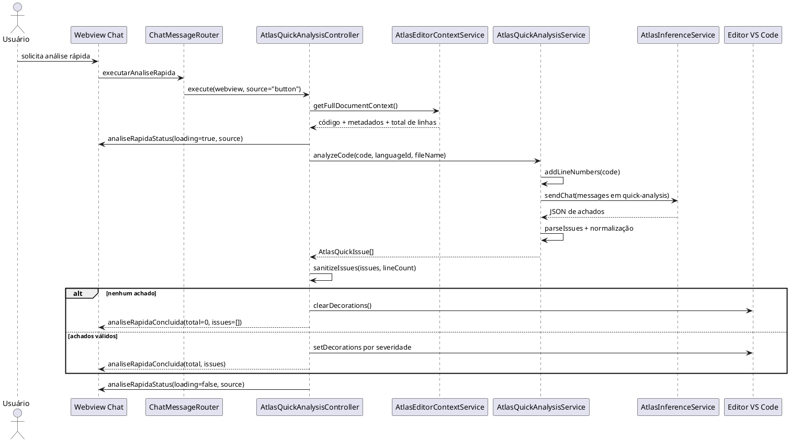
```plantuml
@startuml
skinparam shadowing false
actor Usuário
participant "Webview Chat" as Webview
participant ChatMessageRouter as Router
participant AtlasQuickAnalysisController as Controller
participant AtlasEditorContextService as EditorContext
participant AtlasQuickAnalysisService as QuickService
participant AtlasInferenceService as Inference
participant "Editor VS Code" as Editor

Usuário -> Webview : solicita análise rápida
Webview -> Router : executarAnaliseRapida
Router -> Controller : execute(webview, source="button")
Controller -> EditorContext : getFullDocumentContext()
EditorContext --> Controller : código + metadados + total de linhas
Controller -> Webview : analiseRapidaStatus(loading=true, source)
Controller -> QuickService : analyzeCode(code, languageId, fileName)
QuickService -> QuickService : addLineNumbers(code)
QuickService -> Inference : sendChat(messages em quick-analysis)
Inference --> QuickService : JSON de achados
QuickService -> QuickService : parseIssues + normalização
QuickService --> Controller : AtlasQuickIssue[]
Controller -> Controller : sanitizeIssues(issues, lineCount)
alt nenhum achado
  Controller -> Editor : clearDecorations()
  Controller --> Webview : analiseRapidaConcluida(total=0, issues=[])
else achados válidos
  Controller -> Editor : setDecorations por severidade
  Controller --> Webview : analiseRapidaConcluida(total, issues)
end
Controller -> Webview : analiseRapidaStatus(loading=false, source)
@enduml
```

## UC003 - Solicitar análise arquitetural formal

### Diagrama de Classes

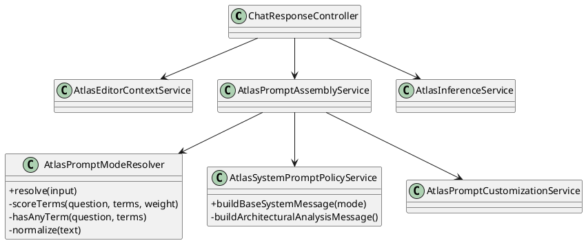
```plantuml
@startuml
skinparam shadowing false
skinparam classAttributeIconSize 0

class ChatResponseController
class AtlasEditorContextService
class AtlasPromptAssemblyService
class AtlasPromptModeResolver {
  +resolve(input)
  -scoreTerms(question, terms, weight)
  -hasAnyTerm(question, terms)
  -normalize(text)
}
class AtlasSystemPromptPolicyService {
  +buildBaseSystemMessage(mode)
  -buildArchitecturalAnalysisMessage()
}
class AtlasPromptCustomizationService
class AtlasInferenceService

ChatResponseController --> AtlasEditorContextService
ChatResponseController --> AtlasPromptAssemblyService
ChatResponseController --> AtlasInferenceService
AtlasPromptAssemblyService --> AtlasPromptModeResolver
AtlasPromptAssemblyService --> AtlasSystemPromptPolicyService
AtlasPromptAssemblyService --> AtlasPromptCustomizationService
@enduml
```

### Diagrama de Sequência

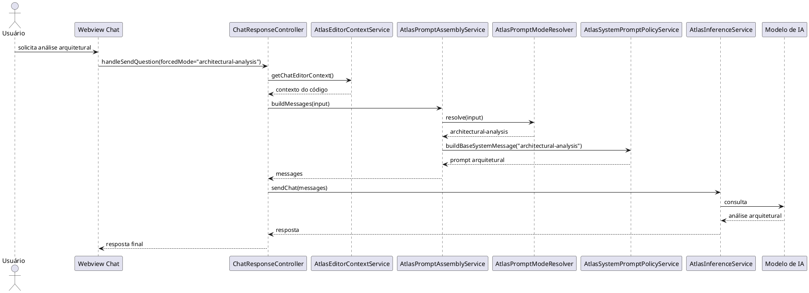
```plantuml
@startuml
skinparam shadowing false
actor Usuário
participant "Webview Chat" as Webview
participant ChatResponseController as Response
participant AtlasEditorContextService as EditorContext
participant AtlasPromptAssemblyService as Prompt
participant AtlasPromptModeResolver as Resolver
participant AtlasSystemPromptPolicyService as Policy
participant AtlasInferenceService as Inference
participant "Modelo de IA" as Model

Usuário -> Webview : solicita análise arquitetural
Webview -> Response : handleSendQuestion(forcedMode="architectural-analysis")
Response -> EditorContext : getChatEditorContext()
EditorContext --> Response : contexto do código
Response -> Prompt : buildMessages(input)
Prompt -> Resolver : resolve(input)
Resolver --> Prompt : architectural-analysis
Prompt -> Policy : buildBaseSystemMessage("architectural-analysis")
Policy --> Prompt : prompt arquitetural
Prompt --> Response : messages
Response -> Inference : sendChat(messages)
Inference -> Model : consulta
Model --> Inference : análise arquitetural
Inference --> Response : resposta
Response --> Webview : resposta final
@enduml
```

## UC004 - Ativar modo estudo

### Diagrama de Classes

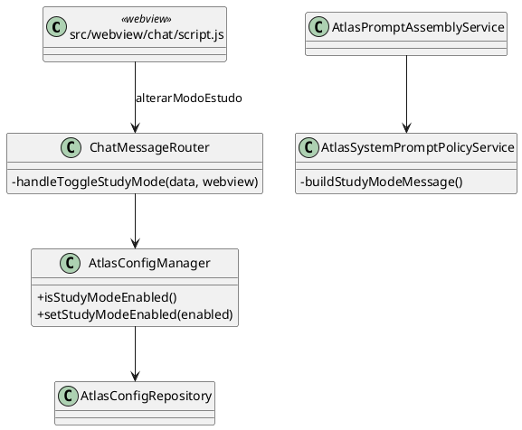
```plantuml
@startuml
skinparam shadowing false
skinparam classAttributeIconSize 0

class "src/webview/chat/script.js" as ChatScript <<webview>>
class ChatMessageRouter {
  -handleToggleStudyMode(data, webview)
}
class AtlasConfigManager {
  +isStudyModeEnabled()
  +setStudyModeEnabled(enabled)
}
class AtlasConfigRepository
class AtlasSystemPromptPolicyService {
  -buildStudyModeMessage()
}
class AtlasPromptAssemblyService

ChatScript --> ChatMessageRouter : alterarModoEstudo
ChatMessageRouter --> AtlasConfigManager
AtlasConfigManager --> AtlasConfigRepository
AtlasPromptAssemblyService --> AtlasSystemPromptPolicyService
@enduml
```

### Diagrama de Sequência

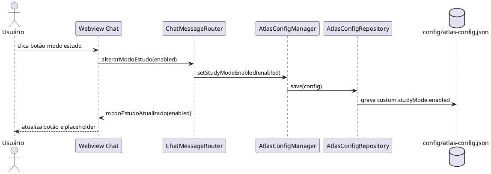
```plantuml
@startuml
skinparam shadowing false
actor Usuário
participant "Webview Chat" as Webview
participant ChatMessageRouter as Router
participant AtlasConfigManager as Config
participant AtlasConfigRepository as Repository
database "config/atlas-config.json" as ConfigFile

Usuário -> Webview : clica botão modo estudo
Webview -> Router : alterarModoEstudo(enabled)
Router -> Config : setStudyModeEnabled(enabled)
Config -> Repository : save(config)
Repository -> ConfigFile : grava custom.studyMode.enabled
Router --> Webview : modoEstudoAtualizado(enabled)
Webview --> Usuário : atualiza botão e placeholder
@enduml
```

## UC005 - Gerenciar chaves de API

### Diagrama de Classes

```plantuml
@startuml
skinparam shadowing false
skinparam classAttributeIconSize 0

class ChatPanelManager
class ChatMessageRouter
class ApiKeyManager {
  +handleMessage(data, webview)
  +addKey(webview)
  +editKey(provider, webview)
  +deleteKey(provider, webview)
  +listCredentials()
  +getRawKey(provider)
}
class SecretStorageService {
  +store(key, value)
  +get(key)
  +delete(key)
}
class AtlasConfigManager
class AtlasProviderService
database "VS Code SecretStorage" as VSSecrets

ChatPanelManager --> ApiKeyManager
ChatMessageRouter --> ApiKeyManager
ApiKeyManager --> SecretStorageService
ApiKeyManager --> AtlasConfigManager
AtlasConfigManager --> AtlasProviderService
SecretStorageService --> VSSecrets
@enduml
```

### Diagrama de Sequência

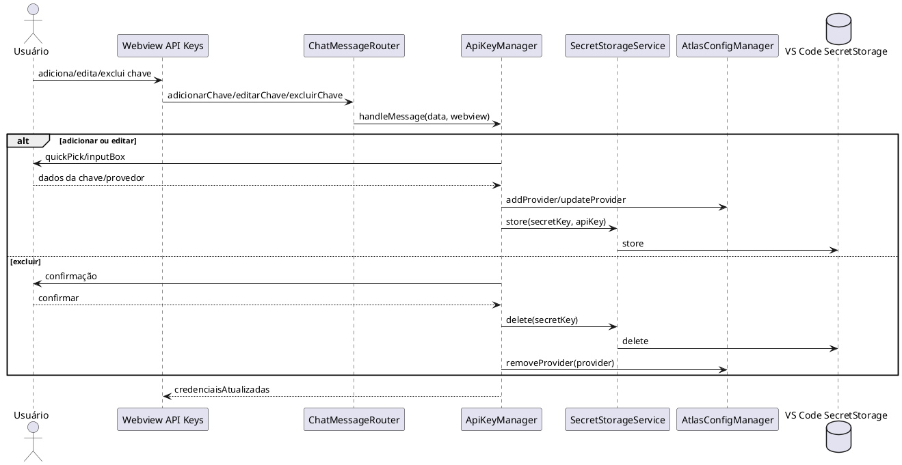
```plantuml
@startuml
skinparam shadowing false
actor Usuário
participant "Webview API Keys" as Webview
participant ChatMessageRouter as Router
participant ApiKeyManager as ApiKeys
participant SecretStorageService as Secrets
participant AtlasConfigManager as Config
database "VS Code SecretStorage" as VSSecrets

Usuário -> Webview : adiciona/edita/exclui chave
Webview -> Router : adicionarChave/editarChave/excluirChave
Router -> ApiKeys : handleMessage(data, webview)

alt adicionar ou editar
  ApiKeys -> Usuário : quickPick/inputBox
  Usuário --> ApiKeys : dados da chave/provedor
  ApiKeys -> Config : addProvider/updateProvider
  ApiKeys -> Secrets : store(secretKey, apiKey)
  Secrets -> VSSecrets : store
else excluir
  ApiKeys -> Usuário : confirmação
  Usuário --> ApiKeys : confirmar
  ApiKeys -> Secrets : delete(secretKey)
  Secrets -> VSSecrets : delete
  ApiKeys -> Config : removeProvider(provider)
end

ApiKeys --> Webview : credenciaisAtualizadas
@enduml
```

## UC006 - Selecionar provedor e modelo cloud

### Diagrama de Classes

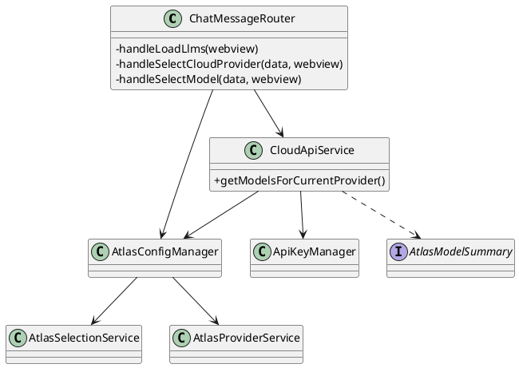
```plantuml
@startuml
skinparam shadowing false
skinparam classAttributeIconSize 0

class ChatMessageRouter {
  -handleLoadLlms(webview)
  -handleSelectCloudProvider(data, webview)
  -handleSelectModel(data, webview)
}
class AtlasConfigManager
class AtlasSelectionService
class AtlasProviderService
class CloudApiService {
  +getModelsForCurrentProvider()
}
class ApiKeyManager
interface AtlasModelSummary

ChatMessageRouter --> AtlasConfigManager
ChatMessageRouter --> CloudApiService
AtlasConfigManager --> AtlasSelectionService
AtlasConfigManager --> AtlasProviderService
CloudApiService --> AtlasConfigManager
CloudApiService --> ApiKeyManager
CloudApiService ..> AtlasModelSummary
@enduml
```

### Diagrama de Sequência

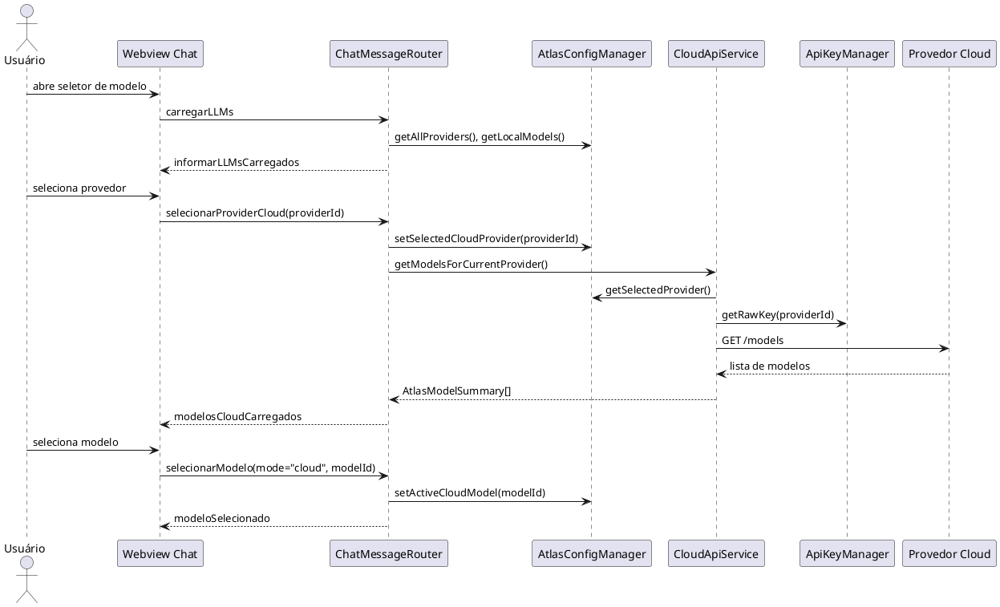
```plantuml
@startuml
skinparam shadowing false
actor Usuário
participant "Webview Chat" as Webview
participant ChatMessageRouter as Router
participant AtlasConfigManager as Config
participant CloudApiService as CloudApi
participant ApiKeyManager as ApiKeys
participant "Provedor Cloud" as Cloud

Usuário -> Webview : abre seletor de modelo
Webview -> Router : carregarLLMs
Router -> Config : getAllProviders(), getLocalModels()
Router --> Webview : informarLLMsCarregados
Usuário -> Webview : seleciona provedor
Webview -> Router : selecionarProviderCloud(providerId)
Router -> Config : setSelectedCloudProvider(providerId)
Router -> CloudApi : getModelsForCurrentProvider()
CloudApi -> Config : getSelectedProvider()
CloudApi -> ApiKeys : getRawKey(providerId)
CloudApi -> Cloud : GET /models
Cloud --> CloudApi : lista de modelos
CloudApi --> Router : AtlasModelSummary[]
Router --> Webview : modelosCloudCarregados
Usuário -> Webview : seleciona modelo
Webview -> Router : selecionarModelo(mode="cloud", modelId)
Router -> Config : setActiveCloudModel(modelId)
Router --> Webview : modeloSelecionado
@enduml
```

## UC007 - Alternar modo local ou nuvem

### Diagrama de Classes

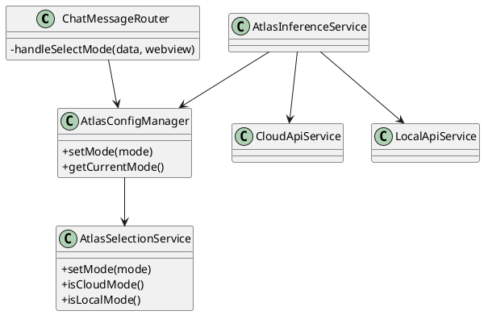
```plantuml
@startuml
skinparam shadowing false
skinparam classAttributeIconSize 0

class ChatMessageRouter {
  -handleSelectMode(data, webview)
}
class AtlasConfigManager {
  +setMode(mode)
  +getCurrentMode()
}
class AtlasSelectionService {
  +setMode(mode)
  +isCloudMode()
  +isLocalMode()
}
class AtlasInferenceService
class CloudApiService
class LocalApiService

ChatMessageRouter --> AtlasConfigManager
AtlasConfigManager --> AtlasSelectionService
AtlasInferenceService --> AtlasConfigManager
AtlasInferenceService --> CloudApiService
AtlasInferenceService --> LocalApiService
@enduml
```

### Diagrama de Sequência

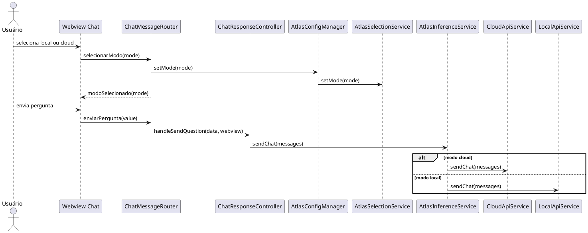
```plantuml
@startuml
skinparam shadowing false
actor Usuário
participant "Webview Chat" as Webview
participant ChatMessageRouter as Router
participant ChatResponseController as Response
participant AtlasConfigManager as Config
participant AtlasSelectionService as Selection
participant AtlasInferenceService as Inference
participant CloudApiService as CloudApi
participant LocalApiService as LocalApi

Usuário -> Webview : seleciona local ou cloud
Webview -> Router : selecionarModo(mode)
Router -> Config : setMode(mode)
Config -> Selection : setMode(mode)
Router --> Webview : modoSelecionado(mode)

Usuário -> Webview : envia pergunta
Webview -> Router : enviarPergunta(value)
Router -> Response : handleSendQuestion(data, webview)
Response -> Inference : sendChat(messages)
alt modo cloud
  Inference -> CloudApi : sendChat(messages)
else modo local
  Inference -> LocalApi : sendChat(messages)
end
@enduml
```

## UC008 - Configurar parâmetros de execução e segurança

### Diagrama de Classes

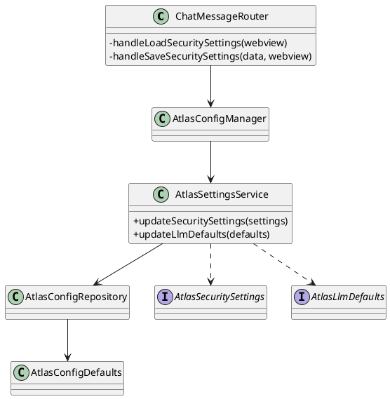
```plantuml
@startuml
skinparam shadowing false
skinparam classAttributeIconSize 0

class ChatMessageRouter {
  -handleLoadSecuritySettings(webview)
  -handleSaveSecuritySettings(data, webview)
}
class AtlasConfigManager
class AtlasSettingsService {
  +updateSecuritySettings(settings)
  +updateLlmDefaults(defaults)
}
class AtlasConfigRepository
class AtlasConfigDefaults
interface AtlasSecuritySettings
interface AtlasLlmDefaults

ChatMessageRouter --> AtlasConfigManager
AtlasConfigManager --> AtlasSettingsService
AtlasSettingsService --> AtlasConfigRepository
AtlasConfigRepository --> AtlasConfigDefaults
AtlasSettingsService ..> AtlasSecuritySettings
AtlasSettingsService ..> AtlasLlmDefaults
@enduml
```

### Diagrama de Sequência

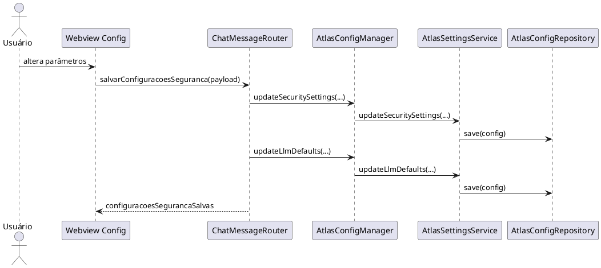
```plantuml
@startuml
skinparam shadowing false
actor Usuário
participant "Webview Config" as Webview
participant ChatMessageRouter as Router
participant AtlasConfigManager as Config
participant AtlasSettingsService as Settings
participant AtlasConfigRepository as Repository

Usuário -> Webview : altera parâmetros
Webview -> Router : salvarConfiguracoesSeguranca(payload)
Router -> Config : updateSecuritySettings(...)
Config -> Settings : updateSecuritySettings(...)
Settings -> Repository : save(config)
Router -> Config : updateLlmDefaults(...)
Config -> Settings : updateLlmDefaults(...)
Settings -> Repository : save(config)
Router --> Webview : configuracoesSegurancaSalvas
@enduml
```

## UC009 - Alterar comportamento do modelo

### Diagrama de Classes

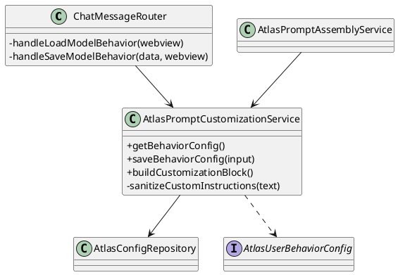
```plantuml
@startuml
skinparam shadowing false
skinparam classAttributeIconSize 0

class ChatMessageRouter {
  -handleLoadModelBehavior(webview)
  -handleSaveModelBehavior(data, webview)
}
class AtlasPromptCustomizationService {
  +getBehaviorConfig()
  +saveBehaviorConfig(input)
  +buildCustomizationBlock()
  -sanitizeCustomInstructions(text)
}
class AtlasConfigRepository
class AtlasPromptAssemblyService
interface AtlasUserBehaviorConfig

ChatMessageRouter --> AtlasPromptCustomizationService
AtlasPromptCustomizationService --> AtlasConfigRepository
AtlasPromptAssemblyService --> AtlasPromptCustomizationService
AtlasPromptCustomizationService ..> AtlasUserBehaviorConfig
@enduml
```

### Diagrama de Sequência

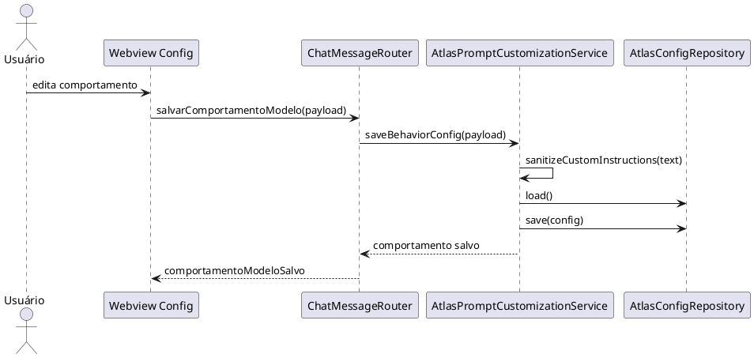
```plantuml
@startuml
skinparam shadowing false
actor Usuário
participant "Webview Config" as Webview
participant ChatMessageRouter as Router
participant AtlasPromptCustomizationService as Custom
participant AtlasConfigRepository as Repository

Usuário -> Webview : edita comportamento
Webview -> Router : salvarComportamentoModelo(payload)
Router -> Custom : saveBehaviorConfig(payload)
Custom -> Custom : sanitizeCustomInstructions(text)
Custom -> Repository : load()
Custom -> Repository : save(config)
Custom --> Router : comportamento salvo
Router --> Webview : comportamentoModeloSalvo
@enduml
```

## UC010 - Gerenciar biblioteca e registro de modelos locais

### Diagrama de Classes

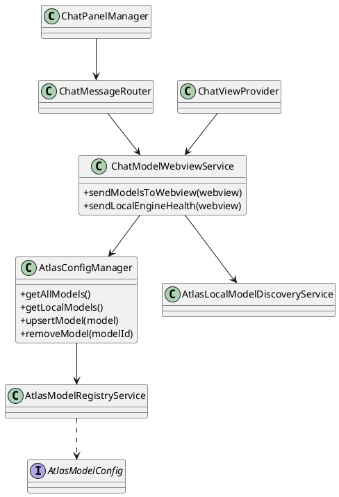
```plantuml
@startuml
skinparam shadowing false
skinparam classAttributeIconSize 0

class ChatPanelManager
class ChatViewProvider
class ChatMessageRouter
class ChatModelWebviewService {
  +sendModelsToWebview(webview)
  +sendLocalEngineHealth(webview)
}
class AtlasConfigManager {
  +getAllModels()
  +getLocalModels()
  +upsertModel(model)
  +removeModel(modelId)
}
class AtlasModelRegistryService
class AtlasLocalModelDiscoveryService
interface AtlasModelConfig

ChatPanelManager --> ChatMessageRouter
ChatMessageRouter --> ChatModelWebviewService
ChatViewProvider --> ChatModelWebviewService
ChatModelWebviewService --> AtlasConfigManager
ChatModelWebviewService --> AtlasLocalModelDiscoveryService
AtlasConfigManager --> AtlasModelRegistryService
AtlasModelRegistryService ..> AtlasModelConfig
@enduml
```

### Diagrama de Sequência

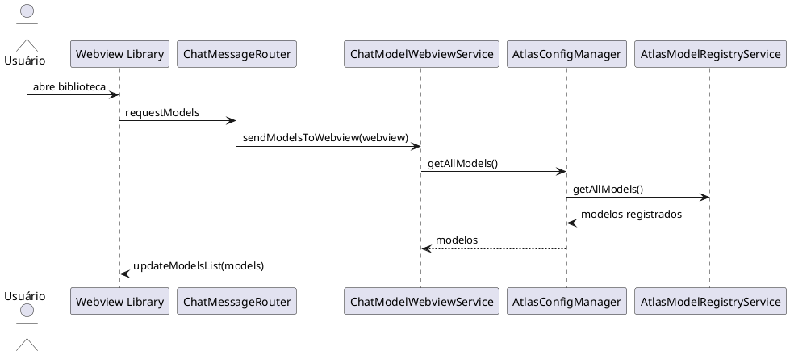
```plantuml
@startuml
skinparam shadowing false
actor Usuário
participant "Webview Library" as Library
participant ChatMessageRouter as Router
participant ChatModelWebviewService as ModelWebview
participant AtlasConfigManager as Config
participant AtlasModelRegistryService as Registry

Usuário -> Library : abre biblioteca
Library -> Router : requestModels
Router -> ModelWebview : sendModelsToWebview(webview)
ModelWebview -> Config : getAllModels()
Config -> Registry : getAllModels()
Registry --> Config : modelos registrados
Config --> ModelWebview : modelos
ModelWebview --> Library : updateModelsList(models)
@enduml
```

## UC011 - Abrir painéis da extensão

### Diagrama de Classes

```plantuml
@startuml
skinparam shadowing false
skinparam classAttributeIconSize 0

class ChatViewProvider
class ChatPanelManager {
  +openPanel(selectedView)
  +normalizeSelectedView(selectedView)
  +getPanelGroup(selectedView)
  +getHtmlForWebview(webview, selectedView)
}
class ChatMessageRouter
class "src/webview/chat" as ChatWebview
class "src/webview/atlas" as AtlasWebview
class "src/webview/api-keys" as ApiKeysWebview
class "src/webview/library" as LibraryWebview

ChatViewProvider --> ChatPanelManager
ChatMessageRouter --> ChatPanelManager : openPanel callback
ChatPanelManager --> ChatWebview
ChatPanelManager --> AtlasWebview
ChatPanelManager --> ApiKeysWebview
ChatPanelManager --> LibraryWebview
@enduml
```

### Diagrama de Sequência

```plantuml
@startuml
skinparam shadowing false
actor Usuário
participant "Webview Chat" as Webview
participant ChatMessageRouter as Router
participant ChatPanelManager as PanelManager
participant "VS Code WebviewPanel" as Panel

Usuário -> Webview : solicita painel
Webview -> Router : abrirPainelConfig(selectedView)
Router -> PanelManager : openPanel(selectedView)
PanelManager -> PanelManager : normalizeSelectedView()
PanelManager -> Panel : createWebviewPanel/reveal
PanelManager -> PanelManager : getHtmlForWebview()
PanelManager --> Panel : html
Panel --> Usuário : painel aberto
@enduml
```

## UC012 - Gerenciar sessões e histórico

### Diagrama de Classes

```plantuml
@startuml
skinparam shadowing false
skinparam classAttributeIconSize 0

class ChatMessageRouter
class ChatSessionController {
  +handleCreateSession(data, webview)
  +handleSwitchSession(data, webview)
  +handleRenameSession(data, webview)
  +handleDeleteSession(data, webview)
  +handleListSessions(webview)
}
class AtlasSessionService {
  +createSession()
  +listSessions()
  +switchSession(sessionId)
  +renameSession(sessionId, title)
  +deleteSession(sessionId)
}
class AtlasHistoryRepository {
  +load()
  +save(history)
}
database "config/atlas-history.json" as HistoryFile

ChatMessageRouter --> ChatSessionController
ChatSessionController --> AtlasSessionService
AtlasSessionService --> AtlasHistoryRepository
AtlasHistoryRepository --> HistoryFile
@enduml
```

### Diagrama de Sequência

```plantuml
@startuml
skinparam shadowing false
actor Usuário
participant "Webview Chat" as Webview
participant ChatMessageRouter as Router
participant ChatSessionController as Controller
participant AtlasSessionService as Sessions
participant AtlasHistoryRepository as Repository
database "config/atlas-history.json" as HistoryFile

Usuário -> Webview : cria/alterna/renomeia/exclui sessão
Webview -> Router : ação de sessão
Router -> Controller : handle(data, webview)
Controller -> Sessions : executa operação
Sessions -> Repository : save(history)
Repository -> HistoryFile : grava JSON
Sessions --> Controller : estado atualizado
Controller --> Webview : sessoesAtualizadas
@enduml
```

## UC013 - Resumir conversas longas

### Diagrama de Classes

```plantuml
@startuml
skinparam shadowing false
skinparam classAttributeIconSize 0

class AtlasSessionService {
  +appendMessage(sessionId, message)
  +summarizeIfNeeded(sessionId)
  -buildSummaryPrompt(messages)
}
class AtlasInferenceService
class AtlasHistoryRepository
class AtlasPromptAssemblyService
class "SUMMARIZATION_SYSTEM_PROMPT" as SummaryPrompt <<constant>>

AtlasSessionService --> AtlasInferenceService
AtlasSessionService --> AtlasHistoryRepository
AtlasSessionService --> SummaryPrompt
AtlasPromptAssemblyService --> AtlasSessionService
@enduml
```

### Diagrama de Sequência

```plantuml
@startuml
skinparam shadowing false
participant ChatResponseController as Response
participant AtlasSessionService as Sessions
participant AtlasInferenceService as Inference
participant AtlasHistoryRepository as Repository
database "config/atlas-history.json" as HistoryFile

Response -> Sessions : appendMessage(sessionId, resposta)
Sessions -> Sessions : verifica WINDOW_SIZE
alt histórico excede janela
  Sessions -> Inference : sendChat(summaryPrompt)
  Inference --> Sessions : resumo
  Sessions -> Sessions : compacta mensagens antigas
end
Sessions -> Repository : save(history)
Repository -> HistoryFile : grava resumo e mensagens recentes
@enduml
```

## UC014 - Executar inferência local com llama-server

### Diagrama de Classes

```plantuml
@startuml
skinparam shadowing false
skinparam classAttributeIconSize 0

class AtlasInferenceService
class LocalApiService {
  +sendChat(messages, onChunk, options)
  +isAbortError(error)
}
class AtlasLocalEngineService {
  +ensureEngine(model)
  +stopEngine()
  +restartEngine(model)
  +isRunning()
  +getEnginesDir()
  -waitUntilReady()
}
class AtlasConfigManager
class AtlasLocalModelDiscoveryService
class AtlasModelRegistryService
database "llama-server\n127.0.0.1:8080" as Llama

AtlasInferenceService --> LocalApiService : modo local
LocalApiService --> AtlasLocalEngineService
LocalApiService --> AtlasConfigManager
LocalApiService --> AtlasLocalModelDiscoveryService
AtlasLocalModelDiscoveryService --> AtlasModelRegistryService
AtlasLocalEngineService --> Llama
@enduml
```

### Diagrama de Sequência

```plantuml
@startuml
skinparam shadowing false
actor Usuário
participant "Webview Chat" as Webview
participant ChatMessageRouter as Router
participant ChatResponseController as Response
participant AtlasInferenceService as Inference
participant LocalApiService as LocalApi
participant AtlasLocalEngineService as Engine
participant "llama-server" as Llama

Usuário -> Webview : envia pergunta em modo local
Webview -> Router : enviarPergunta(value)
Router -> Response : handleSendQuestion(data, webview)
Response -> Inference : sendChat(messages)
Inference -> LocalApi : sendChat(messages, onChunk, options)
LocalApi -> Engine : ensureEngine(model)
alt engine parada
  Engine -> Llama : spawn llama-server
  Engine -> Llama : GET /health ou /v1/models
  Llama --> Engine : pronto
end
LocalApi -> Llama : POST /v1/chat/completions
Llama --> LocalApi : chunks ou resposta completa
LocalApi --> Inference : resposta normalizada
Inference --> Response : resposta
Response --> Webview : respostaParcial/fimResposta
@enduml
```

## UC015 - Descobrir modelos GGUF locais

### Diagrama de Classes

```plantuml
@startuml
skinparam shadowing false
skinparam classAttributeIconSize 0

class ChatMessageRouter
class ChatModelWebviewService
class AtlasLocalModelDiscoveryService {
  +refreshLocalModels()
  +getModelsDir()
  -createModelConfig(fileName)
  -inferProvider(modelName)
  -inferQuantization(modelName)
}
class AtlasConfigManager
class AtlasModelRegistryService {
  +upsertModel(model)
}
database "Pasta de modelos .gguf" as ModelDir

ChatMessageRouter --> AtlasConfigManager
ChatMessageRouter --> AtlasLocalModelDiscoveryService
ChatModelWebviewService --> AtlasLocalModelDiscoveryService
AtlasLocalModelDiscoveryService --> ModelDir
AtlasLocalModelDiscoveryService --> AtlasModelRegistryService
@enduml
```

### Diagrama de Sequência

```plantuml
@startuml
skinparam shadowing false
actor Usuário
participant "Webview Atlas/Library" as Webview
participant ChatMessageRouter as Router
participant AtlasConfigManager as Config
participant AtlasLocalModelDiscoveryService as Discovery
participant AtlasModelRegistryService as Registry
database "Pasta .gguf" as ModelDir

Usuário -> Webview : seleciona pasta de modelos
Webview -> Router : selecionarPastaModelosLocais
Router -> Config : salva caminho configurado
Router -> Discovery : refreshLocalModels()
Discovery -> ModelDir : lista arquivos .gguf
ModelDir --> Discovery : arquivos encontrados
Discovery -> Discovery : infere metadados
Discovery -> Registry : upsertModel(model)
Registry --> Discovery : modelo registrado
Discovery --> Router : resultado
Router --> Webview : updateModelsList(models)
@enduml
```

## UC016 - Indexar projeto com RAG (futuro)

### Diagrama de Classes

```plantuml
@startuml
skinparam shadowing false
skinparam classAttributeIconSize 0

class RagConfigurationUI <<future>>
class ProjectIndexer <<future>> {
  +indexProject(workspace)
}
class EmbeddingGenerator <<future>> {
  +generateEmbeddings(chunks)
}
class VectorDatabaseManager <<future>> {
  +saveVectors(vectors)
  +deleteCollection(projectId)
}
class ContextRetriever <<future>>
class AtlasConfigManager
database ChromaDB <<future>>

RagConfigurationUI --> ProjectIndexer
ProjectIndexer --> EmbeddingGenerator
ProjectIndexer --> VectorDatabaseManager
ProjectIndexer --> AtlasConfigManager
VectorDatabaseManager --> ChromaDB
ContextRetriever --> VectorDatabaseManager
@enduml
```

### Diagrama de Sequência

```plantuml
@startuml
skinparam shadowing false
actor Usuário
participant "RAG Configuration UI\n(futuro)" as UI
participant "ProjectIndexer\n(futuro)" as Indexer
participant "EmbeddingGenerator\n(futuro)" as Embeddings
participant "VectorDatabaseManager\n(futuro)" as VectorDb
database "ChromaDB\n(futuro)" as Chroma

Usuário -> UI : solicita indexação do projeto
UI -> Indexer : indexProject(workspace)
Indexer -> Indexer : lê arquivos e gera chunks
Indexer -> Embeddings : generateEmbeddings(chunks)
Embeddings --> Indexer : vetores
Indexer -> VectorDb : saveVectors(vectors)
VectorDb -> Chroma : persistir embeddings
VectorDb --> Indexer : indexação concluída
Indexer --> UI : status/tamanho da base
UI --> Usuário : exibe resultado
@enduml
```

## UC017 - Pesquisar modelos de IA (futuro)

### Diagrama de Classes

```plantuml
@startuml
skinparam shadowing false
skinparam classAttributeIconSize 0

class ModelSearchUI <<future>>
class HuggingFaceModelSearchService <<future>> {
  +searchModels(query, filters)
}
class ModelCompatibilityService <<future>> {
  +enrichWithCompatibility(models)
}
class AtlasConfigManager
interface ModelSearchResult <<future>>
actor "Repositório de Modelos\n(API)" as RepoAPI

ModelSearchUI --> HuggingFaceModelSearchService
HuggingFaceModelSearchService --> ModelCompatibilityService
HuggingFaceModelSearchService --> RepoAPI
HuggingFaceModelSearchService ..> ModelSearchResult
ModelCompatibilityService --> AtlasConfigManager
@enduml
```

### Diagrama de Sequência

```plantuml
@startuml
skinparam shadowing false
actor Usuário
participant "ModelSearchUI\n(futuro)" as UI
participant "HuggingFaceModelSearchService\n(futuro)" as Search
participant "ModelCompatibilityService\n(futuro)" as Compatibility
participant "Repositório de Modelos\n(API)" as RepoAPI

Usuário -> UI : pesquisa modelo
UI -> Search : searchModels(query, filters)
Search -> RepoAPI : consultar repositório
RepoAPI --> Search : resultados
Search -> Compatibility : enrichWithCompatibility(results)
Compatibility --> Search : resultados avaliados
Search --> UI : ModelSearchResult[]
UI --> Usuário : exibe modelos
@enduml
```

## UC018 - Baixar modelo local (futuro)

### Diagrama de Classes

```plantuml
@startuml
skinparam shadowing false
skinparam classAttributeIconSize 0

class ModelDownloadUI <<future>>
class ModelDownloadService <<future>> {
  +downloadModel(modelId, variant)
}
class LocalModelStorageService <<future>> {
  +saveModelFile(file)
}
class AtlasConfigManager
class AtlasModelRegistryService
actor "Repositório de Modelos\n(API)" as RepoAPI
database "Diretório local de modelos" as ModelDir

ModelDownloadUI --> ModelDownloadService
ModelDownloadService --> RepoAPI
ModelDownloadService --> LocalModelStorageService
LocalModelStorageService --> ModelDir
ModelDownloadService --> AtlasConfigManager
AtlasConfigManager --> AtlasModelRegistryService
@enduml
```

### Diagrama de Sequência

```plantuml
@startuml
skinparam shadowing false
actor Usuário
participant "ModelDownloadUI\n(futuro)" as UI
participant "ModelDownloadService\n(futuro)" as Download
participant "Repositório de Modelos\n(API)" as RepoAPI
participant "LocalModelStorageService\n(futuro)" as Storage
participant AtlasConfigManager as Config
participant AtlasModelRegistryService as Registry
database "Diretório local" as ModelDir

Usuário -> UI : seleciona modelo para baixar
UI -> Download : downloadModel(modelId, variant)
Download -> RepoAPI : requisita artefato
RepoAPI --> Download : arquivo/chunks
Download -> Storage : saveModelFile(file)
Storage -> ModelDir : grava modelo
Storage --> Download : path local
Download -> Config : upsertModel(modelConfig)
Config -> Registry : upsertModel(modelConfig)
Registry --> Config : modelo registrado
Download --> UI : modeloBaixado
UI --> Usuário : modelo disponível
@enduml
```

## UC019 - Adicionar documentos externos ao RAG (futuro)

### Diagrama de Classes

```plantuml
@startuml
skinparam shadowing false
skinparam classAttributeIconSize 0

class RagDocumentsUI <<future>>
class ExternalDocumentIngestionService <<future>> {
  +addDocument(file)
}
class DocumentParser <<future>> {
  +parse(file)
}
class EmbeddingGenerator <<future>>
class VectorDatabaseManager <<future>>
database ChromaDB <<future>>

RagDocumentsUI --> ExternalDocumentIngestionService
ExternalDocumentIngestionService --> DocumentParser
ExternalDocumentIngestionService --> EmbeddingGenerator
ExternalDocumentIngestionService --> VectorDatabaseManager
VectorDatabaseManager --> ChromaDB
@enduml
```

### Diagrama de Sequência

```plantuml
@startuml
skinparam shadowing false
actor Usuário
participant "RagDocumentsUI\n(futuro)" as UI
participant "ExternalDocumentIngestionService\n(futuro)" as Ingestion
participant "DocumentParser\n(futuro)" as Parser
participant "EmbeddingGenerator\n(futuro)" as Embeddings
participant "VectorDatabaseManager\n(futuro)" as VectorDb
database "ChromaDB\n(futuro)" as Chroma

Usuário -> UI : adiciona documento externo
UI -> Ingestion : addDocument(file)
Ingestion -> Parser : parse(file)
Parser --> Ingestion : texto/chunks
Ingestion -> Embeddings : generateEmbeddings(chunks)
Embeddings --> Ingestion : vetores
Ingestion -> VectorDb : saveVectors(vectors)
VectorDb -> Chroma : persistir vetores
VectorDb --> Ingestion : concluído
Ingestion --> UI : documento indexado
UI --> Usuário : confirma inclusão
@enduml
```
