# Diagramas por Caso de Uso - ATLAS

Atualizado em 15 de agosto de 2026.

Este arquivo contém diagramas de classe e de sequência em PlantUML para cada caso de uso atualizado do ATLAS.
Os blocos podem ser copiados diretamente para o PlantText.

> **Nota de atualização:** os diagramas abaixo representam o ATLAS atual como extensão VS Code em TypeScript. Além dos fluxos de inferência local/cloud, sessões, análise rápida e contexto estrutural, o ATLAS possui edição aplicada com prévia e confirmação, refatoração guiada por análise arquitetural e RAG local com `AtlasRagService`, embeddings locais, ChromaDB empacotado, indexação por projeto, materiais complementares e recuperação integrada ao chat. Busca real em Hugging Face, download de modelos GGUF/ONNX e preparação automática da engine `llama.cpp` também estão implementados.

## UC001 - Perguntar sobre o código

### Diagrama de Classes

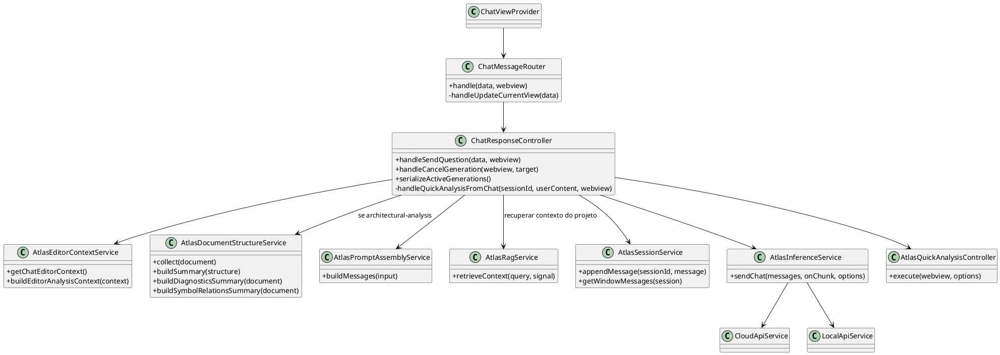
```plantuml
@startuml
skinparam shadowing false
skinparam classAttributeIconSize 0

class ChatViewProvider
class ChatMessageRouter {
  +handle(data, webview)
  -handleUpdateCurrentView(data)
}
class ChatResponseController {
  +handleSendQuestion(data, webview)
  +handleCancelGeneration(webview, target)
  +serializeActiveGenerations()
  -handleQuickAnalysisFromChat(sessionId, userContent, webview)
}
class AtlasEditorContextService {
  +getChatEditorContext()
  +buildEditorAnalysisContext(context)
}
class AtlasDocumentStructureService {
  +collect(document)
  +buildSummary(structure)
  +buildDiagnosticsSummary(document)
  +buildSymbolRelationsSummary(document)
}
class AtlasPromptAssemblyService {
  +buildMessages(input)
}
class AtlasRagService {
  +retrieveContext(query, signal)
}
class AtlasSessionService {
  +appendMessage(sessionId, message)
  +getWindowMessages(session)
}
class AtlasInferenceService {
  +sendChat(messages, onChunk, options)
}
class AtlasQuickAnalysisController {
  +execute(webview, options)
}
class CloudApiService
class LocalApiService

ChatViewProvider --> ChatMessageRouter
ChatMessageRouter --> ChatResponseController
ChatResponseController --> AtlasEditorContextService
ChatResponseController --> AtlasDocumentStructureService : se architectural-analysis
ChatResponseController --> AtlasRagService : recuperar contexto do projeto
ChatResponseController --> AtlasPromptAssemblyService
ChatResponseController --> AtlasSessionService
ChatResponseController --> AtlasInferenceService
ChatResponseController --> AtlasQuickAnalysisController
AtlasInferenceService --> CloudApiService
AtlasInferenceService --> LocalApiService
@enduml
```

### Diagrama de Sequência

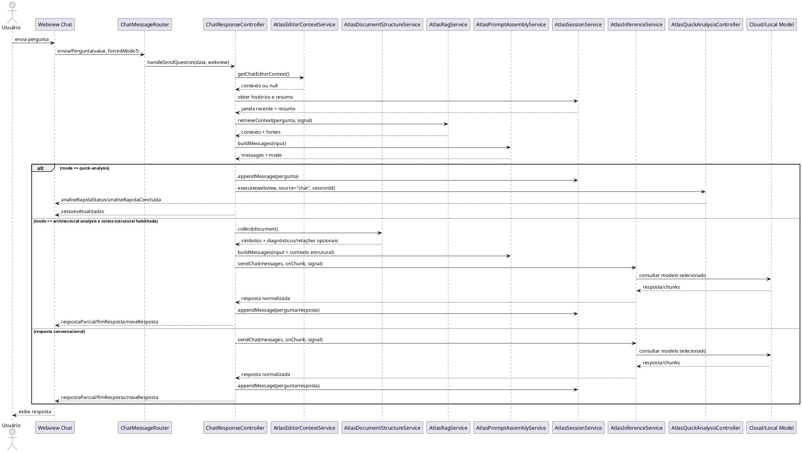
```plantuml
@startuml
skinparam shadowing false
actor Usuário
participant "Webview Chat" as Webview
participant ChatMessageRouter as Router
participant ChatResponseController as Response
participant AtlasEditorContextService as EditorContext
participant AtlasDocumentStructureService as Structure
participant AtlasRagService as RAG
participant AtlasPromptAssemblyService as Prompt
participant AtlasSessionService as Sessions
participant AtlasInferenceService as Inference
participant AtlasQuickAnalysisController as QuickController
participant "Cloud/Local Model" as Model

Usuário -> Webview : envia pergunta
Webview -> Router : enviarPergunta(value, forcedMode?)
Router -> Response : handleSendQuestion(data, webview)
Response -> EditorContext : getChatEditorContext()
EditorContext --> Response : contexto ou null
Response -> Sessions : obter histórico e resumo
Sessions --> Response : janela recente + resumo
Response -> RAG : retrieveContext(pergunta, signal)
RAG --> Response : contexto + fontes
Response -> Prompt : buildMessages(input)
Prompt --> Response : messages + mode
alt mode == quick-analysis
  Response -> Sessions : appendMessage(pergunta)
  Response -> QuickController : execute(webview, source="chat", sessionId)
  QuickController --> Webview : analiseRapidaStatus/analiseRapidaConcluida
  Response --> Webview : sessoesAtualizadas
else mode == architectural-analysis e coleta estrutural habilitada
  Response -> Structure : collect(document)
  Structure --> Response : símbolos + diagnósticos/relações opcionais
  Response -> Prompt : buildMessages(input + contexto estrutural)
  Response -> Inference : sendChat(messages, onChunk, signal)
  Inference -> Model : consultar modelo selecionado
  Model --> Inference : resposta/chunks
  Inference --> Response : resposta normalizada
  Response -> Sessions : appendMessage(pergunta/resposta)
  Response --> Webview : respostaParcial/fimResposta/novaResposta
else resposta conversacional
  Response -> Inference : sendChat(messages, onChunk, signal)
  Inference -> Model : consultar modelo selecionado
  Model --> Inference : resposta/chunks
  Inference --> Response : resposta normalizada
  Response -> Sessions : appendMessage(pergunta/resposta)
  Response --> Webview : respostaParcial/fimResposta/novaResposta
end
Webview --> Usuário : exibe resposta
@enduml
```

## UC002 - Executar análise rápida

### Diagrama de Classes

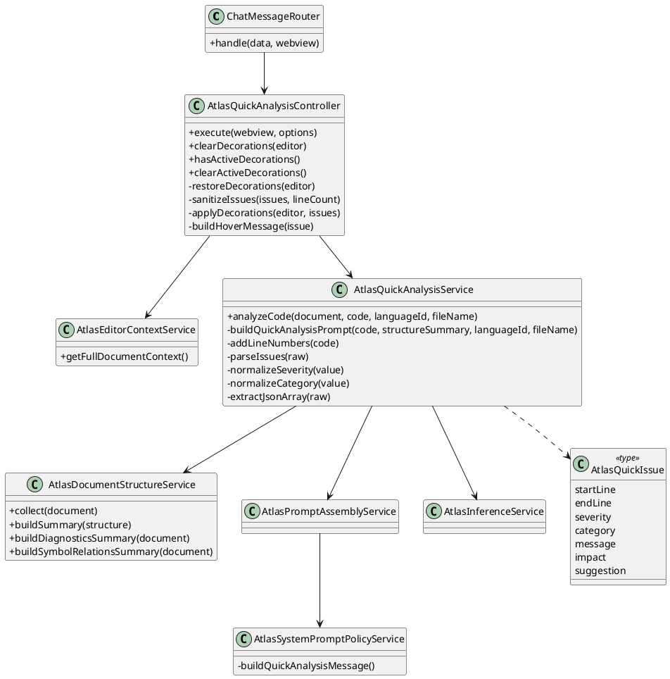
```plantuml
@startuml
skinparam shadowing false
skinparam classAttributeIconSize 0

class ChatMessageRouter {
  +handle(data, webview)
}
class AtlasQuickAnalysisController {
  +execute(webview, options)
  +clearDecorations(editor)
  +hasActiveDecorations()
  +clearActiveDecorations()
  -restoreDecorations(editor)
  -sanitizeIssues(issues, lineCount)
  -applyDecorations(editor, issues)
  -buildHoverMessage(issue)
}
class AtlasEditorContextService {
  +getFullDocumentContext()
}
class AtlasQuickAnalysisService {
  +analyzeCode(document, code, languageId, fileName)
  -buildQuickAnalysisPrompt(code, structureSummary, languageId, fileName)
  -addLineNumbers(code)
  -parseIssues(raw)
  -normalizeSeverity(value)
  -normalizeCategory(value)
  -extractJsonArray(raw)
}
class AtlasDocumentStructureService {
  +collect(document)
  +buildSummary(structure)
  +buildDiagnosticsSummary(document)
  +buildSymbolRelationsSummary(document)
}
class AtlasPromptAssemblyService
class AtlasSystemPromptPolicyService {
  -buildQuickAnalysisMessage()
}
class AtlasInferenceService
class AtlasQuickIssue <<type>> {
  startLine
  endLine
  severity
  category
  message
  impact
  suggestion
}

ChatMessageRouter --> AtlasQuickAnalysisController
AtlasQuickAnalysisController --> AtlasEditorContextService
AtlasQuickAnalysisController --> AtlasQuickAnalysisService
AtlasQuickAnalysisService --> AtlasPromptAssemblyService
AtlasQuickAnalysisService --> AtlasDocumentStructureService
AtlasPromptAssemblyService --> AtlasSystemPromptPolicyService
AtlasQuickAnalysisService --> AtlasInferenceService
AtlasQuickAnalysisService ..> AtlasQuickIssue
@enduml
```

### Diagrama de Sequência

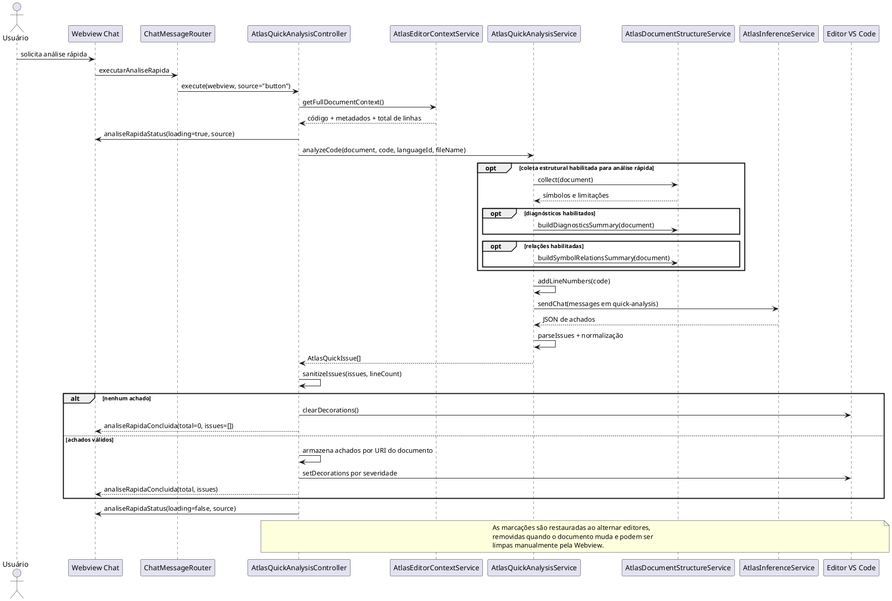
```plantuml
@startuml
skinparam shadowing false
actor Usuário
participant "Webview Chat" as Webview
participant ChatMessageRouter as Router
participant AtlasQuickAnalysisController as Controller
participant AtlasEditorContextService as EditorContext
participant AtlasQuickAnalysisService as QuickService
participant AtlasDocumentStructureService as Structure
participant AtlasInferenceService as Inference
participant "Editor VS Code" as Editor

Usuário -> Webview : solicita análise rápida
Webview -> Router : executarAnaliseRapida
Router -> Controller : execute(webview, source="button")
Controller -> EditorContext : getFullDocumentContext()
EditorContext --> Controller : código + metadados + total de linhas
Controller -> Webview : analiseRapidaStatus(loading=true, source)
Controller -> QuickService : analyzeCode(document, code, languageId, fileName)
opt coleta estrutural habilitada para análise rápida
  QuickService -> Structure : collect(document)
  Structure --> QuickService : símbolos e limitações
  opt diagnósticos habilitados
    QuickService -> Structure : buildDiagnosticsSummary(document)
  end
  opt relações habilitadas
    QuickService -> Structure : buildSymbolRelationsSummary(document)
  end
end
QuickService -> QuickService : addLineNumbers(code)
QuickService -> Inference : sendChat(messages em quick-analysis)
Inference --> QuickService : JSON de achados
QuickService -> QuickService : parseIssues + normalização
QuickService --> Controller : AtlasQuickIssue[]
Controller -> Controller : sanitizeIssues(issues, lineCount)
alt nenhum achado
  Controller -> Editor : clearDecorations()
  Controller --> Webview : analiseRapidaConcluida(total=0, issues=[])
else achados válidos
  Controller -> Controller : armazena achados por URI do documento
  Controller -> Editor : setDecorations por severidade
  Controller --> Webview : analiseRapidaConcluida(total, issues)
end
Controller -> Webview : analiseRapidaStatus(loading=false, source)
note over Controller,Editor
As marcações são restauradas ao alternar editores,
removidas quando o documento muda e podem ser
limpas manualmente pela Webview.
end note
@enduml
```

## UC003 - Solicitar análise arquitetural

### Diagrama de Classes

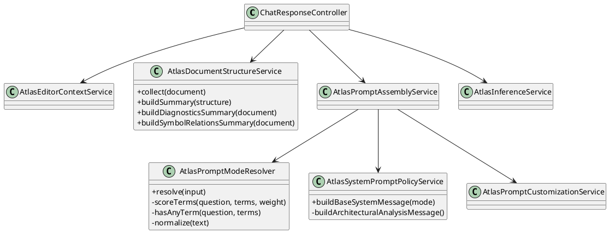
```plantuml
@startuml
skinparam shadowing false
skinparam classAttributeIconSize 0

class ChatResponseController
class AtlasEditorContextService
class AtlasDocumentStructureService {
  +collect(document)
  +buildSummary(structure)
  +buildDiagnosticsSummary(document)
  +buildSymbolRelationsSummary(document)
}
class AtlasPromptAssemblyService
class AtlasPromptModeResolver {
  +resolve(input)
  -scoreTerms(question, terms, weight)
  -hasAnyTerm(question, terms)
  -normalize(text)
}
class AtlasSystemPromptPolicyService {
  +buildBaseSystemMessage(mode)
  -buildArchitecturalAnalysisMessage()
}
class AtlasPromptCustomizationService
class AtlasInferenceService

ChatResponseController --> AtlasEditorContextService
ChatResponseController --> AtlasDocumentStructureService
ChatResponseController --> AtlasPromptAssemblyService
ChatResponseController --> AtlasInferenceService
AtlasPromptAssemblyService --> AtlasPromptModeResolver
AtlasPromptAssemblyService --> AtlasSystemPromptPolicyService
AtlasPromptAssemblyService --> AtlasPromptCustomizationService
@enduml
```

### Diagrama de Sequência

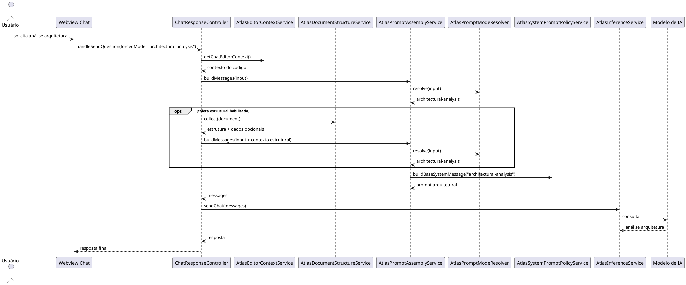
```plantuml
@startuml
skinparam shadowing false
actor Usuário
participant "Webview Chat" as Webview
participant ChatResponseController as Response
participant AtlasEditorContextService as EditorContext
participant AtlasDocumentStructureService as Structure
participant AtlasPromptAssemblyService as Prompt
participant AtlasPromptModeResolver as Resolver
participant AtlasSystemPromptPolicyService as Policy
participant AtlasInferenceService as Inference
participant "Modelo de IA" as Model

Usuário -> Webview : solicita análise arquitetural
Webview -> Response : handleSendQuestion(forcedMode="architectural-analysis")
Response -> EditorContext : getChatEditorContext()
EditorContext --> Response : contexto do código
Response -> Prompt : buildMessages(input)
Prompt -> Resolver : resolve(input)
Resolver --> Prompt : architectural-analysis
opt coleta estrutural habilitada
  Response -> Structure : collect(document)
  Structure --> Response : estrutura + dados opcionais
  Response -> Prompt : buildMessages(input + contexto estrutural)
  Prompt -> Resolver : resolve(input)
  Resolver --> Prompt : architectural-analysis
end
Prompt -> Policy : buildBaseSystemMessage("architectural-analysis")
Policy --> Prompt : prompt arquitetural
Prompt --> Response : messages
Response -> Inference : sendChat(messages)
Inference -> Model : consulta
Model --> Inference : análise arquitetural
Inference --> Response : resposta
Response --> Webview : resposta final
@enduml
```

## UC004 - Ativar modo estudo

### Diagrama de Classes

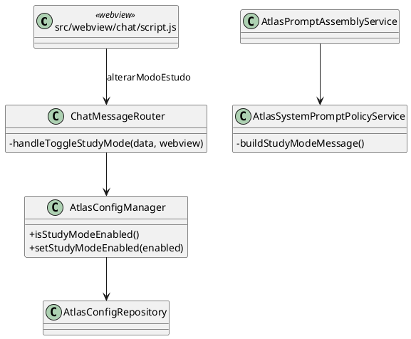
```plantuml
@startuml
skinparam shadowing false
skinparam classAttributeIconSize 0

class "src/webview/chat/script.js" as ChatScript <<webview>>
class ChatMessageRouter {
  -handleToggleStudyMode(data, webview)
}
class AtlasConfigManager {
  +isStudyModeEnabled()
  +setStudyModeEnabled(enabled)
}
class AtlasConfigRepository
class AtlasSystemPromptPolicyService {
  -buildStudyModeMessage()
}
class AtlasPromptAssemblyService

ChatScript --> ChatMessageRouter : alterarModoEstudo
ChatMessageRouter --> AtlasConfigManager
AtlasConfigManager --> AtlasConfigRepository
AtlasPromptAssemblyService --> AtlasSystemPromptPolicyService
@enduml
```

### Diagrama de Sequência

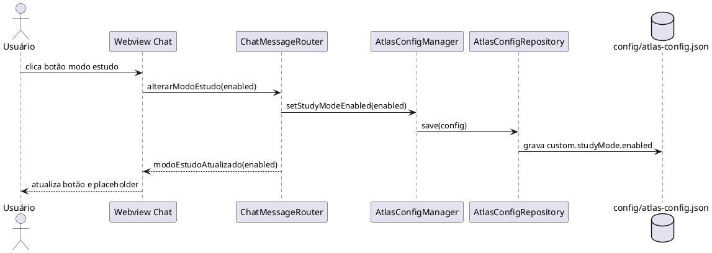
```plantuml
@startuml
skinparam shadowing false
actor Usuário
participant "Webview Chat" as Webview
participant ChatMessageRouter as Router
participant AtlasConfigManager as Config
participant AtlasConfigRepository as Repository
database "config/atlas-config.json" as ConfigFile

Usuário -> Webview : clica botão modo estudo
Webview -> Router : alterarModoEstudo(enabled)
Router -> Config : setStudyModeEnabled(enabled)
Config -> Repository : save(config)
Repository -> ConfigFile : grava custom.studyMode.enabled
Router --> Webview : modoEstudoAtualizado(enabled)
Webview --> Usuário : atualiza botão e placeholder
@enduml
```

## UC005 - Gerenciar chaves de API

### Diagrama de Classes

```plantuml
@startuml
skinparam shadowing false
skinparam classAttributeIconSize 0

class ChatPanelManager
class ChatMessageRouter
class ApiKeyManager {
  +handleMessage(data, webview)
  +addKey(webview)
  +editKey(provider, webview)
  +deleteKey(provider, webview)
  +listCredentials()
  +getRawKey(provider)
}
class SecretStorageService {
  +store(key, value)
  +get(key)
  +delete(key)
}
class AtlasConfigManager
class AtlasProviderService
database "VS Code SecretStorage" as VSSecrets

ChatPanelManager --> ApiKeyManager
ChatMessageRouter --> ApiKeyManager
ApiKeyManager --> SecretStorageService
ApiKeyManager --> AtlasConfigManager
AtlasConfigManager --> AtlasProviderService
SecretStorageService --> VSSecrets
@enduml
```

### Diagrama de Sequência

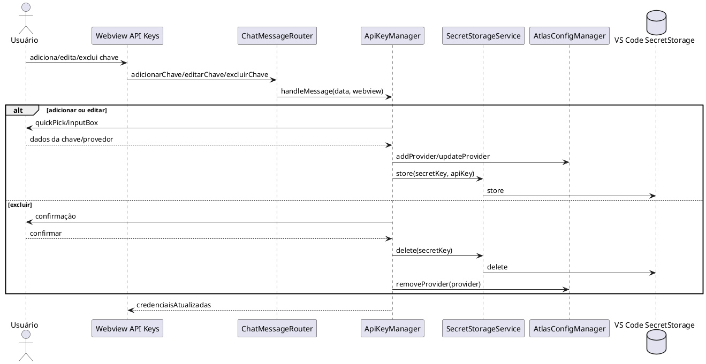
```plantuml
@startuml
skinparam shadowing false
actor Usuário
participant "Webview API Keys" as Webview
participant ChatMessageRouter as Router
participant ApiKeyManager as ApiKeys
participant SecretStorageService as Secrets
participant AtlasConfigManager as Config
database "VS Code SecretStorage" as VSSecrets

Usuário -> Webview : adiciona/edita/exclui chave
Webview -> Router : adicionarChave/editarChave/excluirChave
Router -> ApiKeys : handleMessage(data, webview)

alt adicionar ou editar
  ApiKeys -> Usuário : quickPick/inputBox
  Usuário --> ApiKeys : dados da chave/provedor
  ApiKeys -> Config : addProvider/updateProvider
  ApiKeys -> Secrets : store(secretKey, apiKey)
  Secrets -> VSSecrets : store
else excluir
  ApiKeys -> Usuário : confirmação
  Usuário --> ApiKeys : confirmar
  ApiKeys -> Secrets : delete(secretKey)
  Secrets -> VSSecrets : delete
  ApiKeys -> Config : removeProvider(provider)
end

ApiKeys --> Webview : credenciaisAtualizadas
@enduml
```

## UC006 - Selecionar provedor e modelo cloud

### Diagrama de Classes

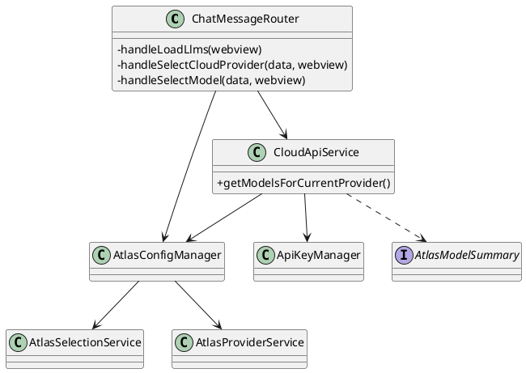
```plantuml
@startuml
skinparam shadowing false
skinparam classAttributeIconSize 0

class ChatMessageRouter {
  -handleLoadLlms(webview)
  -handleSelectCloudProvider(data, webview)
  -handleSelectModel(data, webview)
}
class AtlasConfigManager
class AtlasSelectionService
class AtlasProviderService
class CloudApiService {
  +getModelsForCurrentProvider()
}
class ApiKeyManager
interface AtlasModelSummary

ChatMessageRouter --> AtlasConfigManager
ChatMessageRouter --> CloudApiService
AtlasConfigManager --> AtlasSelectionService
AtlasConfigManager --> AtlasProviderService
CloudApiService --> AtlasConfigManager
CloudApiService --> ApiKeyManager
CloudApiService ..> AtlasModelSummary
@enduml
```

### Diagrama de Sequência

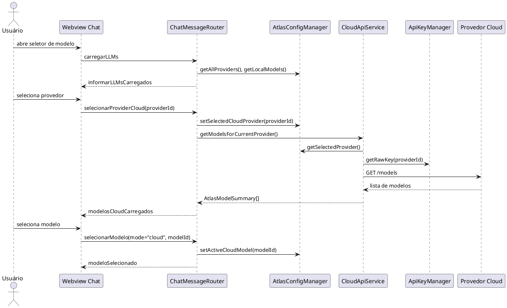
```plantuml
@startuml
skinparam shadowing false
actor Usuário
participant "Webview Chat" as Webview
participant ChatMessageRouter as Router
participant AtlasConfigManager as Config
participant CloudApiService as CloudApi
participant ApiKeyManager as ApiKeys
participant "Provedor Cloud" as Cloud

Usuário -> Webview : abre seletor de modelo
Webview -> Router : carregarLLMs
Router -> Config : getAllProviders(), getLocalModels()
Router --> Webview : informarLLMsCarregados
Usuário -> Webview : seleciona provedor
Webview -> Router : selecionarProviderCloud(providerId)
Router -> Config : setSelectedCloudProvider(providerId)
Router -> CloudApi : getModelsForCurrentProvider()
CloudApi -> Config : getSelectedProvider()
CloudApi -> ApiKeys : getRawKey(providerId)
CloudApi -> Cloud : GET /models
Cloud --> CloudApi : lista de modelos
CloudApi --> Router : AtlasModelSummary[]
Router --> Webview : modelosCloudCarregados
Usuário -> Webview : seleciona modelo
Webview -> Router : selecionarModelo(mode="cloud", modelId)
Router -> Config : setActiveCloudModel(modelId)
Router --> Webview : modeloSelecionado
@enduml
```

## UC007 - Alternar execução local ou cloud

### Diagrama de Classes

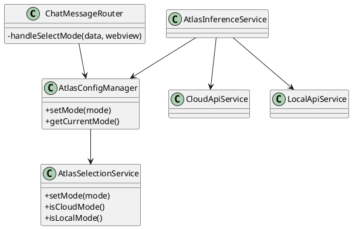
```plantuml
@startuml
skinparam shadowing false
skinparam classAttributeIconSize 0

class ChatMessageRouter {
  -handleSelectMode(data, webview)
}
class AtlasConfigManager {
  +setMode(mode)
  +getCurrentMode()
}
class AtlasSelectionService {
  +setMode(mode)
  +isCloudMode()
  +isLocalMode()
}
class AtlasInferenceService
class CloudApiService
class LocalApiService

ChatMessageRouter --> AtlasConfigManager
AtlasConfigManager --> AtlasSelectionService
AtlasInferenceService --> AtlasConfigManager
AtlasInferenceService --> CloudApiService
AtlasInferenceService --> LocalApiService
@enduml
```

### Diagrama de Sequência

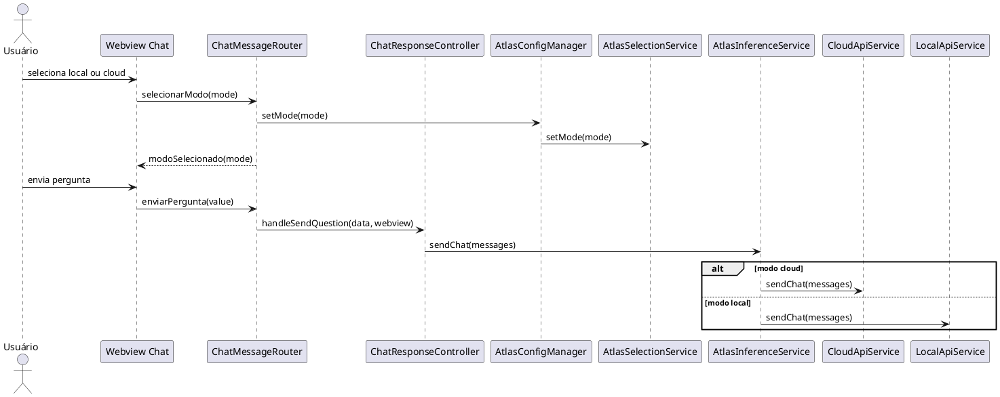
```plantuml
@startuml
skinparam shadowing false
actor Usuário
participant "Webview Chat" as Webview
participant ChatMessageRouter as Router
participant ChatResponseController as Response
participant AtlasConfigManager as Config
participant AtlasSelectionService as Selection
participant AtlasInferenceService as Inference
participant CloudApiService as CloudApi
participant LocalApiService as LocalApi

Usuário -> Webview : seleciona local ou cloud
Webview -> Router : selecionarModo(mode)
Router -> Config : setMode(mode)
Config -> Selection : setMode(mode)
Router --> Webview : modoSelecionado(mode)

Usuário -> Webview : envia pergunta
Webview -> Router : enviarPergunta(value)
Router -> Response : handleSendQuestion(data, webview)
Response -> Inference : sendChat(messages)
alt modo cloud
  Inference -> CloudApi : sendChat(messages)
else modo local
  Inference -> LocalApi : sendChat(messages)
end
@enduml
```

## UC008 - Configurar execução, contexto e segurança

### Diagrama de Classes

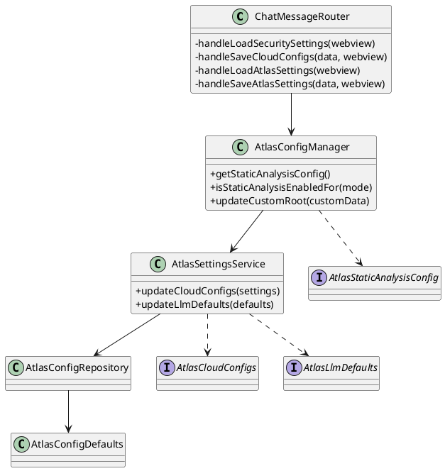
```plantuml
@startuml
skinparam shadowing false
skinparam classAttributeIconSize 0

class ChatMessageRouter {
  -handleLoadSecuritySettings(webview)
  -handleSaveCloudConfigs(data, webview)
  -handleLoadAtlasSettings(webview)
  -handleSaveAtlasSettings(data, webview)
}
class AtlasConfigManager {
  +getStaticAnalysisConfig()
  +isStaticAnalysisEnabledFor(mode)
  +updateCustomRoot(customData)
}
class AtlasSettingsService {
  +updateCloudConfigs(settings)
  +updateLlmDefaults(defaults)
}
class AtlasConfigRepository
class AtlasConfigDefaults
interface AtlasCloudConfigs
interface AtlasLlmDefaults
interface AtlasStaticAnalysisConfig

ChatMessageRouter --> AtlasConfigManager
AtlasConfigManager --> AtlasSettingsService
AtlasSettingsService --> AtlasConfigRepository
AtlasConfigRepository --> AtlasConfigDefaults
AtlasSettingsService ..> AtlasCloudConfigs
AtlasSettingsService ..> AtlasLlmDefaults
AtlasConfigManager ..> AtlasStaticAnalysisConfig
@enduml
```

### Diagrama de Sequência

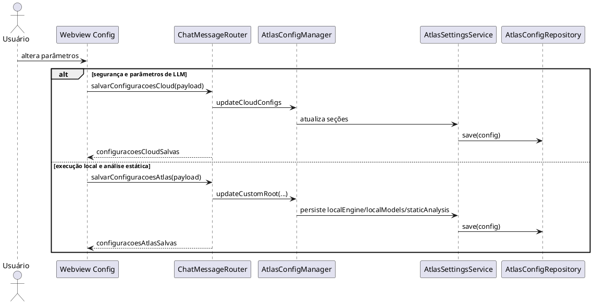
```plantuml
@startuml
skinparam shadowing false
actor Usuário
participant "Webview Config" as Webview
participant ChatMessageRouter as Router
participant AtlasConfigManager as Config
participant AtlasSettingsService as Settings
participant AtlasConfigRepository as Repository

Usuário -> Webview : altera parâmetros
alt segurança e parâmetros de LLM
  Webview -> Router : salvarConfiguracoesCloud(payload)
  Router -> Config : updateCloudConfigs
  Config -> Settings : atualiza seções
  Settings -> Repository : save(config)
  Router --> Webview : configuracoesCloudSalvas
else execução local e análise estática
  Webview -> Router : salvarConfiguracoesAtlas(payload)
  Router -> Config : updateCustomRoot(...)
  Config -> Settings : persiste localEngine/localModels/staticAnalysis
  Settings -> Repository : save(config)
  Router --> Webview : configuracoesAtlasSalvas
end
@enduml
```

## UC009 - Personalizar comportamento

### Diagrama de Classes

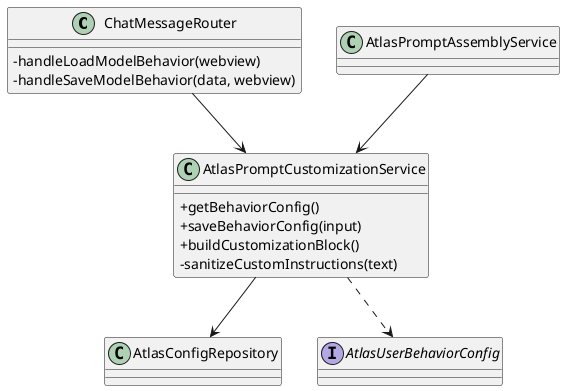
```plantuml
@startuml
skinparam shadowing false
skinparam classAttributeIconSize 0

class ChatMessageRouter {
  -handleLoadModelBehavior(webview)
  -handleSaveModelBehavior(data, webview)
}
class AtlasPromptCustomizationService {
  +getBehaviorConfig()
  +saveBehaviorConfig(input)
  +buildCustomizationBlock()
  -sanitizeCustomInstructions(text)
}
class AtlasConfigRepository
class AtlasPromptAssemblyService
interface AtlasUserBehaviorConfig

ChatMessageRouter --> AtlasPromptCustomizationService
AtlasPromptCustomizationService --> AtlasConfigRepository
AtlasPromptAssemblyService --> AtlasPromptCustomizationService
AtlasPromptCustomizationService ..> AtlasUserBehaviorConfig
@enduml
```

### Diagrama de Sequência

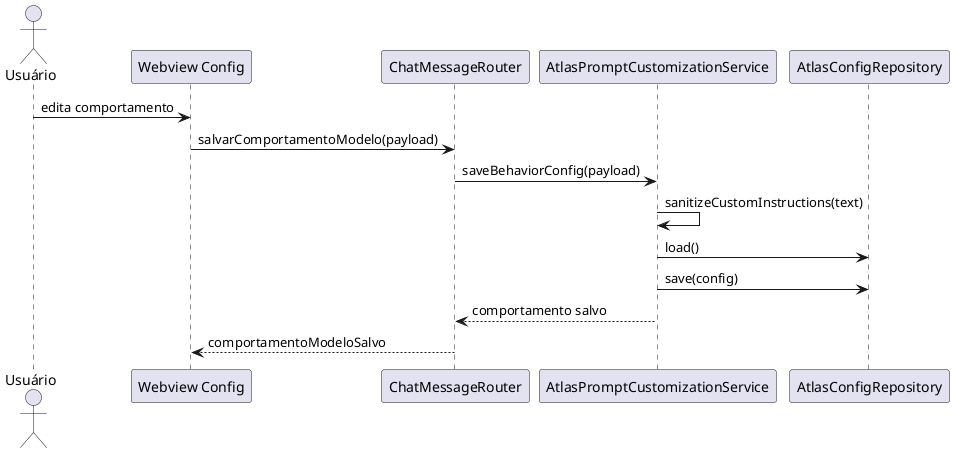
```plantuml
@startuml
skinparam shadowing false
actor Usuário
participant "Webview Config" as Webview
participant ChatMessageRouter as Router
participant AtlasPromptCustomizationService as Custom
participant AtlasConfigRepository as Repository

Usuário -> Webview : edita comportamento
Webview -> Router : salvarComportamentoModelo(payload)
Router -> Custom : saveBehaviorConfig(payload)
Custom -> Custom : sanitizeCustomInstructions(text)
Custom -> Repository : load()
Custom -> Repository : save(config)
Custom --> Router : comportamento salvo
Router --> Webview : comportamentoModeloSalvo
@enduml
```

## UC010 - Gerenciar biblioteca local

### Diagrama de Classes

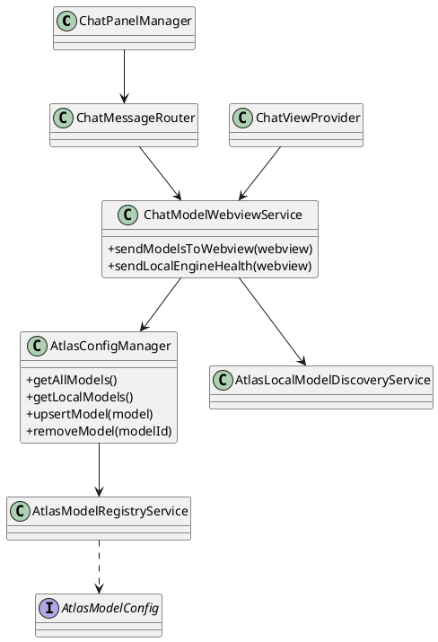
```plantuml
@startuml
skinparam shadowing false
skinparam classAttributeIconSize 0

class ChatPanelManager
class ChatViewProvider
class ChatMessageRouter
class ChatModelWebviewService {
  +sendModelsToWebview(webview)
  +sendLocalEngineHealth(webview)
}
class AtlasConfigManager {
  +getAllModels()
  +getLocalModels()
  +upsertModel(model)
  +removeModel(modelId)
}
class AtlasModelRegistryService
class AtlasLocalModelDiscoveryService
interface AtlasModelConfig

ChatPanelManager --> ChatMessageRouter
ChatMessageRouter --> ChatModelWebviewService
ChatViewProvider --> ChatModelWebviewService
ChatModelWebviewService --> AtlasConfigManager
ChatModelWebviewService --> AtlasLocalModelDiscoveryService
AtlasConfigManager --> AtlasModelRegistryService
AtlasModelRegistryService ..> AtlasModelConfig
@enduml
```

### Diagrama de Sequência

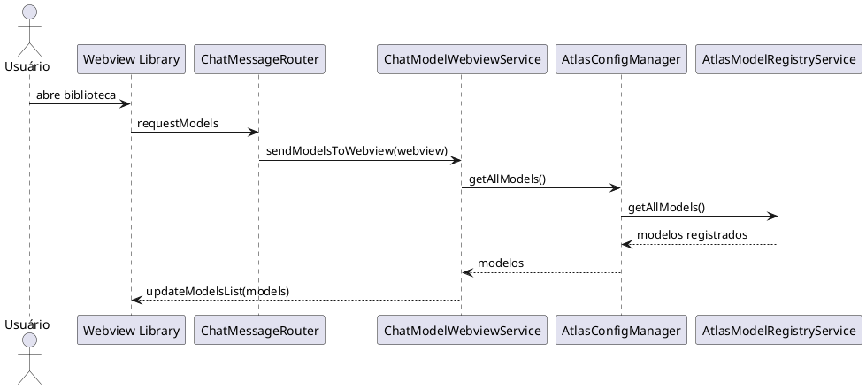
```plantuml
@startuml
skinparam shadowing false
actor Usuário
participant "Webview Library" as Library
participant ChatMessageRouter as Router
participant ChatModelWebviewService as ModelWebview
participant AtlasConfigManager as Config
participant AtlasModelRegistryService as Registry

Usuário -> Library : abre biblioteca
Library -> Router : requestModels
Router -> ModelWebview : sendModelsToWebview(webview)
ModelWebview -> Config : getAllModels()
Config -> Registry : getAllModels()
Registry --> Config : modelos registrados
Config --> ModelWebview : modelos
ModelWebview --> Library : updateModelsList(models)
@enduml
```

## UC011 - Navegar pelos painéis

### Diagrama de Classes

```plantuml
@startuml
skinparam shadowing false
skinparam classAttributeIconSize 0

class ChatViewProvider
class ChatPanelManager {
  +openPanel(selectedView)
  +normalizeSelectedView(selectedView)
  +getPanelGroup(selectedView)
  +getHtmlForWebview(webview, selectedView)
}
class ChatMessageRouter
class "src/webview/chat" as ChatWebview
class "src/webview/atlas" as AtlasWebview
class "src/webview/api-keys" as ApiKeysWebview
class "src/webview/library" as LibraryWebview

ChatViewProvider --> ChatPanelManager
ChatMessageRouter --> ChatPanelManager : openPanel callback
ChatPanelManager --> ChatWebview
ChatPanelManager --> AtlasWebview
ChatPanelManager --> ApiKeysWebview
ChatPanelManager --> LibraryWebview
@enduml
```

### Diagrama de Sequência

```plantuml
@startuml
skinparam shadowing false
actor Usuário
participant "Webview Chat" as Webview
participant ChatMessageRouter as Router
participant ChatPanelManager as PanelManager
participant "VS Code WebviewPanel" as Panel

Usuário -> Webview : solicita painel
Webview -> Router : abrirPainelConfig(selectedView)
Router -> PanelManager : openPanel(selectedView)
PanelManager -> PanelManager : normalizeSelectedView()
PanelManager -> Panel : createWebviewPanel/reveal
PanelManager -> PanelManager : getHtmlForWebview()
PanelManager --> Panel : html
Panel --> Usuário : painel aberto
@enduml
```

## UC012 - Gerenciar sessões

### Diagrama de Classes

```plantuml
@startuml
skinparam shadowing false
skinparam classAttributeIconSize 0

class ChatMessageRouter
class ChatSessionController {
  +handleCreateSession(data, webview)
  +handleSwitchSession(data, webview)
  +handleRenameSession(data, webview)
  +handleDeleteSession(data, webview)
  +handleListSessions(webview)
}
class AtlasSessionService {
  +createSession()
  +listSessions()
  +switchSession(sessionId)
  +renameSession(sessionId, title)
  +deleteSession(sessionId)
}
class AtlasHistoryRepository {
  +load()
  +save(history)
}
database "config/atlas-history.json" as HistoryFile

ChatMessageRouter --> ChatSessionController
ChatSessionController --> AtlasSessionService
AtlasSessionService --> AtlasHistoryRepository
AtlasHistoryRepository --> HistoryFile
@enduml
```

### Diagrama de Sequência

```plantuml
@startuml
skinparam shadowing false
actor Usuário
participant "Webview Chat" as Webview
participant ChatMessageRouter as Router
participant ChatSessionController as Controller
participant AtlasSessionService as Sessions
participant AtlasHistoryRepository as Repository
database "config/atlas-history.json" as HistoryFile

Usuário -> Webview : cria/alterna/renomeia/exclui sessão
Webview -> Router : ação de sessão
Router -> Controller : handle(data, webview)
Controller -> Sessions : executa operação
Sessions -> Repository : save(history)
Repository -> HistoryFile : grava JSON
Sessions --> Controller : estado atualizado
Controller --> Webview : sessoesAtualizadas
@enduml
```

### Fluxo complementar do UC012 — resumir conversas longas

#### Diagrama de Classes

```plantuml
@startuml
skinparam shadowing false
skinparam classAttributeIconSize 0

class AtlasSessionService {
  +appendMessage(sessionId, message)
  +summarizeIfNeeded(sessionId)
  -buildSummaryPrompt(messages)
}
class AtlasInferenceService
class AtlasHistoryRepository
class AtlasPromptAssemblyService
class "SUMMARIZATION_SYSTEM_PROMPT" as SummaryPrompt <<constant>>

AtlasSessionService --> AtlasInferenceService
AtlasSessionService --> AtlasHistoryRepository
AtlasSessionService --> SummaryPrompt
AtlasPromptAssemblyService --> AtlasSessionService
@enduml
```

#### Diagrama de Sequência

```plantuml
@startuml
skinparam shadowing false
participant ChatResponseController as Response
participant AtlasSessionService as Sessions
participant AtlasInferenceService as Inference
participant AtlasHistoryRepository as Repository
database "config/atlas-history.json" as HistoryFile

Response -> Sessions : appendMessage(sessionId, resposta)
Sessions -> Sessions : verifica WINDOW_SIZE
alt histórico excede janela
  Sessions -> Inference : sendChat(summaryPrompt)
  Inference --> Sessions : resumo
  Sessions -> Sessions : compacta mensagens antigas
end
Sessions -> Repository : save(history)
Repository -> HistoryFile : grava resumo e mensagens recentes
@enduml
```

## UC013 - Executar inferência local

### Diagrama de Classes

```plantuml
@startuml
skinparam shadowing false
skinparam classAttributeIconSize 0

class AtlasInferenceService
class LocalApiService {
  +sendChat(messages, onChunk, options)
  -sendLocalRequest(...)
  -adjustDynamicContextWindow(...)
  -getContextOverflow(data)
  -readStreamingResponse(...)
}
class AtlasLocalEngineService {
  +ensureEngine(model, options)
  +stopEngine()
  +restartEngine(model, options)
  +isRunning()
  +getEnginesDir()
  -waitUntilReady()
}
class AtlasConfigManager
class AtlasLocalModelDiscoveryService
class AtlasModelRegistryService
database "llama-server\n127.0.0.1:8080" as Llama

AtlasInferenceService --> LocalApiService : modo local
LocalApiService --> AtlasLocalEngineService
LocalApiService --> AtlasConfigManager
AtlasLocalModelDiscoveryService --> AtlasModelRegistryService
AtlasLocalEngineService --> Llama
@enduml
```

### Diagrama de Sequência

```plantuml
@startuml
skinparam shadowing false
actor Usuário
participant "Webview Chat" as Webview
participant ChatMessageRouter as Router
participant ChatResponseController as Response
participant AtlasInferenceService as Inference
participant LocalApiService as LocalApi
participant AtlasConfigManager as Config
participant AtlasLocalEngineService as Engine
participant "llama-server" as Llama

Usuário -> Webview : envia pergunta em modo local
Webview -> Router : enviarPergunta(value)
Router -> Response : handleSendQuestion(data, webview)
Response -> Inference : sendChat(messages)
Inference -> LocalApi : sendChat(messages, onChunk, options)
LocalApi -> Engine : ensureEngine(model)
alt engine parada
  Engine -> Llama : spawn llama-server
  Engine -> Llama : GET /health ou /v1/models
  Llama --> Engine : pronto
end
LocalApi -> Llama : POST /v1/chat/completions
alt contexto insuficiente e ajuste automático habilitado
  Llama --> LocalApi : erro de context size/window/length
  LocalApi -> LocalApi : getContextOverflow(error)
  LocalApi -> Config : updateModel(contextWindow)
  LocalApi -> Engine : restartEngine(model, reason="parameter-update")
  Engine -> Llama : parar processo anterior
  Engine -> Llama : spawn llama-server com novo --ctx-size
  Engine -> Webview : status "aplicando novos parâmetros"
  Engine --> LocalApi : engine pronta
  LocalApi -> Llama : reenvia POST /v1/chat/completions
end
Llama --> LocalApi : chunks ou resposta completa
LocalApi --> Inference : resposta normalizada
Inference --> Response : resposta
Response --> Webview : respostaParcial/fimResposta
@enduml
```

## UC014 - Descobrir modelos GGUF

### Diagrama de Classes

```plantuml
@startuml
skinparam shadowing false
skinparam classAttributeIconSize 0

class ChatMessageRouter
class ChatModelWebviewService
class AtlasLocalModelDiscoveryService {
  +refreshLocalModels()
  +getModelsDir()
  -createModelConfig(fileName)
  -inferProvider(modelName)
  -inferQuantization(modelName)
}
class AtlasConfigManager
class AtlasModelRegistryService {
  +upsertModel(model)
}
database "Pasta de modelos .gguf" as ModelDir

ChatMessageRouter --> AtlasConfigManager
ChatMessageRouter --> AtlasLocalModelDiscoveryService
ChatModelWebviewService --> AtlasLocalModelDiscoveryService
AtlasLocalModelDiscoveryService --> ModelDir
AtlasLocalModelDiscoveryService --> AtlasModelRegistryService
@enduml
```

### Diagrama de Sequência

```plantuml
@startuml
skinparam shadowing false
actor Usuário
participant "Webview Atlas/Library" as Webview
participant ChatMessageRouter as Router
participant AtlasConfigManager as Config
participant AtlasLocalModelDiscoveryService as Discovery
participant AtlasModelRegistryService as Registry
database "Pasta .gguf" as ModelDir

Usuário -> Webview : seleciona pasta de modelos
Webview -> Router : selecionarPastaModelosLocais
Router -> Config : salva caminho configurado
Router -> Discovery : refreshLocalModels()
Discovery -> ModelDir : lista arquivos .gguf
ModelDir --> Discovery : arquivos encontrados
Discovery -> Discovery : infere metadados
Discovery -> Registry : upsertModel(model)
Registry --> Discovery : modelo registrado
Discovery --> Router : resultado
Router --> Webview : updateModelsList(models)
@enduml
```

## UC015 - Indexar projeto com RAG

### Diagrama de Classes

```plantuml
@startuml
skinparam shadowing false
skinparam classAttributeIconSize 0

class "Webview RAG" as RagConfigurationUI {
  +carregarEstadoInicial()
  +exibirStatusBaseVetorial()
  +exibirProjetos()
  +exibirProgresso()
  +liberarTelaEmErroOuTimeout()
  +cancelarIndexacao()
}
class ChatMessageRouter {
  -handleIndexWorkspaceRag(webview, source, projectId)
}
class AtlasRagService {
  +indexCurrentWorkspace(onProgress, signal)
  +indexSelectedFolder(folderUri, onProgress, signal)
  +indexProject(projectId, onProgress, signal)
  +deleteProjectIndex(projectId)
}
class AtlasEmbeddingService {
  +embedDocuments(chunks, signal)
}
class AtlasEmbeddingModelDiscoveryService {
  +resolveActiveModel()
  +refreshEmbeddingModels()
  +downloadDefaultEmbeddingModel()
}
class AtlasChromaService {
  +ensureReady()
  +getStatus()
}
class AtlasRagRepository {
  +upsertChunks(collection, chunks)
  +replaceCollection(staging, target)
  +saveProject(project)
  +deleteProject(projectId)
}
database "ChromaDB local" as ChromaDB
artifact "index-manifest.json" as Manifest

RagConfigurationUI --> ChatMessageRouter : postMessage
ChatMessageRouter --> AtlasRagService
AtlasRagService --> AtlasEmbeddingService
AtlasEmbeddingService --> AtlasEmbeddingModelDiscoveryService
AtlasRagService --> AtlasChromaService
AtlasRagService --> AtlasRagRepository
AtlasRagRepository --> AtlasChromaService
AtlasRagRepository --> ChromaDB
AtlasRagRepository --> Manifest
@enduml
```

### Diagrama de Sequência

```plantuml
@startuml
skinparam shadowing false
actor Usuário
participant "Webview RAG" as UI
participant ChatMessageRouter as Router
participant AtlasRagService as RAG
participant AtlasEmbeddingService as Embeddings
participant AtlasEmbeddingModelDiscoveryService as EmbeddingModels
participant AtlasRagRepository as Repository
participant AtlasChromaService as Runtime
database "ChromaDB local" as Chroma
database "Manifesto JSON" as Manifest

UI -> Router : carregarEstadoRag
Router --> UI : estadoRagCarregado ou erro
alt erro/timeout inicial
  UI --> Usuário : remove loading e mantém configurações acessíveis
end

Usuário -> UI : indexa workspace, pasta ou projeto
UI -> Router : indexarWorkspaceRag / selecionarPastaRag / reindexarProjetoRag
Router -> RAG : index...(onProgress, signal)
RAG -> Runtime : ensureReady()
Runtime --> RAG : ChromaClient disponível
RAG -> RAG : lê, filtra e gera chunks
loop preparação por arquivo
  RAG --> Router : progresso de arquivos/chunks
  Router --> UI : progressoIndexacaoRag
end
loop lotes de 16 chunks
  Embeddings -> EmbeddingModels : resolveActiveModel()
  EmbeddingModels --> Embeddings : caminho do modelo selecionado
  RAG -> Embeddings : embedDocuments(texts, signal)
  Embeddings --> RAG : vetores normalizados
  RAG -> Repository : upsertChunks(coleção temporária, chunks)
  Repository -> Chroma : persistir documentos, metadados e vetores
  RAG --> Router : progresso dos embeddings
  Router --> UI : chunks processados/restantes
end
RAG -> Repository : replaceCollection(staging, coleção ativa)
Repository -> Chroma : substitui coleção
RAG -> Repository : saveProject/replaceProjectSources
Repository -> Manifest : grava estado
RAG --> Router : projeto concluído
Router --> UI : indexacaoRagConcluida
UI --> Usuário : exibe status, tamanho e fontes
@enduml
```

## UC016 - Pesquisar modelos no Hugging Face

### Diagrama de Classes

```plantuml
@startuml
skinparam shadowing false
skinparam classAttributeIconSize 0

class "Webview Search" as ModelSearchUI {
  +searchModels(query, page)
  +requestModelDetails(modelId)
  +requestRepositoryHardware()
}
class ChatMessageRouter {
  -handleSearchHuggingFaceModels(data, webview)
  -handleGetHuggingFaceModelDetails(data, webview)
  -handleSendRepositoryHardwareInfo(webview)
  -handleOpenHuggingFaceFile(data)
}
class HuggingFaceModelService {
  +searchModels(query, modelFilter, offset, limit)
  +getModelDetails(modelId)
  -isSupportedModel(model)
  -mapModel(model)
}
class HardwareDiagnosticService {
  +getHardwareInfo()
}
class "compatibility-diagnostics.js" as Compatibility {
  +renderCompatibilityDiagnosticsCard(model, selectedFile, context)
}
actor "Hugging Face API" as RepoAPI

ModelSearchUI --> ChatMessageRouter : postMessage
ChatMessageRouter --> HuggingFaceModelService
ChatMessageRouter --> HardwareDiagnosticService
HuggingFaceModelService --> RepoAPI : /api/models e README
ModelSearchUI --> Compatibility : renderiza diagnóstico GGUF
Compatibility --> ModelSearchUI : cartão de compatibilidade
@enduml
```

### Diagrama de Sequência

```plantuml
@startuml
skinparam shadowing false
actor Usuário
participant "Webview Search" as UI
participant ChatMessageRouter as Router
participant HuggingFaceModelService as HF
participant HardwareDiagnosticService as Hardware
participant "compatibility-diagnostics.js" as Compatibility
participant "Hugging Face API" as RepoAPI

Usuário -> UI : pesquisa modelo
UI -> Router : buscarModelosHuggingFace(query, filter, offset, limit, requestId)
Router -> HF : searchModels(query, filter, offset, limit)
HF -> RepoAPI : /api/models
RepoAPI --> HF : modelos e siblings
HF -> HF : filtra GGUF executável e ONNX compatível
HF --> Router : modelos paginados
Router --> UI : modelosHuggingFaceEncontrados
UI -> Router : detalharModeloHuggingFace(modelId)
Router -> HF : getModelDetails(modelId)
HF -> RepoAPI : /api/models/<repo>?blobs=true
RepoAPI --> HF : detalhes, arquivos e metadados
HF --> Router : HuggingFaceModelDetails
Router --> UI : modeloHuggingFaceDetalhado
UI -> Router : solicitarHardwareRepositorio
Router -> Hardware : getHardwareInfo()
Hardware --> Router : RAM, CPU, GPU, VRAM, storage
Router --> UI : hardwareRepositorioCarregado
UI -> Compatibility : classifica variante selecionada
UI --> Usuário : exibe detalhes, variantes e compatibilidade
@enduml
```

## UC017 - Baixar modelo GGUF ou ONNX

### Diagrama de Classes

```plantuml
@startuml
skinparam shadowing false
skinparam classAttributeIconSize 0

class "Webview Search" as ModelDownloadUI {
  +downloadSelectedModel()
}
class ChatMessageRouter {
  -handleDownloadHuggingFaceModel(data, webview)
}
class ChatViewProvider {
  +downloadHuggingFaceModel(modelId, fileName, webview)
}
class HuggingFaceModelService {
  +getModelDetails(modelId)
  +downloadModel(model, fileName, onProgress, signal)
  +downloadGguf(modelId, fileName, onProgress, signal)
  +downloadEmbeddingModel(model, fileName, onProgress, signal)
}
class AtlasLocalModelDiscoveryService {
  +refreshLocalModels()
  +getModelsDir()
}
class AtlasEmbeddingModelDiscoveryService {
  +refreshEmbeddingModels()
  +getModelsDir()
}
class ChatModelWebviewService {
  +sendModelsToWebview(webview)
}
class AtlasConfigManager
class AtlasModelRegistryService
actor "Hugging Face API" as RepoAPI
database "Pasta de modelos GGUF" as ModelDir
database "Pasta de embeddings ONNX" as EmbeddingDir

ModelDownloadUI --> ChatMessageRouter : baixarModeloHuggingFace
ChatMessageRouter --> ChatViewProvider
ChatViewProvider --> HuggingFaceModelService
HuggingFaceModelService --> RepoAPI
HuggingFaceModelService --> ModelDir : GGUF
HuggingFaceModelService --> EmbeddingDir : ONNX e arquivos auxiliares
ChatViewProvider --> AtlasLocalModelDiscoveryService : GGUF
ChatViewProvider --> AtlasEmbeddingModelDiscoveryService : ONNX
AtlasLocalModelDiscoveryService --> AtlasConfigManager
AtlasConfigManager --> AtlasModelRegistryService
ChatViewProvider --> ChatModelWebviewService
@enduml
```

### Diagrama de Sequência

```plantuml
@startuml
skinparam shadowing false
actor Usuário
participant "Webview Search" as UI
participant ChatMessageRouter as Router
participant ChatViewProvider as Provider
participant HuggingFaceModelService as HF
participant AtlasLocalModelDiscoveryService as LocalDiscovery
participant AtlasEmbeddingModelDiscoveryService as EmbeddingDiscovery
participant ChatModelWebviewService as ModelWebview
participant "Hugging Face API" as RepoAPI
database "Pasta GGUF" as ModelDir
database "Pasta ONNX" as EmbeddingDir

Usuário -> UI : seleciona modelo para baixar
UI -> Router : baixarModeloHuggingFace(modelId, fileName)
Router -> Provider : downloadHuggingFaceModel(modelId, fileName, webview)
Provider -> HF : getModelDetails(modelId)
HF -> RepoAPI : consulta detalhes
RepoAPI --> HF : formato GGUF ou ONNX
alt GGUF
  Provider -> HF : downloadGguf(...)
  HF -> RepoAPI : resolve/main/<arquivo.gguf>
  RepoAPI --> HF : stream do arquivo
  HF -> ModelDir : grava GGUF
  Provider -> LocalDiscovery : refreshLocalModels()
  LocalDiscovery -> LocalDiscovery : cria AtlasModelConfig
else ONNX embedding
  Provider -> HF : downloadEmbeddingModel(...)
  HF -> RepoAPI : ONNX + arquivos auxiliares
  RepoAPI --> HF : arquivos do modelo
  HF -> EmbeddingDir : grava modelo e atlas-model.json
  Provider -> EmbeddingDiscovery : refreshEmbeddingModels()
end
Provider -> ModelWebview : sendModelsToWebview()
Provider --> Router : targetPath, format
Router --> UI : downloadModeloHuggingFaceConcluido
UI --> Usuário : modelo disponível
@enduml
```

## UC018 - Gerenciar materiais complementares

### Diagrama de Classes

```plantuml
@startuml
skinparam shadowing false
skinparam classAttributeIconSize 0

class ChatMessageRouter {
  -handleAddExternalRagDocuments(webview)
  -handleDeleteExternalRagDocument(data, webview)
  -handleClearExternalRagDocuments(webview)
}
class AtlasRagService {
  +addExternalDocuments(uris, onProgress, signal)
  +listExternalDocuments()
  +deleteExternalDocument(sourceId)
  +deleteAllExternalDocuments()
  -prepareExternalDocument(projectId, uri)
}
class AtlasExternalDocumentParser {
  +canParse(uri)
  +parse(uri, bytes)
  +getSupportedExtensions()
}
class AtlasEmbeddingService {
  +embedDocuments(texts, signal)
}
class AtlasRagRepository {
  +saveSources(sources)
  +upsertChunks(collectionName, chunks)
  +listExternalDocuments(projectId)
  +deleteExternalSourcesFromManifest(projectId)
}
database "ChromaDB local" as ChromaDB

ChatMessageRouter --> AtlasRagService
AtlasRagService --> AtlasExternalDocumentParser
AtlasRagService --> AtlasEmbeddingService
AtlasRagService --> AtlasRagRepository
AtlasRagRepository --> ChromaDB
@enduml
```

### Diagrama de Sequência

```plantuml
@startuml
skinparam shadowing false
actor Usuário
participant "Webview RAG" as UI
participant ChatMessageRouter as Router
participant AtlasRagService as RAG
participant AtlasExternalDocumentParser as Parser
participant AtlasEmbeddingService as Embeddings
participant AtlasRagRepository as Repository
database "ChromaDB local" as Chroma

Usuário -> UI : adiciona material complementar
UI -> Router : adicionarDocumentoExternoRag
Router -> RAG : addExternalDocuments(uris, progress, signal)
RAG -> Parser : canParse(uri) / parse(uri, bytes)
Parser --> RAG : texto extraído + tipo + linguagem
RAG -> RAG : chunkContent(...)
RAG -> Embeddings : embedDocuments(chunks)
Embeddings --> RAG : vetores
RAG -> Repository : saveSources(source)
RAG -> Repository : upsertChunks(collectionName, chunks)
Repository -> Chroma : persistir vetores
Repository --> RAG : concluído
RAG --> Router : documentos importados / ignorados
Router --> UI : documentosExternosRagAtualizados
UI --> Usuário : confirma inclusão
@enduml
```

## UC019 - Configurar análise estrutural

### Diagrama de Classes

```plantuml
@startuml
skinparam shadowing false
skinparam classAttributeIconSize 0

class "Configurações Gerais" as AtlasSettingsWebview <<webview>>
class ChatMessageRouter {
  -handleLoadAtlasSettings(webview)
  -handleSaveAtlasSettings(data, webview)
  -getAtlasSettingsPayload()
}
class AtlasConfigManager {
  +getStaticAnalysisConfig()
  +getContextProfile()
  +isStaticAnalysisEnabledFor(mode)
  +updateCustomRoot(customData)
}
class AtlasSettingsService
class AtlasConfigRepository
class AtlasDocumentStructureService {
  +collect(document)
  +buildSummary(structure)
  +buildDiagnosticsSummary(document)
  +buildSymbolRelationsSummary(document)
}
class AtlasQuickAnalysisService
class ChatResponseController
class AtlasCodeEditController
interface AtlasStaticAnalysisConfig
interface AtlasContextProfileSettings
class "Provedores de linguagem do VS Code" as LanguageProviders <<external>>

AtlasSettingsWebview --> ChatMessageRouter
ChatMessageRouter --> AtlasConfigManager
AtlasConfigManager --> AtlasSettingsService
AtlasSettingsService --> AtlasConfigRepository
AtlasConfigManager ..> AtlasStaticAnalysisConfig
AtlasConfigManager ..> AtlasContextProfileSettings
AtlasQuickAnalysisService --> AtlasConfigManager : finalidade + perfil
ChatResponseController --> AtlasConfigManager : finalidade + perfil
AtlasCodeEditController --> AtlasConfigManager : finalidade + perfil
AtlasQuickAnalysisService --> AtlasDocumentStructureService
ChatResponseController --> AtlasDocumentStructureService
AtlasCodeEditController --> AtlasDocumentStructureService
AtlasDocumentStructureService --> LanguageProviders : símbolos, diagnósticos e referências
@enduml
```

### Diagrama de Sequência

```plantuml
@startuml
skinparam shadowing false
actor Usuário
participant "Configurações Gerais" as Webview
participant ChatMessageRouter as Router
participant AtlasConfigManager as Config
participant AtlasSettingsService as Settings
participant AtlasConfigRepository as Repository
database "config/atlas-config.json" as ConfigFile
participant "Fluxo solicitante\n(QuickAnalysis / Architecture / Edit)" as Consumer
participant AtlasDocumentStructureService as Structure
participant "Provedores de linguagem do VS Code" as LanguageProviders

== Configuração ==
Usuário -> Webview : abre Configurações Gerais
Webview -> Router : carregarConfiguracoesAtlas
Router -> Config : getStaticAnalysisConfig()\ngetContextProfile()
Config --> Router : configuração efetiva + perfil
Router --> Webview : configuracoesAtlasCarregadas
Usuário -> Webview : ativa análise estrutural e escolhe finalidades
Webview -> Webview : valida opções dependentes
Usuário -> Webview : salvar
Webview -> Router : salvarConfiguracoesAtlas(payload)
Router -> Config : updateCustomRoot(staticAnalysis)
Config -> Settings : updateCustomRoot(...)
Settings -> Repository : save(config)
Repository -> ConfigFile : grava custom.staticAnalysis
Router --> Webview : configuracoesAtlasSalvas

== Consumo da configuração ==
Usuário -> Consumer : inicia análise rápida,\nanálise arquitetural ou refatoração
Consumer -> Config : consulta enabled + finalidade + perfil
Config -> Config : combina opção global, uso na finalidade\ne includeStaticAnalysis do perfil
Config --> Consumer : habilitada ou desabilitada
alt análise estrutural habilitada para a finalidade e o perfil
  Consumer -> Structure : collect(document)
  Structure -> LanguageProviders : executeDocumentSymbolProvider
  LanguageProviders --> Structure : símbolos e intervalos
  opt incluir diagnósticos
    Structure -> LanguageProviders : getDiagnostics(document)
    LanguageProviders --> Structure : diagnósticos publicados
  end
  opt incluir relações entre símbolos
    Structure -> LanguageProviders : executeReferenceProvider
    LanguageProviders --> Structure : referências externas
  end
  Structure --> Consumer : resumo estrutural limitado às evidências
  Consumer -> Consumer : acrescenta contexto ao prompt ou à análise
else desabilitada ou incompatível com o perfil
  Consumer -> Consumer : continua somente com o contexto textual permitido
end
@enduml
```

## UC020 - Aplicar edição direta

### Diagrama de Classes

```plantuml
@startuml
skinparam shadowing false
skinparam classAttributeIconSize 0

class ChatMessageRouter {
  -handleArchitectureGuidedRefactor(data, webview)
}
class ChatResponseController {
  +handleSendQuestion(data, webview)
  -handleDirectCodeEdit(session, userContent, webview, signal)
  -getCodeEditRagContext(query, settings, profile, destination, signal)
}
class AtlasCodeEditController {
  +shouldApplyDirectEditRequest(userRequest, options)
  +executeDirectEdit(webview, options)
  +executeArchitectureGuidedEdit(webview, options)
  +cancelActiveEdit()
  +buildRefactorMetadata(editorContext)
  -passesDeterministicEditGuards(normalizedUserRequest)
  -classifyEditIntentWithModel(userRequest, options)
  -assertDocumentStillMatches(editorContext, metadata)
}
class AtlasCodeEditService {
  +applyEdit(request)
  +formatResultMessage(result)
  -buildEditMessages(request)
  -parsePlan(raw)
  -validatePlan(plan, document)
  -previewAndConfirm(document, plan, signal)
  -applyLineEdits(document, edits)
}
class AtlasCodeEditPreviewProvider {
  +setContent(uri, content)
  +provideTextDocumentContent(uri)
}
class AtlasEditorContextService {
  +getChatEditorContext()
  +getFullDocumentContext()
}
class AtlasDocumentStructureService {
  +collect(document)
  +buildSummary(structure)
}
class AtlasRagService {
  +retrieveContext(query, signal)
}
class AtlasInferenceService {
  +sendChat(messages, onChunk, options)
}
class AtlasSessionService {
  +appendMessage(sessionId, message)
  +getSession(sessionId)
}
class AtlasConfigManager {
  +isRefactoringEnabled()
  +useModelIntentDetectionForCodeEditing()
  +getStaticAnalysisConfig()
}
class "vscode.WorkspaceEdit" as WorkspaceEdit

ChatMessageRouter --> AtlasCodeEditController : análise arquitetural
ChatMessageRouter --> AtlasRagService : contexto opcional
ChatMessageRouter --> AtlasSessionService
ChatResponseController --> AtlasCodeEditController : edição direta
ChatResponseController --> AtlasRagService : contexto opcional
ChatResponseController --> AtlasSessionService
AtlasCodeEditController --> AtlasEditorContextService
AtlasCodeEditController --> AtlasDocumentStructureService : contexto opcional
AtlasCodeEditController --> AtlasConfigManager
AtlasCodeEditController --> AtlasInferenceService : classificar intenção
AtlasCodeEditController --> AtlasCodeEditService
AtlasCodeEditService --> AtlasInferenceService : gerar plano JSON
AtlasCodeEditService *-- AtlasCodeEditPreviewProvider
AtlasCodeEditService --> WorkspaceEdit : aplicar após confirmação
@enduml
```

### Diagrama de Sequência - Edição Direta

```plantuml
@startuml
skinparam shadowing false
actor Usuário
participant "Webview Chat" as UI
participant ChatMessageRouter as Router
participant ChatResponseController as Response
participant AtlasCodeEditController as EditController
participant AtlasRagService as RAG
participant AtlasEditorContextService as EditorContext
participant AtlasCodeEditService as EditService
participant AtlasInferenceService as Inference
participant "vscode.diff" as Diff
participant "vscode.WorkspaceEdit" as WorkspaceEdit
participant AtlasSessionService as Session

Usuário -> UI : pede correção, implementação ou refatoração
UI -> Router : enviarPergunta
Router -> Response : handleSendQuestion(data, webview)
Response -> EditController : shouldApplyDirectEditRequest(pedido, contexto, histórico)
opt classificação pelo modelo habilitada
  EditController -> Inference : sendChat(classificação JSON)
  Inference --> EditController : intenção + confiança
end
EditController --> Response : editar ou responder em texto
alt pedido permanece textual
  Response -> Response : monta prompt e gera resposta normal
else edição aplicada
  opt RAG habilitado para edição
    Response -> RAG : retrieveContext(pedido, signal)
    RAG --> Response : trechos recuperados
  end
  Response -> EditController : executeDirectEdit(pedido, RAG, signal)
  EditController -> EditorContext : getChatEditorContext()
  EditorContext --> EditController : arquivo ou seleção
  EditController -> EditService : applyEdit(request)
  EditService -> Inference : sendChat(prompt do plano JSON)
  Inference --> EditService : summary, rationale, risk, verification, edits
  EditService -> EditService : validar linhas e sobreposições
  EditService -> Diff : abrir original x prévia
  Diff --> Usuário : revisar alterações
  alt usuário confirma
    Usuário -> EditService : Aplicar alterações
    EditService -> WorkspaceEdit : applyEdit(edits)
    WorkspaceEdit --> EditService : aplicado
    EditService --> EditController : resultado aprovado
    EditController --> Response : edição concluída
    Response -> Session : appendMessage(pedido do usuário)
    Response --> UI : edicaoCodigoConcluida
  else usuário cancela
    Usuário -> EditService : Cancelar
    EditService --> EditController : resultado não aprovado
    EditController --> Response : edição cancelada
    Response --> UI : edicaoCodigoCancelada
  end
end
@enduml
```

### Diagrama de Sequência - Refatoração Guiada por Análise

```plantuml
@startuml
skinparam shadowing false
actor Usuário
participant "Webview Chat" as UI
participant ChatMessageRouter as Router
participant AtlasSessionService as Session
participant AtlasRagService as RAG
participant AtlasCodeEditController as EditController
participant AtlasEditorContextService as EditorContext
participant AtlasDocumentStructureService as Structure
participant AtlasCodeEditService as EditService
participant AtlasInferenceService as Inference
participant "vscode.diff" as Diff
participant "vscode.WorkspaceEdit" as WorkspaceEdit

Usuário -> UI : Refatorar com base nesta análise
UI -> Router : executarRefatoracaoArquitetural(sessionId, generationId)
Router -> Session : localizar análise arquitetural refatorável
Session --> Router : conteúdo + documentUri + contentHash
opt RAG habilitado para edição
  Router -> RAG : retrieveContext(análise)
  RAG --> Router : trechos recuperados
end
Router -> EditController : executeArchitectureGuidedEdit(análise, metadados, RAG)
EditController -> EditorContext : getFullDocumentContext()
EditorContext --> EditController : documento atual
EditController -> EditController : validar documentUri e SHA-256
alt arquivo diferente ou alterado
  EditController --> Router : erro; nova análise necessária
  Router --> UI : erro
else arquivo ainda corresponde
  opt análise estática habilitada para refatoração
    EditController -> Structure : collect(document)
    Structure --> EditController : resumo estrutural
  end
  EditController -> EditService : applyEdit(análise + código + contextos)
  EditService -> Inference : sendChat(prompt do plano JSON)
  Inference --> EditService : plano de edições
  EditService -> EditService : validar plano
  EditService -> Diff : abrir original x prévia
  Diff --> Usuário : revisar alterações
  alt usuário confirma
    Usuário -> EditService : Aplicar alterações
    EditService -> WorkspaceEdit : applyEdit(edits)
    WorkspaceEdit --> EditService : aplicado
    EditService --> Router : resultado aprovado
    Router -> Session : persistir pedido + resumo da refatoração
    Router --> UI : novaResposta + sessoesAtualizadas
  else usuário cancela
    Usuário -> EditService : Cancelar
    EditService --> Router : resultado não aprovado
    Router --> UI : edicaoCodigoCancelada
  end
end
@enduml
```
