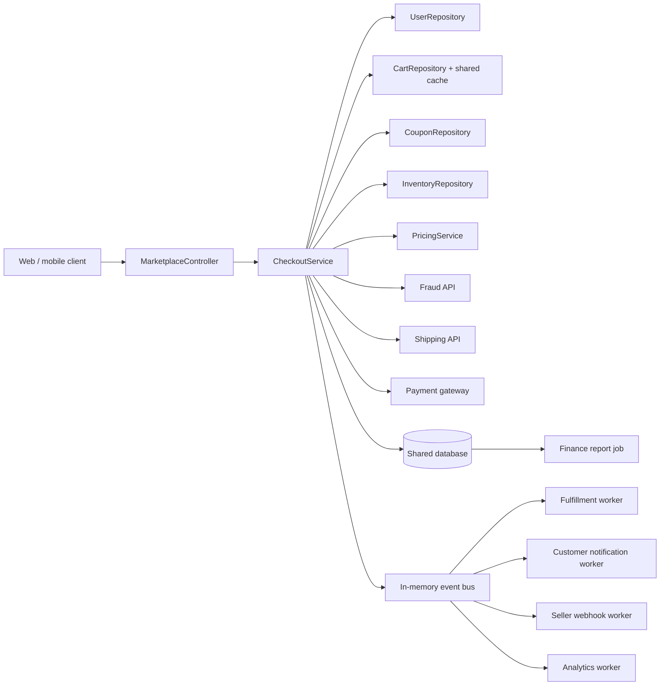

# Problematic Marketplace

Este diretório contém uma aplicação **intencionalmente problemática** para
exercitar a análise arquitetural do Atlas. O código compila; os defeitos foram
colocados principalmente no comportamento, nas fronteiras de confiança e nas
decisões de arquitetura.

## Cenário

Uma plataforma de marketplace white-label atende vários tenants e processa
checkouts durante campanhas de alto tráfego. O mesmo fluxo consulta carrinho,
cupom, estoque, cotação de entrega e antifraude, captura o pagamento, persiste o
pedido e publica eventos para fulfillment, notificações, webhooks e analytics.

O sistema começou pequeno e recebeu correções urgentes ao longo dos anos. Hoje
há relatos intermitentes de:

- clientes vendo dados que não reconhecem;
- estoque negativo em campanhas relâmpago;
- cobranças duplicadas ou com valor divergente da tela;
- cupons acima do limite de utilização;
- mais de uma entrega para o mesmo pedido;
- cancelamentos feitos por usuários indevidos;
- relatórios financeiros inconsistentes;
- memória crescente nos workers e logs contendo dados sensíveis.

## Arquitetura aparente

Apesar dos nomes sugerirem serviços separados, tudo compartilha processo,
estado global, configuração mutável e uma única representação de dados.

## Roteiro para análise no Atlas

1. Começar por `api.ts` e identificar quais dados vêm de fronteiras não
   confiáveis.
2. Seguir o fluxo de `CheckoutService.checkout` até banco, gateway e eventos.
3. Verificar isolamento por tenant em cada repositório e chave de cache.
4. Modelar falhas em cada `await`: o que já foi alterado e o que seria desfeito?
5. Analisar duas requisições simultâneas para o mesmo carrinho, cupom e SKU.
6. Considerar entrega duplicada, fora de ordem e com retry parcial de eventos.
7. Comparar o valor mostrado, capturado, persistido, reembolsado e reportado.
8. Fazer uma revisão de segurança, privacidade e observabilidade.
9. Propor uma arquitetura alvo e uma migração incremental, sem reescrever tudo
   de uma vez.

Os cenários em `failure-scenarios.ts` tornam algumas falhas determinísticas. O
arquivo `GABARITO.md` contém uma lista de achados e deve ser lido depois
da análise.

## Arquivos

| Arquivo                | Papel aparente                                             |
| ---------------------- | ---------------------------------------------------------- |
| `api.ts`               | Adaptador HTTP e endpoints administrativos                 |
| `checkout-service.ts`  | Orquestração do caso de uso principal                      |
| `repositories.ts`      | Acesso a carrinho, estoque, cupom, pedido e pagamento      |
| `database.ts`          | Banco e transação simulados                                |
| `integrations.ts`      | Pagamento, antifraude, entrega e notificação               |
| `pricing.ts`           | Conversão, desconto, imposto, frete e fidelidade           |
| `event-bus.ts`         | Publicação e retry de eventos                              |
| `workers.ts`           | Fulfillment, e-mail, webhook, analytics e relatório        |
| `bootstrap.ts`         | Composição e massa de dados multi-tenant                   |
| `failure-scenarios.ts` | Reproduções pequenas de falhas concorrentes e de segurança |

## Perguntas de aprofundamento

- Quais invariantes de negócio não estão representadas pelo modelo?
- Onde uma transação local ajuda e onde ela cria falsa segurança?
- Qual é a unidade correta de idempotência em cada integração?
- Que dados deveriam compor todas as chaves, consultas e eventos multi-tenant?
- Quais side effects precisam de outbox, inbox, saga ou compensação?
- Como separar erro de negócio, indisponibilidade transitória e erro interno?
- Quais métricas seriam úteis sem causar cardinalidade explosiva?
- Como migrar valores monetários existentes sem quebrar relatórios históricos?
